# Matlab 变量

> 原文：<https://www.educba.com/matlab-variables/>

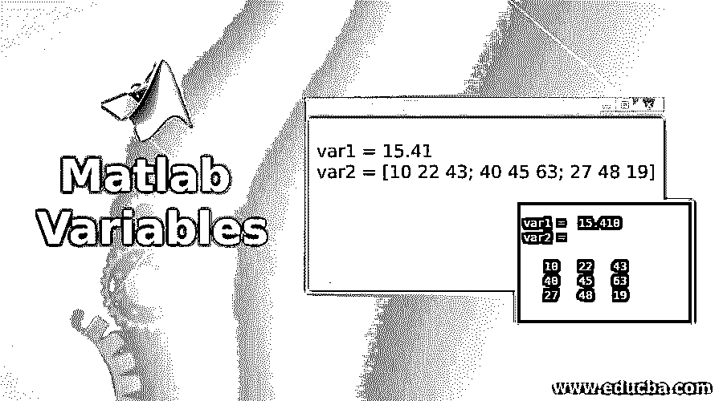

## Matlab 变量介绍

MATLAB 代码中创建的变量由其工作空间处理，用于定义内存位置和存储分配给每个变量的值。Matlab workspace 支持创建新变量以及在命令执行中重用现有变量。在 Matlab 环境中，不管数据类型如何，每个变量都被视为矩阵或数组。

### 在 Matlab 中声明变量

Matlab 不需要显式声明变量。当用户指定变量名后接方程式和数据时，具有给定变量名的变量被实例化，其中保存所分配的数据。

<small>Hadoop、数据科学、统计学&其他</small>

可以通过以下方式将数据分配给变量:

#### 1.将常数值赋给变量

**代码:**

`var1 = 15.41
var2 = [10 22 43; 40 45 63; 27 48 19]`

**输出**:

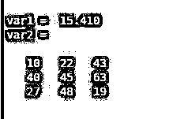

#### 2.将表达式赋给变量

**代码:**

`var1 = sqrt(16)
var2=sin(1)`

**输出**:

#### 3.在 Matlab 中初始化变量

Matlab 变量用赋给它的初始值初始化。Matlab 变量支持空数据和非空数据作为初始值。

**代码:**

`var1 = [] var2=10`

**输出**:

### Matlab 中变量是如何工作的？

从代码中创建变量后，Matlab 会将变量添加到工作空间中。

**代码:**

`var1="I am variable";
I = [1 2 3; 4 5 6; 7 8 9];`

**输出:**

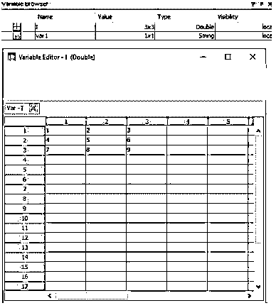

**解释:**变量的内容可以使用命令编辑，也可以从变量编辑器编辑。除了编辑之外，其他操作，如删除、复制、拷贝、调整大小或改变变量的形状都可以在工作区中完成。

可以在 Matlab 命令窗口的一个命令行中声明多个变量。

**代码:**

`var1=50;var2=60;var3=70;`

**输出**:

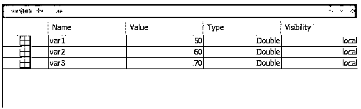

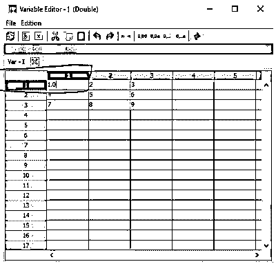

### Matlab 中的变量类型

Matlab 变量支持各种数据类型，例如:

#### 1.茶

Matlab 变量支持字符数组。

**代码:**

`char_var = "I am a char type variable";
char_var_arr = ["charset1","charset2","charset3"];`

**输出:**

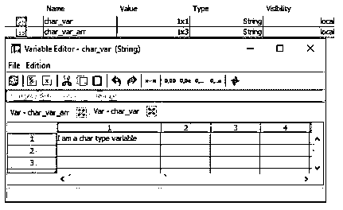

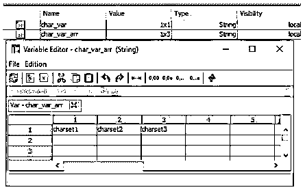

#### 2.情结

Matlab 变量支持复数变量，即“实数+I *虚数”的形式。

**a .创建复数:**

**代码:**

`complex_var = complex(5,10);`

**输出**:

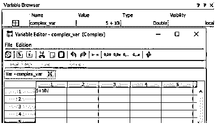

**b .创建复数数组:**

**代码:**

`real = uint8([11;25;23;40]);
imgainary = uint8([21;25;27;47]);
complex_arr = complex(real,imgainary)`

**输出**:

#### 3.两倍

在 Matlab 中，默认的数字数据类型或类是“double ”,这为大多数计算任务提供了高精度。数值变量以 64 位(8 字节)双精度浮点值的形式自动捕获。

**代码:**

`var_name = 100;
xtype = class(var_name)`

**输出:**

它支持将变量数据类型转换为 double。

**代码:**

`other_var = true
other_var_double = double(other_var);
other_var_newtype = class(other_var_double)`

**输出**:

#### 4.带符号整数

Matlab 支持单整数数据类型的变量数组。根据数据的大小，变量可以定义为 8/16/32/64 位有符号整数。

**代码:**

`var_int8 = int8(50) ; var_int16 = int16(50); var_int32 = int32(50); var_int64 = int64(50);`

**输出:**

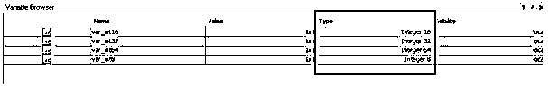

#### 5.逻辑学的

逻辑值可以在 Matlab 编程中以变量的形式使用。但是逻辑值转换不支持复数值和 nan，并会引发转换错误。

任何非零元素被转换为逻辑 1，即布尔真，而 0 被转换为逻辑 0，即布尔假。

**代码:**

`A = [10 -23 0;35 42 71; -28 0 36];
L = logical(A)`

**输出:**

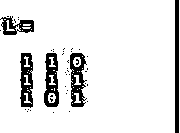

#### 6.单一的

Matlab 支持单精度变量声明，并且这些声明存储为“单”数据类型 4 字节(32 位)浮点值。

**代码:**

`single_var= single(100)
vartype = class(single_var)`

**输出:**

#### 7.结构

可以将结构数组定义为一种数据类型，该数据类型允许使用数据容器对相关数据进行分组，这些数据容器被称为字段，并且可以用作用户定义的数据类型。字段可以包含 Matlab 支持的任何数据类型的数据。

一个字段的数据可以使用点符号形式访问，如“结构名.字段名”所示。

| **语法** | **描述** |
| s =结构 | 以大小为 1X1 的标量形式创建结构，不带字段。 |
| s = struct(字段，值) | 以数组的形式创建一个结构，其中包含为该结构定义的字段和值。 |
| s=struct(field1，value1，…，fieldN，valueN) | 以具有多个字段(field1，field2，…，fieldN)和值(value1，value2，…)的数组形式创建一个结构..，valueN)，为结构定义。 |
| s =结构([]) | 用于创建没有字段的空结构(0 乘 0)。 |
| s =结构(对象) | 用于创建标量结构，该结构由与“obj”的属性对应的字段名称和值组成。 |

**代码:**

`struct_var = struct`

**输出:**

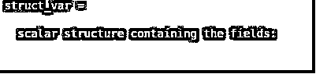

**代码:**

`field_name = 'field_name';
values = {'A string';
[15, 25, 35];
magic(4)};
s = struct(field_name,values)
s.field_name`

**输出**:

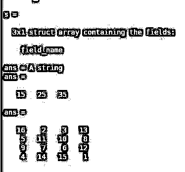

**代码:**

`field1 = 'field1';  value1 = zeros(1,15);
field2 = 'field2';  value2 = {'str1', 'str2'};
field3 = 'field3';  value3 = {pi/3, pi.^3};
field4 = 'field4';  value4 = {'text'};
s = struct(field1,value1,field2,value2,field3,value3,field4,value4);
s.field1
s.field2
s.field3
s.field4`

**输出:**

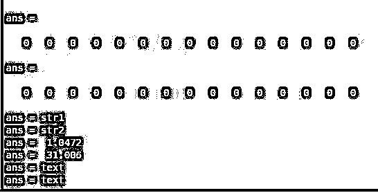

**代码:**

`s=struct([])`

**输出**:

#### 8.无符号整数

Matlab 支持无符号整数数据类型的变量数组。变量可以定义为 8/16/32/64 位无符号整数，具体取决于要存储在变量中的数据大小。

**代码:**

`var_int8 = uint8(50) ; var_int16 = uint16(50); var_int32 = uint32(50); var_int64 = uint64(50);`

**输出:**

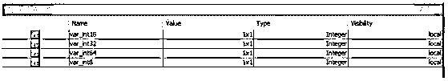

#### 9.定点数据类型

Matlab SIMULINK 模块允许用户创建使用定点数据类型数值表示参数值和信号的模型。定点数据的应用减少了内存消耗，提高了从 SIMULINK 模型生成代码的速度。

**代码:**

`var1 = fi(pi)`

**输出**:

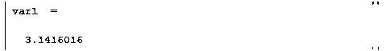

**Note:** When the return value from an expression is not assigned to any variableexplicitly, a default variable ‘ans’ gets defined by the system and the return value of the expressions gets assigned to it. This default variable ‘ans’ is reusable throughout the code. The elements or their subsets from a multidimensional array and tall arrays are not editable in the Variables editor. In the Workspace browser or the Variables editor, double quotes need to be used surrounding the string value while editing any string type variable.

如果在运行时创建了一个空变量或变量获得了空值，该变量将根据数据类型被赋予一个默认值，例如:

对于数值数组变量:“0”

对于单元格和结构数组变量:“[]”

对于分类变量:'【T0 ' '

### 推荐文章

这是一个 Matlab 变量指南。这里我们讨论 Matlab 变量的介绍，它是如何工作的，以及类型和例子。您也可以浏览我们的其他相关文章，了解更多信息——

1.  [线性拟合 Matlab](https://www.educba.com/linear-fit-matlab/)
2.  [Matlab 中的协方差](https://www.educba.com/covariance-in-matlab/)
3.  [Matlab 中的等高线图](https://www.educba.com/contour-plot-in-matlab/)
4.  [Matlab 绘图标记](https://www.educba.com/matlab-plot-marker/)

