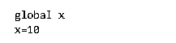
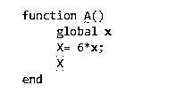
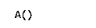
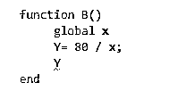
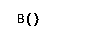
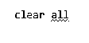
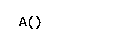

# Matlab 全局变量

> 原文：<https://www.educba.com/matlab-global-variables/>

## Matlab 全局变量简介

在 MATLAB 中，如果各种函数将变量的名称声明为 global，在这种情况下，这些函数将使用一个名为 global 的变量实例。如果我们在任何一个函数中改变这个变量的值，这个改变将适用于所有其他使用它作为全局变量的函数。

函数的变量叫做局部变量。这些变量的范围仅限于函数本身的范围，而全局变量的范围扩展到所有调用全局变量的函数。

<small>Hadoop、数据科学、统计学&其他</small>

**语法:**

1.  全球 v1、v2、v3 …vn 用于将任何变量声明为全局变量。
2.  从语法上可以明显看出，我们可以在一个声明中将多个变量设置为全局变量。
3.  如果我们需要清除一个全局变量，我们可以使用语法“clear all”来清除所有定义的全局变量

### 如何在 Matlab 中将变量设置为全局变量？

现在让我们了解如何在 MATLAB 中将变量设置为全局变量:

#### 示例#1

在第一个例子中，我们将在开始时声明一个全局变量，然后在函数中使用它。本例中要遵循的步骤是:

1.  将变量声明为全局变量
2.  创建一个函数
3.  在函数内部调用全局变量
4.  调用函数获取输出，并验证全局变量是否按预期工作

**代码:**

`global x`

**【声明全局变量‘x’】**

`x = 10;`

**【给全局变量赋值】**

接下来，我们将创建一个执行两个整数相乘的函数。其中一个输入将是上面声明的全局变量。

`function A()
global x
X = 6 * x;
X
end`

[Please note that the above function has called the global variable ‘x’, and will hence utilize the value assigned to it by us; i.e. 10]

现在如果我们调用函数' A '，那么输出必须是 6 * 10 = 60。

这是我们的输入和输出在 MATLAB 命令窗口中的样子:

**输入 1:**

声明全局变量:

**输入 2:**

创建函数并调用上面步骤中声明的全局变量:

**输入 3:**

调用函数“A”:

**输出:**

正如我们在输出中看到的，我们得到了 10 和 6 的乘积，也就是 60。这里，我们使用了在函数体外部定义的全局变量作为输入之一。

接下来，我们将创建另一个函数，并将利用我们在开始时创建的同一个全局变量‘x’。

#### 实施例 2

在这个例子中，我们将创建一个新的函数，但是将使用我们为第一个例子创建的相同的全局变量。这里，我们不会声明一个全局变量，而只是在新函数体内调用它。这是一种有效的方法，因为我们已经在工作区的开始将变量‘x’声明为全局变量。本例中要遵循的步骤是:

1.  创建一个函数
2.  在函数内部调用全局变量
3.  调用函数获取输出，并验证全局变量是否按预期工作

**代码:**

我们将创建一个执行 2 整数除法的函数，并将直接使用第一个示例中声明的全局变量作为输入之一。

`function B()
global x
Y = 80 / x;
Y
end`

[Please note that the above function has called the global variable ‘x’ directly without declaring it in the beginning]

现在如果我们调用函数 B，那么输出必须是 80 / 10 = 8。

这是我们的输入和输出在 MATLAB 命令窗口中的样子:

**输入 1:**

创建函数“B”并使用在工作区开头声明的全局变量:

**输入 2:**

调用函数“B”:

**输出:**

正如我们在输出中看到的，我们得到了 80 和 10 的除法，即 8。这里，我们使用了在工作区开始时定义的全局变量作为输入之一。

接下来，我们将学习如何清除全局变量。为此，我们将使用语法“全部清除”。请记住，如果我们使用“clear all”语法。我们将不再能够在函数中使用上面定义的全局变量‘x’。

#### 实施例 3

在这个例子中，我们将清除我们创建的全局变量。本例中要遵循的步骤是:

1.  使用“全部清除”语法
2.  在函数内部调用全局变量
3.  调用函数获取输出，并验证全局变量是否如预期的那样工作(**它不应该给出任何输出，因为我们已经从我们的工作区**中清除了全局变量

**代码:**

`clear all`

[Using “clear all” syntax to clear the global variable created in the beginning]

我们将使用我们在第一个例子中创建的同一个函数 A，它执行两个整数的乘法

`function A()
global x
X = 6 * x;
X
end`

[Please note that the above function has called the global variable ‘x’, even though we have cleared the global variable created]

现在，如果我们调用函数' A '，那么一定没有任何输出。

这是我们的输入和输出在 MATLAB 命令窗口中的样子:

**输入 1:**

清除创建的全局变量:

**输入 2:**

**调用函数‘A’:**

**

** 

**输出:**

**T2】**

 **正如我们所看到的，我们没有得到任何输出值。这是因为我们现在没有全局变量“x”的任何值。

### 结论

1.  如果一个函数被声明为全局的，那么它的单个实例可以在不同的函数中使用。
2.  “global”是用于将任何函数声明为全局函数的语法。
3.  如果我们想清除创建的全局变量，可以使用“全部清除”。

### 推荐文章

这是一个 Matlab 全局变量的指南。在这里我们讨论的介绍，语法，如何在 Matlab 中设置一个全局变量？和代码实现的例子。您也可以看看以下文章，了解更多信息–

1.  [Matlab 表单](https://www.educba.com/matlab-forms/)
2.  [Matlab 绘图标题](https://www.educba.com/matlab-plot-title/)
3.  [Matlab fplot()](https://www.educba.com/matlab-fplot/)
4.  [Matlab 变量](https://www.educba.com/matlab-variables/)

**