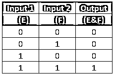
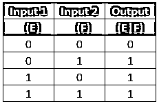

# Matlab 逻辑运算符

> 原文：<https://www.educba.com/matlab-logical-operators/>

## Matlab 逻辑运算符简介

运算符是任何编程语言中最重要的部分之一。它们意味着在操作数之间执行任何数学或逻辑运算。例如，c+d=e，这里的+是一个算术运算符，用于在 c 和 d 之间执行加法运算，从而得到 e。任何编程语言中都有各种类型的 Matlab 逻辑运算符，如关系运算符、算术运算符、逻辑运算符、赋值运算符等等。

### 逻辑运算符

逻辑运算符是根据表达式的输入产生二进制值(即 1 或 0)的运算符类型。它们也用于数组和条件语句中，以检查各种条件和语句。Matlab 中使用两种类型的逻辑运算。请在下面找到它们:

<small>Hadoop、数据科学、统计学&其他</small>

*   **逐元素逻辑运算:**此处，逻辑运算是在操作数之间逐元素执行的。&和|用于表示 Matlab 中的元素操作。
*   **短路逻辑运算:**此处，逻辑运算仅根据对第一个表达式的求值产生一个标量值。表达式的第一部分求值后被短路，因此得名。& &和||在 Matlab 中用来表示短路行为。

### 逻辑运算符的类型及示例

Matlab 中使用了三种类型的逻辑运算符，如 AND(E&F)，OR(E|F)，NOT(~E)。请在下面找到 Matlab 中使用的逻辑运算符的工作方式和类型:

#### 1.逻辑 AND 运算符

在基于元素的操作中，它由& operator 表示。它执行逻辑运算，并根据提供给输入信号的输入产生 1 或 0(真或假)。请查找下面的真值表，它描述了 Matlab 中 AND 运算符的工作原理:

在上面的真值表中，如果任何输入或操作数为 0 或 false，则结果输出总是为 False 或 0。类似地，如果两个输入信号都为真，则结果输出为真。在短路操作中，表达式通过计算表达式的第一部分产生输出。如果表达式的第一部分结果为 0 或 False，则不会对已定义表达式的第二部分进行更多计算。使用短路逻辑运算的表达式的输出总是产生标量值。在 Matlab 中用&&运算符表示。在 Matlab 中使用&&和&运算符时，我们应该始终小心，因为这两个运算符是不同的，会给出不同的输出。

**举例:**

E = [0，0，1，1，0，1，0]

F = [1，1，1，0，0，1]

**输出:**

E&F = [0，0，1，0，0，0]

如果上述数组的两个输入都是 1，那么它将产生 1，否则为 0。

#### 2.逻辑或运算符

在基于元素的操作中，它由|运算符表示。它执行逻辑运算，并根据提供给输入信号的输入产生 1 或 0(真或假)。请找到下面的真值表，它描述了 Matlab 中 OR 运算符的工作原理。

在上面的真值表中，如果任何输入或操作数为 1 或真，则结果输出总是为真或 1。类似地，如果两个输入信号都为真，则结果输出为真。在短路操作中，表达式通过计算表达式的第一部分产生输出。如果表达式的第一部分的结果为 1 或 True，则不会对已定义表达式的第二部分进行更多计算。使用短路逻辑运算的表达式的输出总是产生标量值。在 Matlab 中用||运算符表示。在 Matlab 中使用||和|运算符时，我们应该始终小心，因为这两个运算符是不同的，会给出不同的输出。

**举例:**

E = [1，1，1，0，0，0]

F = [0，0，1，0，1，0，0]

**输出:**

E|F = [1，1，1，1，0，0]

如果任一操作数为 1，则结果为 1，否则为 0。

#### 3.逻辑非运算符

这个操作符根据我们提供给输入信号的输入返回 0 或 1。如果输入信号为 0，则结果为 1，如果输入信号为 1，则结果为 0。输入可以是多维数组、标量、矩阵或向量。在 Matlab 中用~符号表示。它也支持复数。not(E)也用于表示 Matlab 中的逻辑 not 运算，但由于它存在运算符重载问题，因此应避免使用。请找到下面的真值表来描述 Matlab 中逻辑非运算符的工作:

**举例:**

E = [1，0，1，0，1，0，1]

**输出:**

~E = [0，1，0，1，0，1，0]

它只是否定输入并提供输出。

Matlab 中有许多用于逻辑运算的预定义函数，例如:

*   **any(E):** 该函数用于检查数组中的元素是逻辑 1 还是非零。如果数组包含任何非零元素，则结果为 1 否则为 0。
*   **all(E):** 该函数用于检查一个数组中的所有元素是否为非零或 1。如果数组中的所有元素都不为零或 1，那么对于相应的数组，其标量值为 1，如果不为零，则为 0。
*   **Islogical():** 这个函数用来检查一个特定的数组是否符合逻辑。如果表达式符合逻辑，则返回 True，否则返回 False。

### 结论

逻辑运算符根据条件(真或假)来控制程序流的执行。如果一个表达式中使用了许多运算符，那么该表达式将按照定义的优先级顺序进行计算。

### 推荐文章

这是一个 Matlab 逻辑运算符指南。在这里，我们讨论了 Matlab 中使用的不同类型的逻辑运算符的简要概述和例子。您也可以浏览我们推荐的其他文章，了解更多信息——

1.  [Matlab 中的 IF-Else 语句](https://www.educba.com/if-else-statement-in-matlab/)
2.  [MATLAB 中的数据类型](https://www.educba.com/data-types-in-matlab/)
3.  [Matlab 的优势](https://www.educba.com/advantages-of-matlab/)
4.  [Matlab vs Octave](https://www.educba.com/matlab-vs-octave/)

