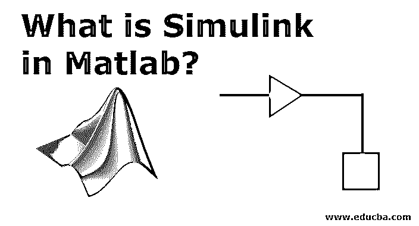
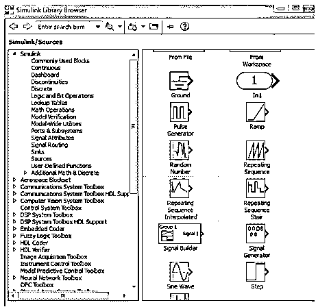
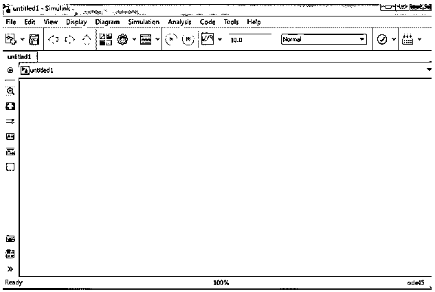
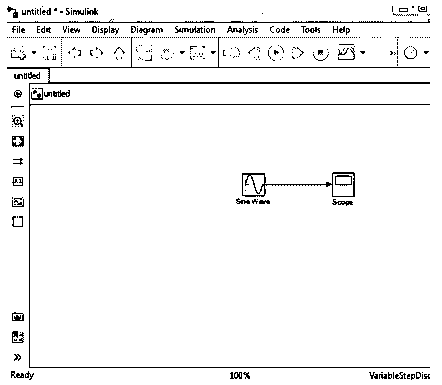
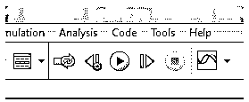
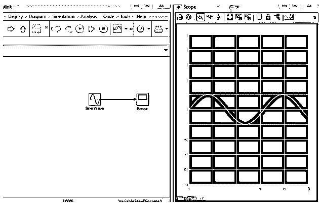
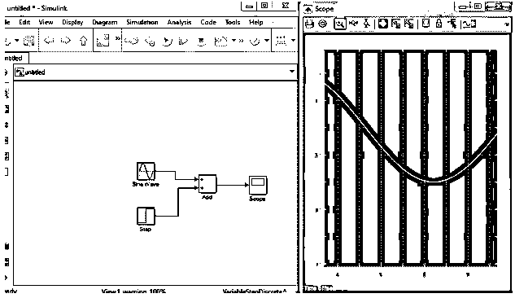
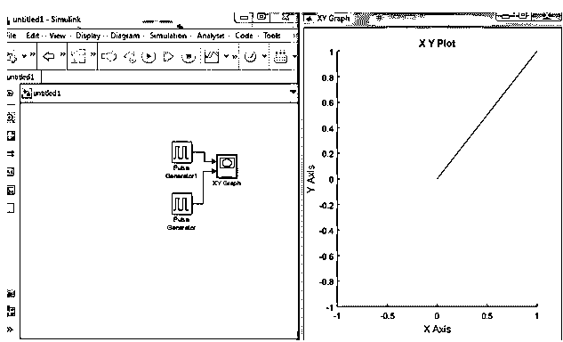

# Matlab 中的 Simulink 是什么？

> 原文：<https://www.educba.com/what-is-simulink-in-matlab/>

## Matlab 中的 Simulink 简介

Simulink 是一个动态的软件 MATLAB 集成仿真和模型设计系统。Simulink 是一种图形编程语言数据流工具，用于建模、模拟和分析 MDS，也是由 MathWorks 开发的。它本质上是一个图解框架，带有可定制的块库包，具有产品风格控制、可追溯性标准和应用程序覆盖分析，类似的链接能够定期验证和验证模型。

**Simulink 支持:**

<small>Hadoop、数据科学、统计学&其他</small>

*   系统级设计
*   模拟
*   自动代码生成
*   嵌入式系统的测试和验证

在 Simulink 中，用户可以使用各种其他的 Matlab 产品和附加的特定硬件系统和软件应用程序。

*   **Stateflow** :用于开发系统的状态机和流程图。
*   **Simulink Coder:** 用于生成 c 代码，实现实时应用。
*   **xPC Target 连同基于的实时系统:**它是一个平台，用来模拟和分析系统上的状态机。
*   **嵌入式编码器:**用于嵌入式系统。
*   HDL 编码器:用于设计 VHDL 代码和 Verilog 代码。
*   它为设计系统提供了一个图形用户界面。

通过设计风格检查、需求和模型完成分析，Simulink 对于系统的系统验证和测试是有效的。Simulink 模型验证器允许我们识别错误，并为系统检查创建测试案例场景。

### Matlab 中的 Simulink 是如何工作的？

以下步骤展示了 Simulink 在 Matlab 中的工作方式。

1)第一步，我们需要在库的帮助下打开 Simulink，只需在命令窗口中键入“Simulink”。

2)面板上有三个模块库:Simulink、搜索结果和常用。选择库:Simulink。选择以上选项后，右侧会给出各种库列表。它有各种科学和工程领域的图书馆。

3)第三步是创建基本的构建模块。要创建新系统，请在库选项上选择“新建”选项。这将为系统设计打开一个新的窗口。

4)第四步是元素的选择。这里我们需要选择构建系统块所需的块。这里有一个简单的拖放选项，否则你可以用鼠标左键继续。

5)最后一步是显示输出。窗口顶部有一个绿色小图标，用于运行模型。

### Matlab 中的 Simulink 实例

让我们看一些例子:

#### 示例# 1

让我们考虑一个例子，我想设计一个正弦波并显示结果。

要解决上述问题，我需要遵循以下步骤:

*   在命令窗口中键入“Simulink”
*   打开新模型窗口
*   选择源并将正弦波块拖到一个新的空白窗口。
*   选择一个接收器，并将“选择正常范围”拖动到新的空白窗口
*   连接源和汇，这意味着正弦波和范围。
*   点击运行按钮。

**实施例 1 的设计和输出**

#### 实施例 2

第二个例子是两个信号的相加，让我们假设两个信号一个是正弦波信号，第二个是阶跃信号。

要设计一个模型，我们需要遵循以下步骤:

*   在命令窗口中键入“Simulink”。
*   打开新模型窗口。
*   选择源并将正弦波块拖到一个新的空白窗口。
*   选择源并拖动步进信号。
*   选择数学运算并将加法器拖到一个新窗口。
*   选择一个水槽，将“正常范围”拖到新的空白窗口中。
*   将正弦波和阶跃信号连接到加法器。
*   将加法器连接到示波器以显示结果。
*   点击运行按钮。

**实施例 2 的设计和输出**

#### 实施例 3

下一个例子是设计两个信号相对于“x”和“y”轴的曲线图。

为了绘制图表，我们需要遵循以下步骤:

在命令窗口中键入“Simulink”

*   打开新模型窗口
*   选择源并将脉冲发生器波形块拖至新的空白窗口。
*   选择源并将脉冲发生器拖至空白窗口。
*   选择并拖动加法器到新窗口。
*   选择一个水槽，并将选择的图形块拖动到空白窗口
*   将两个脉冲波发生器连接至图表。
*   点击运行按钮。

**实施例 3 的设计和输出**

### 结论

Simulink 是设计任何系统的一种简单而有效的方法。这只是拖放理论，拖放使设计在插入和删除块方面变得容易。Simulink 在显示单元的源、操作符和汇中有各种设计选项。

### 推荐文章

这是一个指南，什么是 Matlab 中的 Simulink？.在这里，我们讨论了 Matlab 中的介绍和 Simulink 如何工作的例子。您也可以看看以下文章，了解更多信息–

1.  [Matlab 命令](https://www.educba.com/matlab-commands/)
2.  [什么是 Matlab？](https://www.educba.com/what-is-matlab/)
3.  [MATLAB vs R](https://www.educba.com/matlab-vs-r/)
4.  [Matlab 简介](https://www.educba.com/introduction-to-matlab/)
5.  [带示例的 Matlab 梯度完全指南](https://www.educba.com/matlab-gradient/)

