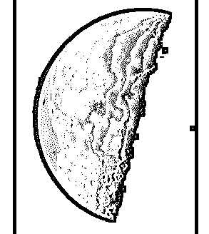
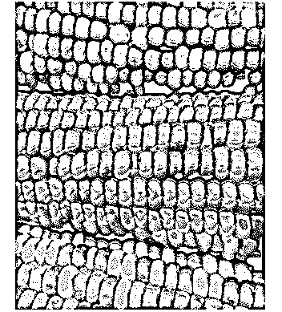

# Matlab Imread

> 原文：<https://www.educba.com/matlab-imread/>

## Matlab Imread 简介

在 MATLAB 中使用 Imread 函数从图形文件中读取图像或色标，这些文件的格式有“bmp”、“cur”、“gif”、“jpg”、“hdf”、“ico”等。如果 Imread 函数的语法中没有提到格式，它会从文件的内容中推断出格式。Imread 函数只将一个图像“读入”到我们发起的变量中；为了在我们的作品上显示图像，我们需要结合使用' imshow '函数和 imread 函数。

我们从中读取图像的图形文件可以在 MATLAB 目录中，也可以是我们保存的文件。

<small>Hadoop、数据科学、统计学&其他</small>

**下表显示了 Imread 函数支持的一些格式:**

| **格式** | **描述** | **变体** |
| 1.骨形态发生蛋白 | 位图 | 1、4、8、16、32 位未压缩图像 |
| 2.'诅咒' | 光标资源 | 1、4、8 位未压缩图像 |
| 3.' gif ' | 图形交换格式 | 1 转换为 8 位图像 |
| 4.' hdf ' | 分层数据格式 | 8 位栅格，带或不带色彩映射表 |
| 5.ico | 图标资源 | 1、4、8 位未压缩图像 |

**现在让我们了解一下 MATLAB 中 Imread 函数的语法:**

**语法**

1.  I = imread(文件)
2.  I = imread(文件，fmt)

**描述:**

1.  **I = imread (file)** 将读取由参数‘file’指定的图像因为我们没有在这个语法中传递任何格式参数，所以它将从文件的内容中推断出格式。如果文件有多个图像，imread 将只读取第一个图像。如果我们希望 imread 读取第一个图像以外的图像，我们必须将图像的编号作为参数传递。
2.  **I = imread (file，fmt)** 将读取作为参数传递的文件中的彩色图像或灰度图像。在这个语法中，我们还指定了文件的格式。

### Matlab Imread 示例

现在，让我们借助各种示例来理解在 MATLAB 中使用“imread (file)函数”从文件中读取图像的代码。

#### 示例#1

在本例中，我们将从“moon.tif”文件中读取一幅图像，该文件位于 MATLAB 的目录中。以下是需要遵循的步骤:

1.  调用 imread 函数来读取图像。
2.  调用 imshow 函数来显示在我们的工作区中读取的图像

**代码:**

`I = imread (‘moon.tif’)`

[Using the imread function to read the image of the moon]

`imshow (I)`

[Passing the image read in the above step to imshow function. This will display the image in our workspace]

**输入:**

`I = imread ('moon.tif')
imshow (I)`

**输出:**

正如我们在输出中看到的，我们获得了一幅月球的图像，这是从 MATLAB 的文件中读取的。

#### 实施例 2

在本例中，我们将从 MATLAB 目录下的“kids.tif”文件中读取一幅图像。以下是需要遵循的步骤:

1.  调用 imread 函数来读取图像。
2.  调用 imshow 函数来显示在我们的工作区中读取的图像

**代码:**

`I = imread (‘kids.tif’)`

[Using the imread function to read the image of the kids]

`imshow (I)`

[Passing the image read in the above step to imshow function. This will display the image in our workspace]

**输入:**

`I = imread ('kids.tif')
imshow (I)`

**输出:**

正如我们在输出中看到的，我们已经获得了孩子们的图像，这是我们从 MATLAB 的文件中读取的。

在上面的两个例子中，我们读取了输入文件中第一个位置的图像。接下来，我们将学习如果文件有多个图像，如何读取特定的图像。

#### 实施例 3

在本例中，我们将从“corn.tif”文件中读取第 3 张至张图片，该文件位于 MATLAB 的目录中。以下是需要遵循的步骤:

1.  调用 imread 函数并传递“3”作为第二个参数来读取第三个图像。
2.  调用 imshow 函数来显示在我们的工作区中读取的图像

**代码:**

`I = imread (‘corn.tif’, 3)`

[Using the imread function to read the image of the corns. The second argument passed represents the position of the image which we want to read in the file]

`imshow (I)`

[Passing the image read in the above step to imshow function. This will display the image in our workspace]

**输入:**

`I = imread ('corn.tif', 3)
imshow (I)`

**输出:**

正如我们在输出中所看到的，我们已经获得了一个图像，它出现在文件“玉米. tif”中的位置 3，这是我们从 MATLAB 的目录中读取的。

在上面的所有例子中，我们已经从“tif”文件中读取了图像。接下来，我们将学习如何从“png”格式中读取图像。

#### 实施例 4

在本例中，我们将从“peppers.png”文件中读取一个图像，该文件位于 MATLAB 目录中。以下是需要遵循的步骤:

1.  调用 imread 函数来读取图像。
2.  调用 imshow 函数来显示在我们的工作区中读取的图像

**代码:**

`I = imread (‘peppers.png’)`

[Using the imread function to read the image from png file]

`imshow (I)`

[Passing the image read in the above step to imshow function. This will display the image in our workspace]

**输入:**

`I = imread ('peppers.png')
imshow (I)`

**输出:**

正如我们在输出中看到的，我们已经获得了辣椒的图像，它是从一个 png 文件中读取的。

### 结论

1.  在 MATLAB 中使用 Imread 从图形文件中读取图像。MATLAB 支持各种格式，我们可以从中读取图像
2.  Imread 函数也可以用来从多图像文件中读取图像

### 推荐文章

这是一个 Matlab Imread 指南。这里我们讨论 Matlab Imread 的各种例子，以及代码和输出。您也可以看看以下文章，了解更多信息–

1.  [Matlab 符号](https://www.educba.com/matlab-syms/)
2.  [震级 Matlab](https://www.educba.com/magnitude-matlab/)
3.  [卷积 Matlab](https://www.educba.com/convolution-matlab/)
4.  [带通滤波器 Matlab](https://www.educba.com/bandpass-filter-matlab/)

