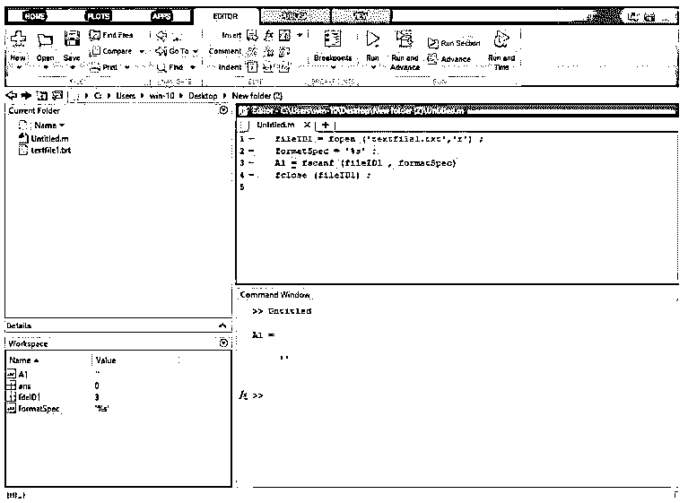
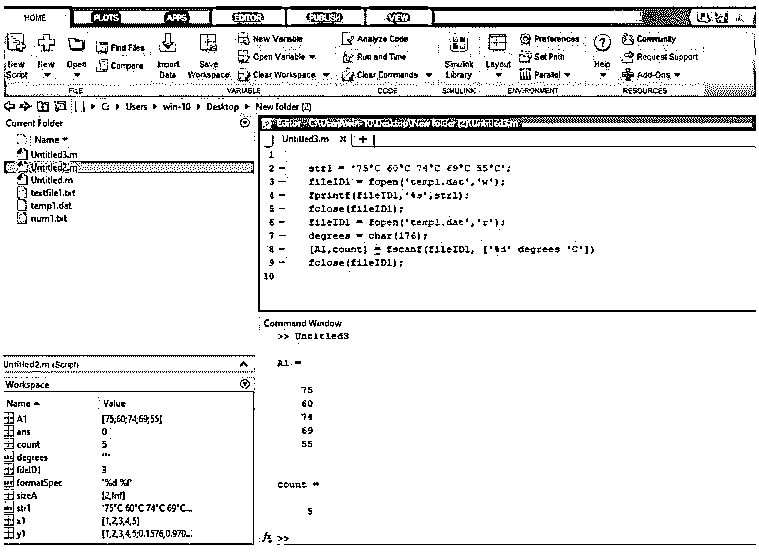

# fscanf Matlab

> 原文：<https://www.educba.com/fscanf-matlab/>

## fscanf Matlab 简介

在某些应用程序中，需要访问文本文件来执行从文本文件中读取数据、在文本文件中写入数据等操作。为了从文本文件中读取数据，我们使用 fscanf 语句。fscanf 是 MatLab 上的一个内置函数，用于从文本文件中读取数据。txt 扩展名)。为了读取数据，首先，我们必须需要使用 fopen 语句打开该文件，并且我们指定读取“r”的访问模式的类型。

**语法:**

<small>Hadoop、数据科学、统计学&其他</small>

fscanf Matlab 的语法如下所示:

`A = fscanf (fileID,formatSpec)`

`A = fscanf (fileID,formatSpec,sizeA)`

`[A,count] = fscanf (_)`

### Matlab fscanf 怎么做？

为了从文本文件中读取数据，我们使用 fscanf 语句。强制使用 fopen 语句打开文件。在 fopen 语句中，我们编写了一个想要打开的文本文件名，并指定了一种访问模式。

使用 fscanf 语句读取文本文件的步骤:

*   **第一步:**首先用 fopen 语句打开一个文件，指定访问方式的类型。
*   **步骤 2:** 指定指定的格式，如果需要，则指定 sizeA。
*   **第三步:**然后，我们使用 fscanf 语句，显示读取的数据。
*   **第四步:**使用 fclose 语句关闭文件。

### fscanf Matlab 示例

下面是 fscanf Matlab 的例子:

#### 示例#1

让我们看看阅读操作的例子；对于读取操作，我们取一个文本文件 textfile1.txt，对于读取操作，首先，我们指定使用 fopen 语句的访问类型，我们将 fopen 放在括号中，我们取我们要读取的文本文件名(filetext1.txt)和读取文件的访问类型，这由“r”指定，逗号分隔这两个参数。然后使用我们定义为浮点型的“formatspec”来指定格式。然后我们使用 fscanf 语句；基本上，它用于读取文本文件。我们将 fscanf 放在括号中，编写一个文件标识符 fileID1(文本文件由文件标识符 fileID1 表示)和格式说明符，格式说明符是我们之前定义的 formatSpec，这两个参数由逗号分隔。这读取存储在变量 A1 的数据。我们使用 fclose 语句关闭文件。

**代码:**

`fileID1 = fopen ('textfile1.txt','r') ;
formatSpec = '%s' ;
A1 = fscanf (fileID1 , formatSpec)
fclose (fileID1) ;`

**输出:**

**

** 

#### 实施例 2

让我们考虑另一个例子；在这个例子中，我们取一个整数作为浮点数，整数存储在 x1 变量中，浮点数是用 rand 函数创建的(rand 函数返回一个随机浮点数)，这些浮点数存储在 y1 变量中。然后我们使用 fopen 语句打开一个文件，然后使用 fprintf 语句写入这些数字，然后使用 fclose 语句关闭该文件。然后我们使用类型函数来查看数据；type 函数用于显示内容的数据。然后我们使用 fopen 语句再次打开一个文件，我们在 reading 'r '中指定访问模式的类型，然后我们将那个 fopen 返回数据赋给 fileID1fileID1 是打开文件的文件标识符。然后我们在格式说明符(formatSpec)上指定格式，那么 sizeA，sizeA 必须是正整数。然后我们取一个 fscanf 语句，在 fscanf 的括号里，取一个文件标识符(fileID1)，格式说明符(formatSpec)和一个 sizeA，返回的读取数据都存储在 A1 变量里。然后我们需要使用 fclose 语句关闭打开的文件。然后我们用一个转置符号来转置 A1。然后我们在命令窗口中看到一个结果。

**代码:**

`x1 = 1:1:5;
y1 = [x1;rand(1,5)];
fileID1 =fopen('num1.txt','w');
fprintf(fileID1,'%d %4.4f\n',y1);
fclose(fileID1);
type num1.txt
fileID1 = fopen('num1.txt','r');
formatSpec = '%d %f';
sizeA = [2 Inf];
A1 = fscanf(fileID1,formatSpec,sizeA)
fclose(fileID1);
A1 = A1'`

**输出:**

**

** 

#### 实施例 3

让我们看一个与 fscanf 语句相关的例子；在这个例子中，我们跳过了字符串中的 C 文本。我们在变量 str1 上取一个温度字符串。我们使用 fopen 语句打开一个 temp1.txt 文件，并指定要写入的访问模式类型，这些 fopen 语句分配给文件标识符 fileID1。然后，我们使用 fprintf 语句将该温度字符串写入 temp1.txt 文件。然后，我们使用 fclose 语句关闭打开文件。然后，我们使用 fopen 语句再次打开该文件进行读取；在 fopen 中，我们将访问模式的类型指定为 read 'r '，然后将其分配给文件标识符 fileID1。C 的 ASCII 码是 176；这些被传递给度变量。然后我们取一个 fscanf 语句；在 fscanf 中，我们取一个打开文件的文件标识符，在方括号中，我们取一个除了 C 以外的整数度数，这些数据赋给 A1 和 count。A1 是一个温度，在计数器中存储一个温度值。然后我们简单地使用 fclose 语句关闭打开文件。

**代码:**

`str1 = '75°C 60°C 74°C 69°C 55°C';
fileID1 = fopen('temp1.dat','w');
fprintf(fileID1,'%s',str1);
fclose(fileID1);
fileID1 = fopen('temp1.dat','r');
degrees = char(176);
[A1,count] = fscanf(fileID1, ['%d' degrees 'C'])
fclose(fileID1);`

**输出:**

**

** 

### 结论

在本文中，我们看到了 fscanf 的概念；基本上，fscanf 用于从文本文件中读取数据。然后看到了与 fscanf 语句相关的语法，以及如何在 MatLab 代码中使用它。此外，我们还看到了一些与 fscanf 语句相关的示例。

### 推荐文章

这是一个 fscanf Matlab 的指南。这里我们讨论一下入门，Matlab fscanf 怎么做？并分别举例说明。您也可以看看以下文章，了解更多信息–

1.  [Matlab 绘图标题](https://www.educba.com/matlab-plot-title/)
2.  [Matlab 堆积条形图](https://www.educba.com/matlab-stacked-bar/)
3.  [Matlab 排序](https://www.educba.com/matlab-sort/)
4.  [带通滤波器 Matlab](https://www.educba.com/bandpass-filter-matlab/)

