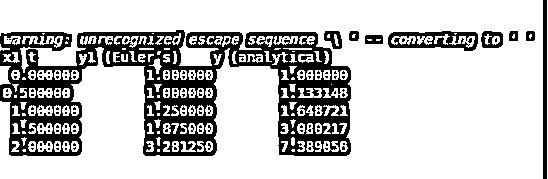
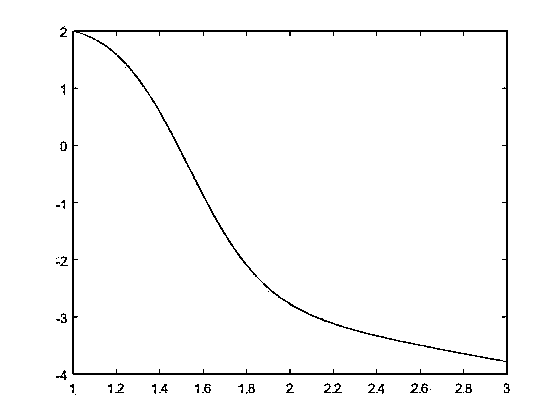

# 欧拉方法 Matlab

> 原文：<https://www.educba.com/euler-method-matlab/>

## 欧拉方法介绍 Matlab

要分析微分方程，我们可以用欧拉的方法。求解给定初值的一阶一次微分方程的一种数值方法称为欧拉法。欧拉方法是最简单的龙格-库塔方法。步长的误差对应于步长的平方，给定时间的误差对应于步长，这不过是欧拉方法的一阶技术。欧拉方法是常微分方程数值积分的最基本的强调方法。在这个主题中，我们将学习欧拉法 Matlab。

当我们有一个困难的时间-解决微分方程的近似行为，欧拉的方法被使用。

<small>Hadoop、数据科学、统计学&其他</small>

**语法**

欧拉方法的语法如下所示

`T1=a:g:b;
(y(j+1) = y(j) + g * f(x(j),y(j)))
E=[T1' Y']`

哪里-

a 和 b 是起点和终点，g 是步长，E =[T1′Y′]其中 T 是横坐标矢量，Y 是纵坐标矢量。

### 欧拉法在 Matlab 中是如何工作的？

欧拉方法的步骤

**步骤 1:** 初始条件和设置

**第二步:**加载步长

**第三步:**加载起始值

**第四步:**加载结束值

**第五步:**分配结果

**第六步:**加载起始值

**第七步:**给定微分方程的表达式

### 例子

下面举几个例子

#### 示例#1

让我们看一个欧拉法则初始条件的例子；现在我们首先定义函数有两个变量，所以我们应该有两个自变量。我们有第一个或初始条件，y1 在 x1 sub 0 处的值。步长为 0.5，因此我们为侧边定义步长，由于我们有一个解的表格表示，我们定义了表格的标题，因此我们在这里有左列的 x1，我们将有中间的欧拉解和解析解。我们定义表的第一行，因为我们知道域的初始值或域的初始起点；我们有 y1 的初始值，我们可以计算初值，或者在区域开始的解函数的值。现在，我们进行一个循环，通常从第一个点开始计算 z1，下一个点的步长是 h1，我们还有增量，或者我们都通过解直到 x1 和负边。现在在循环内部，我们有这是欧拉公式，我们有当前解的 y1，我们有微分方程乘以一条边来计算下一步的值，这里我们计算 bx1 作为下一步。最后，我们打印下一步的结果，以对其他值进行循环，最后，我们结束循环。

**Matlab 代码:**

`clc;
clear all;
close all;
dy1 = @(x1, y1) x1*y1;
f1 = @(x1) exp (x1^2/2);
x0 = 0;
xn1 = 2;
y1 = 1;
h1 =0.5;
fprintf ('x1\ t\t y1 (Euler’s) \t y (analytical) \n')
fprintf (' %f \t %f \t %f\n', x0, y1, f1(x0));
for x1= x0 : h1 : xn1-h1
y1 = y1 + dy1(x1, y1)*h1;
d1 = x1 + h1;
fprintf ('%f \t %f \t %f \n ', d1,y1,f1(d1))
end;`

**输出:**

图 1

这是步长为 0.5 的解。我们注意到有很大的不同，尤其是在最后一排。我们可以改变步长(h1)来查看其他更好的结果。

#### 实施例 2

我们以绘制欧拉方法为例；示例如下:-

`dy/dt = y^2 - 5t           y(0) = 0.5
1 ≤ t ≤ 3                       ∆t = 0.01`

我们已经在封闭区间 1 到 3 内解决了这个问题，我们的步长是 0.01。所以我们可以拿 200 个点，以 0.01 的差达到 1 比 3。假设 t 的值等于 0，从 201 到 1，我们会在相应的点上计算 y，从 201 到 1。现在，我们知道我们的初始点是 1 2，所以我们会说让我们取第一个值 1。那么对于 y，我们要取第一个值为 1。现在我们只需要设置变量 I，我们只需要一个循环，对于 I = 1 到 200，在循环内部，对于 t 的每个后续值，在第 I 个值之后，我们加上 0.01。然后对于 y，取 I 加 1 等于我们想要的前一个 y 值(y(i))并在其中加上 0.01，我们将会看到一个值数组，所以我在乘法符号 y(i)前放了一个点，然后我把一个点放在 2 的幂上，然后我们减去 4 乘以 t(i)，最后结束循环。现在我们取一个图 t，y，它是一个图(t，y)。

**Matlab 代码:**

`clc;
clear all;
close all;
t = zeros (201,1);
y = zeros (201,1);
t(1) = 1;
y(1) = 2;
for i= 1 : 200
t(i+1) = t(i) + 0.01;
y(i+1) =y(i) + 0.01 .* (( y(i).^2) - 5.*(t(i)));
end
plot(t, y);`

**输出:**

图 2

### 结论

在本文中，我们看到了欧拉方法的概念；基本上是用欧拉法求解一阶一次微分方程，给定初值。然后看到了与欧拉方法语句相关的语法以及它在 MatLab 中是如何工作的。此外，我们还看到了一些与欧拉方法相关的例子。

### 推荐文章

这是一个欧拉法 Matlab 指南。这里我们讨论欧拉方法的概念；基本上是用欧拉法求解给定初值的一阶一次微分方程。您也可以看看以下文章，了解更多信息–

1.  [Matlab 符号](https://www.educba.com/matlab-syms/)
2.  [Matlab 变量](https://www.educba.com/matlab-variables/)
3.  [带通滤波器 Matlab](https://www.educba.com/bandpass-filter-matlab/)
4.  [Matlab 排序](https://www.educba.com/matlab-sort/)

