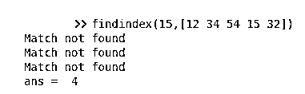
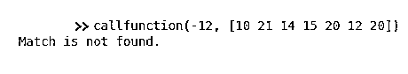
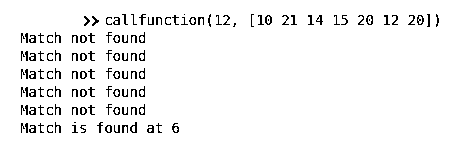
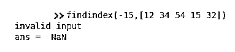
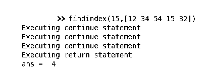

# Matlab 返回

> 原文：<https://www.educba.com/matlab-return/>

## MATLAB 返回简介

在计算机程序设计中，定义了一条返回语句，执行该语句可以将控制权从调用子例程返回给父子例程。执行流程在程序代码中紧接着指令的那一点重新开始，这一点称为它的返回地址，代码的运行范围可以定义为被调用的子例程。在没有父子例程的情况下，return 语句将执行控制权返回给命令提示符。在这个主题中，我们将学习 Matlab 返回。

**语法**

<small>Hadoop、数据科学、统计学&其他</small>

return 命令将控制重定向到调用脚本或函数，而不是让 MATLAB 执行被调用子例程中的其余连续命令。当脚本或函数包含返回时，MATLAB 只将控件重定向到命令提示符，并且没有从任何调用程序调用它。

对于这两种情况，语法都是单个命令指令，即 return

### 返回语句的用例

根据程序的技术要求，在不同的条件下使用返回命令。它还可以用于数据有效性检查功能。下面讨论了一些重要的用例。

#### 1.将控制带到键盘

如果一个程序需要用户在某个特定条件发生时采取行动，当前的子程序或函数可以被直接调用，而不用被任何父子程序触发，当执行“返回”命令时，控制流返回到命令提示符或键盘。

**举例:**

下面的代码片段定义了一个函数 findindex()，其中 return 命令有两个用途:

1.  对输入数据执行验证检查
2.  一旦找到匹配，就将控制权返回给键盘

`%Defining findindex() , the called subroutine
function Index = findindex(inputval,referenceArray)
%Using return statement for data validation
Index = NaN;
if inputval< 0
disp('invalid input')
return
end
%Using return statement on achieving the program objective i.e. finding matching element
for Index = 1:length(referenceArray)
if referenceArray(Index) == inputval
return;
else
disp('Match not found')
end
end
endfunction`

**情况 1:**return 语句在给出负输入时执行

`findindex(-15,[12 34 54 15 32])`

**输出:**

**情况 2:** 发现输入数据匹配时执行 return 语句

`findindex(15,[12 34 54 15 32])`

**输出:**

#### 2.将执行流从被调用的子例程重定向到父(调用)子例程

如果程序需要在某些特定条件发生时将控制流重新路由到调用子例程或调用函数。当它的父子程序触发当前子程序或函数中的电流，并执行命令' return '时，它可以被执行。

**举例:**

下面的代码片段在另一个函数 callfunction()中定义了一个函数 findindex()，其中 return 命令有两个用途:

*   对 findindex()函数的输入数据执行有效性检查
*   将控制从 findfunction()返回命令返回到 callfunction()

`%Defining findindex() , the called subroutine
function Index = findindex(inputval,referenceArray)
%Using return statement for data validation Index = NaN;if inputval< 0   returnend
%Using return statement on achieving the program objective
for Index = 1:length(referenceArray)    if referenceArray(Index) == inputval        return; elsedisp('Match not found')endendendfunction
%Defining callfunction() , the calling subroutine
function resultfunc = callfunction(inputval,referenceArray)result=findindex(inputval,referenceArray); if isnan(result)disp('Match is not found.')    elsedisp(['Match is found at ' num2str(result)])    endendfunction`

**情况 1:**return 语句在给出负输入时执行

`callfunction(-12, [10 21 14 15 20 12 20])`

**情况 2:** 发现输入数据匹配时执行 return 语句

`callfunction(12, [10 21 14 15 20 12 20])`

**输出:**

#### 3.在循环中使用 return 和 continue 语句

程序可以灵活地决定在什么条件下控制流应该被重新路由到它的调用子程序或命令提示符，以及在什么条件下将强制流停留在当前系统中。

**举例:**

下面的代码片段在另一个函数 callfunction()中定义了一个函数 findindex()，其中 return 命令有两个用途:

*   对 findindex()函数的输入数据执行有效性检查
*   将控制从 findfunction()返回到 callfunction()，当找到匹配时返回命令，当没有找到匹配的元素时使用命令“continue”使流停留在循环中。

**举例:**

`%Defining findindex()
function Index = findindex(inputval,referenceArray)
Index = NaN;
if inputval< 0
return
end
%Beginning of the loop
for Index = 1:length(referenceArray)
if referenceArray(Index) == inputval
disp('Executing return statement')
return ;
else
disp('Executing continue statement')
continue;
end
end
endfunction`

**情况 1:**return 语句在给出负输入时执行

`findindex(-15,[12 34 54 15 32])`

**输出:**

**情况 2:** 基于查找匹配或非匹配元素的返回和继续语句执行

`findindex(15,[12 34 54 15 32])`

**输出:**

### Matlab 回归的优势

一旦满足所需条件，使用 return 语句可以防止执行不需要的功能。因此，它提高了代码质量，优化了代码执行。因为它减少了要执行的指令数量，所以也减少了程序的执行时间。因此它

使执行更快，从而提高性能。return 语句与“continues”语句的结合使用为程序提供了灵活性，使其能够决定是重新路由控制流还是在代码的当前范围内保持运行。

### 附加说明

在条件块(如 if 或 switch)或循环控制语句(如 f or 或 While)中使用 return 时，程序员需要小心。在 MATLAB 中，当控制流到达条件块中的 return 语句时，它只是退出循环，并退出执行 return 命令的脚本或函数。因此，它直接将控制返回给调用子例程或命令提示符。

在 MATLAB 中，不支持使用 return 语句返回值。要发送返回值，需要设置每个“out”参数的值。函数可以返回多个参数作为返回值。

### 推荐文章

这是一个 Matlab 返回的指南。在这里，我们讨论 return 语句的用例以及示例、案例和输出。您也可以看看以下文章，了解更多信息–

1.  [Matlab fplot()](https://www.educba.com/matlab-fplot/)
2.  [点积 MATLAB](https://www.educba.com/dot-product-matlab/)
3.  [震级 Matlab](https://www.educba.com/magnitude-matlab/)
4.  [雅可比 Matlab](https://www.educba.com/jacobian-matlab/)

