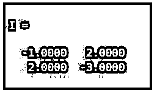
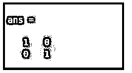
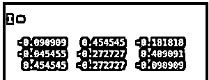
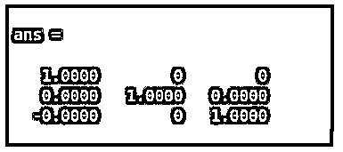
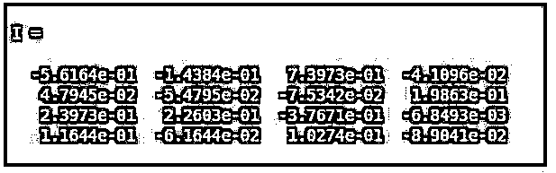
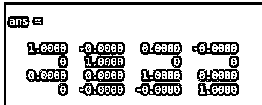

# Matlab 矩阵求逆

> 原文：<https://www.educba.com/matlab-matrix-inverse/>

## Matlab 矩阵求逆简介

以下文章提供了 Matlab 矩阵求逆的概要。与任何矩阵相反，“M”被定义为当与矩阵 M 相乘时，给出单位矩阵作为输出的矩阵。逆矩阵用符号 M–1 表示。因此，根据定义，如果我们将 M 乘以 M–1，我们将在输出中得到一个单位矩阵。矩阵有逆矩阵的前提是它必须是方阵，并且矩阵的行列式不应该等于零。

**Matlab 中求矩阵逆的语法:**

<small>Hadoop、数据科学、统计学&其他</small>

`I = inv (M)`

**描述:**

*   I = inv (M)用于获取输入矩阵 M 的逆矩阵，请记住这里的‘M’必须是方阵。

### Matlab 矩阵求逆的例子

下面给出了 Matlab 矩阵求逆的例子:

#### 示例#1

在第一个例子中，我们将得到一个 2 X 2 矩阵的逆矩阵。

下面是我们在这个例子中要遵循的步骤:

*   定义要计算其逆矩阵的矩阵。
*   将此矩阵作为输入传递给反函数。
*   通过将输入矩阵乘以输出矩阵来验证结果。这将给出一个单位矩阵作为输出。

**代码:**

m =[3 ^ 2；2 1];

[Creating a 2 X 2 square matrix]

I = inv(M)

[Passing the input matrix to the function inv] [Please note that, since we have used a 2 x 2 matrix as the input, our output matrix will also be a 2 X 2 matrix. This, when multiplied with the input matrix, will give an identity matrix as the output]

我*M

[Code to verify that ‘I’ is inverse of ‘M’. This should give an identity matrix as the output]

这是我们的输入和输出在 MATLAB 命令窗口中的样子:

**输入:**

`M = [3 2 ; 2 1];
I = inv(M)
I*M`

**输出 1:(逆矩阵)**

**输出 2:(这应该是一个单位矩阵)**

正如我们在输出 1 中看到的，函数“inv”给出了输入矩阵的逆矩阵。输出 2 验证“I”是“M”的倒数。

#### 实施例 2

在这个例子中，我们将得到一个 3×3 矩阵的逆矩阵。

下面是我们在这个例子中要遵循的步骤:

*   定义要计算其逆矩阵的 3 X 3 矩阵。
*   将此矩阵作为输入传递给反函数。
*   通过将输入矩阵乘以输出矩阵来验证结果。这将给出一个单位矩阵作为输出。

**代码:**

m =[3 2 3；4 2 1;3 4 1];

[Creating a 3 X 3 square matrix]

I = inv(M)

[Passing the 3 X 3 input matrix to the function inv] [Please note that, since we have used a 3 x 3 matrix as the input, our output matrix will also be a 3 X 3 matrix. This, when multiplied with the input matrix, will give an identity matrix as the output]

我*M

[Code to verify that ‘I’ is inverse of ‘M’. This should give an identity matrix as the output]

这是我们的输入和输出在 MATLAB 命令窗口中的样子:

**输入:**

`M = [3 2 3; 4 2 1; 3 4 1];
I = inv(M)
I*M`

**输出 1:(逆矩阵)**

**<u>

</u>** 

**输出 2:(这应该是一个单位矩阵)**

**

** 

正如我们在输出 1 中看到的，函数“inv”给出了输入矩阵的逆矩阵。输出 2 验证“I”是“M”的倒数。

#### 实施例 3

在这个例子中，我们将得到一个 4 X 4 矩阵的逆矩阵。

下面是我们在这个例子中要遵循的步骤:

*   定义要计算其逆矩阵的 4 X 4 矩阵。
*   将此矩阵作为输入传递给反函数。
*   通过将输入矩阵乘以输出矩阵来验证结果。这将给出一个单位矩阵作为输出。

**代码:**

m =[1 3 3 6；4 2 8 2;3 3 4 5;2 6 3 1];

[Creating a 4 X 4 square matrix]

I = inv(M)

[Passing the 4 X 4 input matrix to the function inv] [Please note that, since we have used a 4 x 4 matrix as the input, our output matrix will also be a 4 X 4 matrix. This, when multiplied with the input matrix, will give an identity matrix as the output]

我*M

[Code to verify that ‘I’ is inverse of ‘M’. This should give an identity matrix as the output]

这是我们的输入和输出在 MATLAB 命令窗口中的样子:

**输入:**

`M = [1 3 3 6; 4 2 8 2; 3 3 4 5; 2 6 3 1];
I = inv(M)
I*M`

**输出 1:(逆矩阵)**

**输出 2:(这应该是一个单位矩阵)**

**<u>

</u>** 

正如我们在输出 1 中看到的，函数“inv”给出了输入矩阵的逆矩阵。输出 2 验证“I”是“M”的倒数。

### 结论

与任何矩阵相反，“M”被定义为当与矩阵 M 相乘时，给出单位矩阵作为输出的矩阵。我们使用 Matlab 中的函数“inv”来获得矩阵的逆矩阵。我们只能找到方阵的逆矩阵。

### 推荐文章

这是一个 Matlab 矩阵求逆的指南。这里我们分别结合实例讨论 Matlab 矩阵求逆的介绍。您也可以看看以下文章，了解更多信息–

1.  [Matlab 排序](https://www.educba.com/matlab-sort/)
2.  [Matlab 自相关](https://www.educba.com/matlab-autocorrelation/)
3.  [Matlab 变量](https://www.educba.com/matlab-variables/)
4.  [Matlab 导入数据](https://www.educba.com/matlab-import-data/)

