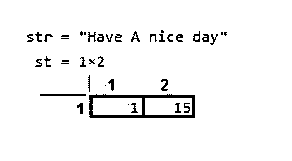
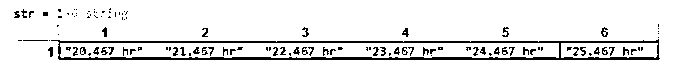
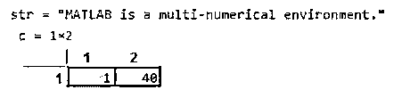

# Matlab 字符串

> 原文：<https://www.educba.com/matlab-string/>

## Matlab 字符串介绍

Matlab string 用于表示字符序列中的数据。它使用字符串数组而不是字符格式来表示类似文本的数据。它将每个元素存储成一个序列格式。在其中，我们可以将文本、数字、特殊符号、日期时间、持续时间或日历持续时间数组等数据表示成一个字符串数组。它的函数将数据类型从输入数组转换为字符串数组格式。如果数据已经存储在一个表示数字的字符串数组中，那么通过使用 double 函数，我们可以将它转换为一个数字数组。

**语法:**

<small>Hadoop、数据科学、统计学&其他</small>

`str = string(A)`

`str = string(D)`

### 字符串数据类型在 Matlab 中是如何工作的？

它用于将输入数据表示成序列格式。使用 Matlab 字符串函数有以下简单的步骤。

*   **第一步:**加载数据，可以是任意格式。
*   第二步:使用适当的语法。
*   **第三步:**执行 Matlab 代码获取输出。

### Matlab 字符串示例

下面是提到的例子:

#### 示例#1

在这个例子中，我们可以使用 Matlab 字符串函数将文本数组转换为字符串数组，然后测量该数组的大小。它用于将输入数据表示成序列格式。首先，您获取不同格式的数据，如文本、数字、特殊符号、日期时间、持续时间或日历持续时间数组，这些数据可以使用函数以字符串格式表示。在这个例子中，我们获取文本数组格式的数据。然后我们创建一个包含文本格式单词的数组。" A = [' Have '，' A '，' nice '，' day ']；"这一行创建单词的文本数组。所以一个文本数据中总共有 4 个单词被放入一个数组中。我们知道，要将文本数组转换成字符串数组，我们需要使用函数。然后，我们使用具有适当语法的函数将输入数组转换为字符串数组。“str = string(A)”该语法用于将输入数组转换为字符串数组。

**代码:**

`clc;
clear all;
close all;
A = ['Have',' A',' nice',' day'];
str = string(A)
st = size(A)`

**输出:**

执行 Matlab 代码后，输入数组被转换为字符串数组和生成数组。

#### 实施例 2

在这个例子中，我们可以使用 Matlab 字符串函数将持续时间数组转换为字符串数组。正如我们所知，它用于将输入数据表示成序列或字符串格式。首先你获取数据，这里的数据是持续时间格式的。为此，我们创建一个持续时间数组。" D =小时(20:25) +分钟(28) +秒钟(2.2345)；"这一行用于将数据放入持续时间数组。数据在持续时间数组中，包括小时、分钟和秒类型的数据。我们知道，要将持续时间数组转换为字符串数组，我们需要使用函数。然后，我们使用具有适当语法的函数将持续时间数组转换为字符串数组。“str = string(D)”此语法用于将输入数组转换为字符串数组，其中 D 是持续时间数组。“str”是创建的字符串数组。

**代码:**

`clc;
clear all;
close all;
D = hours(20:25) + minutes(28) + seconds(2.2345);
str = string(D)`

**输出:**

执行 Matlab 代码后，字符串数组被创建到命令窗口中。

#### 实施例 3

在这个例子中，我们可以使用 Matlab 字符串函数将字符向量转换为字符串数组。所以首先你需要数据。所以这里的数据是字符向量的格式。“A = ['MATLAB 是一个多数值环境。”];"这一行将字符向量赋给变量 a。然后我们使用带有适当语法的函数将持续时间数组转换为字符串数组。"str = string(A)"该语法用于将字符向量转换为字符串数组，其中 A 是字符向量," str "是创建的字符串数组。

**代码:**

`clc;
clear all;
close all;
A = ['MATLAB is a multi-numerical environment.'];
str = string(A)
c = size(A)`

**输出:**

**

** 

### 结论

在本文中，我们看到了 Matlab 字符串的概念。基本上，它用于将数据类型从输入数组转换为字符串数组格式。然后我们看到了与字符串语句相关的语法，以及如何在 Matlab 中使用它。在将数据转换为字符串数组时，它起着非常重要的作用。

### 推荐文章

这是一个 Matlab 字符串指南。这里我们讨论一下介绍，字符串数据类型在 Matlab 中是如何工作的？和示例。您也可以看看以下文章，了解更多信息–

1.  [点积 MATLAB](https://www.educba.com/dot-product-matlab/)
2.  [卷积 Matlab](https://www.educba.com/convolution-matlab/)
3.  [聚 val MATLAB](https://www.educba.com/polyval-matlab/)
4.  [Matlab 中的字符串数组](https://www.educba.com/string-array-in-matlab/)

