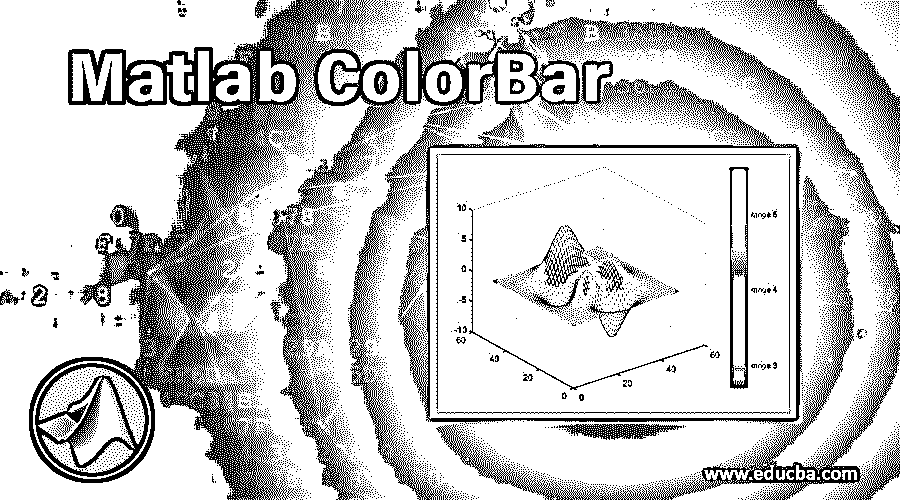
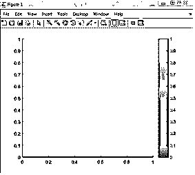
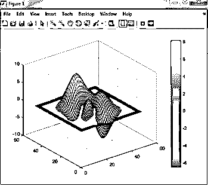
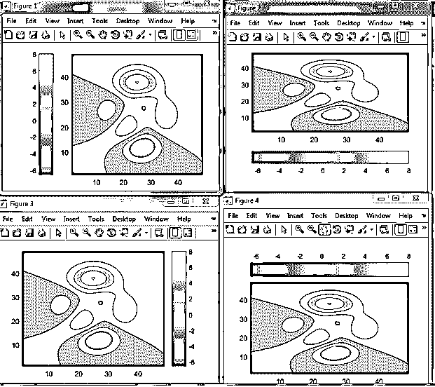
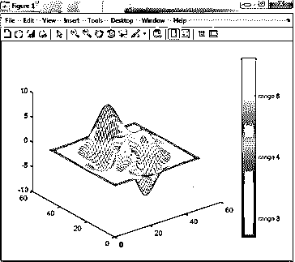

# Matlab 颜色栏

> 原文：<https://www.educba.com/matlab-colorbar/>

## Matlab 颜色栏简介

' Colorbar '功能用于以颜色的形式给出对象的特定范围的刻度。在颜色栏中，有各种属性为色标提供了额外的功能。颜色条的属性包括位置、名称、值、目标、关闭、目标关闭等。默认情况下，颜色条在图形绘图的右侧显示刻度。我们可以通过发出像外北、外西、外东、外南这样的命令来改变彩条的位置。通过使用命令的名称和值，我们可以给颜色条添加一个标题，并且我们可以改变颜色条的外观。该功能主要用于等高线、曲面、网格等绘图。在这个主题中，我们将学习 Matlab 颜色栏。

**语法:**

<small>Hadoop、数据科学、统计学&其他</small>

1.  彩条
2.  彩条(位置)
3.  变量名=colorbar()

### Colorbar 在 Matlab 中是如何工作的？

使用 colorbar 命令的步骤–

**第一步:**接受任何图形或图表

**步骤 2:** 编写颜色条命令，并将其赋给一个变量

**步骤 3:** 应用颜色条的属性

**第四步:**显示数字。

以上步骤是使用 colorbar 的一般步骤，我们可以根据开发和演示的需要修改这些步骤。

### Matlab 颜色栏示例

以下是下面提到的例子。

#### 示例#1

在示例 1 中，color bar 函数直接应用于一个变量，因此我们只能看到 color bar 列或 bar，而没有任何图形。由于我们没有提到颜色条的任何位置，因此，默认情况下，它将位于图的右侧。这里线宽提到 2.5。在命令窗口中，我们可以看到颜色栏的默认和内置属性。属性为线宽度在 0 到 1 的范围之外，字体大小为 9，位置为[ 0.5220 0.15 0.0376 0.7167 ]，单位为规范化单位。

示例 1 的 Matlab 代码

a = colorbar
b = a .线宽
a .线宽= 2.5

**命令窗口**

`>> Untitled
b =    0.5000
a =
ColorBar with properties :
Location : ' eastoutside '
Limits :  [0 1] FontSize :  9
Position : [0.5220 0.15 0.0376 0.7167] Units : ' normalized '
Show all properties`

**输出:**

#### 实施例 2

在本例中，我们使用了一个内置的“surf”图。在海浪中，有不同颜色的山峰。颜色强度显示峰的比例值。这里我们没有给绘图或颜色条分配任何变量，因此我们不能显示属性。

例如 Matlab 代码

`clear all ;
clc ;
surf (peaks)
colorbar`

**输出:**

#### 实施例 3

在示例 3 中，我们使用了内置的等高线图。在这个例子中，我们已经声明了颜色条的位置，因此它将根据代码占据绘图的位置。在这里，我们已经声明了西外、东外、南外和北外的位置。

例 3 的 Matlab 代码

`contourf (peaks)
a = colorbar
a . Location = ' westoutside '
figure ( ) ;
contourf(peaks)
b = colorbar
b . Location = ' southoutside '
figure( ) ;
contourf(peaks)
c = colorbar
c . Location = ' eastoutside '
figure( ) ;
contourf(peaks)
d = colorbar
d . Location = ' northoutside '
figure( ) ;`

**命令窗口-**

`>> Untitled
a =
ColorBar with properties :
Location :  ' eastoutside '
Limits :   [ -6.5466 8 ] FontSize :  9
Position :  [0.8202 0.1095 0.0476 0.8167] Units :  ' normalized '
Show all properties
b =
ColorBar with properties :
Location : ' eastoutside '
Limits : [ -6.5466 8 ] FontSize : 9
Position : [ 0.8202 0.1095 0.0476 0.8167 ] Units :  ' normalized '
Show all properties
c =
ColorBar with properties :
Location : ' eastoutside '
Limits :  [ -6.5466 8 ] FontSize :  9
Position : [0.8202 0.1095 0.0476 0.8167] Units :  ' normalized '
d =
ColorBar with properties :
Location : ' eastoutside '
Limits :  [-6.5466 8] FontSize :  9
Position : [0.8202 0.1095 0.0476 0.8167] Units :   ' normalized '
Show all properties`

**输出:**

#### 实施例 4

在这个例子中，我们声明了 color bar 的另一个特性。网格是 Matlab 中内置的图形。这里我们提到了色条的刻度和刻度标签。我们可以给颜色条分配任何范围和任何标签。

`mesh(peaks)
colorbar ( ' Ticks ' , [-15, -10, -5, 0, 5, 10, 15] , . . .
' TickLabels ', { 'range 1' , 'range 2' , 'range 3' ,'range 4' ,'range 5' } )`

**输出:**

### 结论

在上面的例子中，我们看到了颜色条的不同属性，这增加了颜色条的有效和可靠的建模。大多数彩条仅用于三维绘图，因此彩条能有效地表示三维图形。颜色栏的属性包括位置、线宽、记号、记号标签、坐标、字体大小、界限和单位。

### 推荐文章

这是一个 Matlab 颜色栏的指南。在这里，我们将讨论如何在 Matlab 中使用 Colorbar，以及示例和输出。您也可以看看以下文章，了解更多信息–

1.  [Matlab 中的曲面图](https://www.educba.com/surface-plot-in-matlab/)
2.  [Matlab 中的平方根](https://www.educba.com/square-root-in-matlab/)
3.  [Matlab 中的自然日志](https://www.educba.com/natural-log-in-matlab/)
4.  [Matlab 反函数](https://www.educba.com/matlab-inverse-function/)

