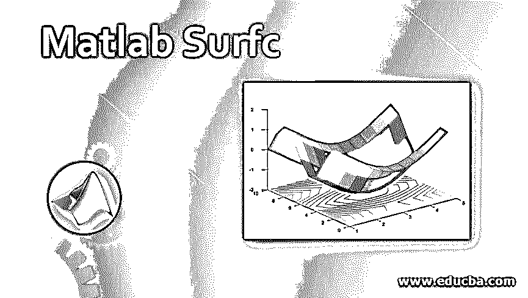
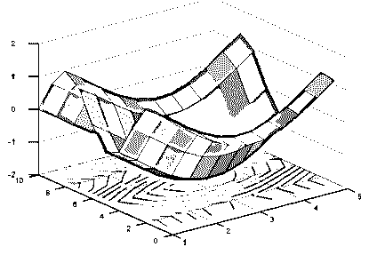
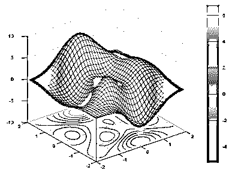
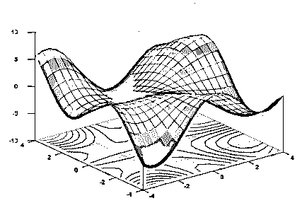

# Matlab Surfc

> 原文：<https://www.educba.com/matlab-surfc/>

## Matlab Surfc 简介

情节是一种向不了解特定主题背景知识的观众以图形方式解释结果的方式。它们非常有助于向没有任何技术前沿知识的人解释结果。Matlab 中有多个图形，用于各种商业目的。等高线图是在预测变量(X 和 Y 平面)的帮助下，有助于绘制三维图形的一种图。等高线图也称为水平图。在本主题中，我们将学习 Matlab Surfc。

### 用语法实现 Matlab 中的 surfc 函数

在 Matlab 中，等高线图用于在预测变量(X 和 Y)的帮助下绘制 Z 平面(响应变量)中的三维图形。绘制的三维图形称为等高线。如果我们想在曲面图下绘制等高线图，那么我们使用 Matlab 中的 surfc 函数。请找到以下用于绘制相同内容的语法:

<small>Hadoop、数据科学、统计学&其他</small>

*   **surfc (a，b，c):** 用于绘制一个三维的表面图和其下的等高线图。曲面图是一个三维图，其曲面由边和不同的面颜色组成。矩阵 c 中的值被绘制为 x-y 平面中网格上方的高度，其值由变量 a 和 b 给出。
*   **surfc (a，b，c，color):** 这个用来用给定的表面颜色画出图。
*   **surfc(c):** 用于绘制表面和轮廓图，以 c 中指定的行和列元素的值作为(x，y)坐标。
*   **surfc(轴值，_ _ _ _ _ _):**这将产生一个带有指定轴值的图，而不使用当前轴值。

*   **surfc (___，属性的名称，属性的值):**当我们想要使用绘图的任何属性并对绘图进行必要的定制时，使用该语法。我们可以根据业务需求分配属性的名称和价值。

### Matlab Surfc 示例

下面的例子描述了 Matlab 中 surfc 函数的使用:

#### 示例#1

借助矩阵在曲面图下显示等高线图。

`[a,b] = meshgrid(1:0.4:5,1:10);
c = cos(a) + sin(b);
surfc(a,b,c)`

**输出:**

在上述示例中，矩阵作为输入给出，等高线图绘制在曲面图下方。各个图的表面取其颜色和高度的函数值。

#### 实施例 2

要显示在曲面图下绘制等高线图时颜色图的使用:

`[a,b] = meshgrid(-2:.115:2);
c = peaks(a,b);
d = a.*b;
surfc(a,b,c,d)
colorbar`

**输出:**

在上面的例子中，我们指定了一个新的变量‘d’来使用表面和轮廓图中的颜色。使用变量“c”给出的高度值绘制表面图。使用 colormap 后，需要注意的是 c 和 d 的大小是一样的。在最后一部分中，我们在图中添加了一个颜色条，以显示颜色图的值和变量“d”中的值是如何相互对应的。

上述语法中使用的第一和第二输入值，即“a”和“b ”,是 x 和 y 坐标，可以用矩阵或向量的形式表示。如果这些值以矩阵的形式表示，那么它应该在一个维度上增加或减少，而在另一个维度上保持不变。用于为输入值创建矩阵的函数可通过使用 meshgrid 函数来实现。如果这些值以向量的形式表示，那么这些值应该增加或减少。第三个输入值“c”表示在每个 x-y 坐标值处绘制的表面图的高度。它应该至少有两行和两列，并以矩阵的形式表示。

图中有各种属性，可以通过属性的名称和值执行。请查找以下一些可用于自定义图的属性:

*   我们可以使用不同的值(如 flat、interp 或任何 RGB 三元组值)来更改绘图的边缘颜色。如果给定的值为“flat ”,那么每条边应该有不同的颜色，这可以由 CData 属性定义。如果值被给定为“interp ”,那么应该有由 CData 属性定义的每条边的插值颜色。我们也可以将 RGB 值分配给边缘。RGB 值决定红色、绿色和蓝色的强度级别。
*   我们还可以更改线条样式，如实线、虚线、点线或点划线，虚线是默认的线条样式。曲面的面颜色也可以用 flat、interp 或任何 RGB 值来更改。如果给定的值为“flat ”,那么每个表面应该有不同的颜色，这可以由 CData 属性定义。如果给定的值为“interp ”,那么应该有每个曲面的插值颜色，这可以由 CData 属性定义。我们也可以将 RGB 值分配给曲面。RGB 值决定红色、绿色和蓝色的强度级别。
*   我们还可以更改每个面的透明度级别，可以在 0 到 1 的特定范围内，平面、interp 或 texturemap。

#### 实施例 3

要将图的边缘颜色绘制为蓝色:

`[a,b] = meshgrid(-4:.4:4);
c = a.*sin(b) - b.*cos(a);
s = surfc(a,b,c,'EdgeColor','b');`

**输出:**

### 结论

等高线图可用于在地图上寻找地理位置，以确定相对于地面和水的存储容量和各种水平。它们具有各种其他属性，可以根据需要进行定制。

### 推荐文章

这是一个 Matlab Surfc 的指南。这里我们讨论的例子描述了 Matlab 中 surfc 函数的使用，以及它的工作原理和语法。您也可以看看以下文章，了解更多信息–

1.  [Matlab 中的 fmin search](https://www.educba.com/fminsearch-in-matlab/)
2.  [高斯拟合 Matlab](https://www.educba.com/gaussian-fit-matlab/)
3.  [Matlab 中的 2D 图](https://www.educba.com/2d-plots-in-matlab/)
4.  [Matlab 计数](https://www.educba.com/matlab-count/)

