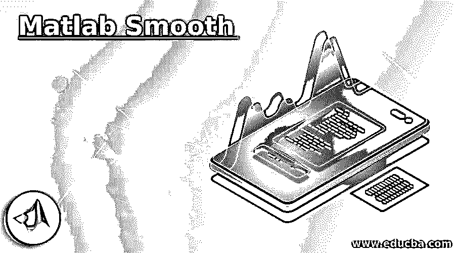
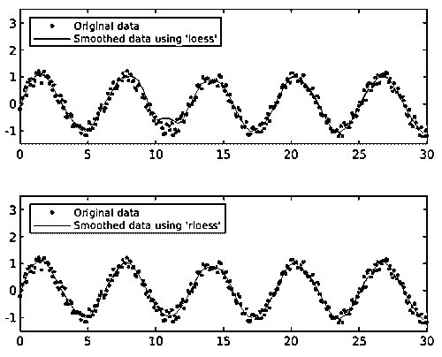
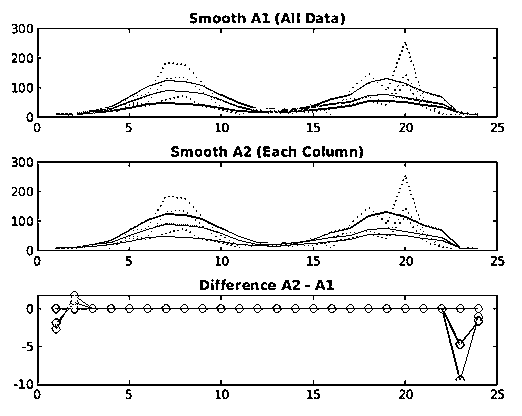

# Matlab 平滑

> 原文：<https://www.educba.com/matlab-smooth/>

## Matlab 平滑简介

“平滑”功能用于使用移动平均、Savitzky-Golay 过滤器和“lowess”模型等方法或通过拟合平滑样条曲线来平滑输入参数的响应。与过滤函数相比,“平滑”函数给出了不同的结果，因为平滑函数是在终点处理的。在 matlab 中，smooth 函数使用两个语句，一个是“smooth ”,另一个是“smoothdata”。“平滑”语句用于平滑响应数据。“smoothdata”语句用于平滑噪声数据。“smoothdata”语句提供了移动中值和高斯方法等选项。yy = smooth( y)用于平滑 y 变量中的响应数据

### Matlab 平滑的语法

与平滑响应数据相关的语法:

<small>Hadoop、数据科学、统计学&其他</small>

*   yy =平滑(y)
*   yy =平滑(y，跨度)
*   yy = smooth(y，方法)
*   yy =平滑(y，跨度，方法)
*   yy =平滑(y，' sgolay '，度数)
*   yy =平滑(y，span，' sgolay '，度数)
*   yy = smooth(x，y，**_ _ _ _ _ _**)

与平滑噪声数据相关的语法

*   B =平滑数据(A)
*   B = smoothdata(A,dim)
*   B = smoothdata(___，方法)
*   B = smoothdata(___，方法，窗口)
*   B = smoothdata(___，nanflag)
*   B = smoothdata(___，Name，Value)
*   [B，window] = smoothdata(___)

### Matlab 中的 Smooth 是如何工作的？

在 matlab 中，smooth 'smooth '语句用于平滑响应数据。“smoothdata”语句用于平滑噪声数据。

平滑响应数据的步骤:

*   第一步:第一个输入参数是接受变量。
*   **第二步:**然后我们使用“平滑”语句。
*   **第三步:**然后我们用“subplot”和“plot”来绘制平滑响应数据信号。

平滑噪声数据的步骤:

*   **步骤 1:** 取第一个输入信号中含有噪声的变量。
*   **第二步:**然后我们用“smoothdata”平滑有噪声的数据。
*   **第三步:**然后我们用“subplot”和“plot”来绘制平滑响应数据信号

### Matlab 平滑的例子

下面是一些例子:

#### 示例#1

让我们看一个 matlab 平滑的例子。一个基本平滑的函数，用于降低信号中的噪声。在这个例子中，我们讨论如何使用平滑函数来减少噪声。在这个例子中，我们在 0 到 30 的范围内取 Y，有 0.1 的差异。然后在 y 信号的帮助下产生连续和失真的信号 y。现在我们使用平滑语句来减少信号 Y = sin(Y)+0.5 *(rand(size(Y))-0.5)内的噪声。为了降低信号中的噪声，采用了黄土法和 rloess 法。处理后的信号分别存储在 yy1 和 yy2。现在使用 subplot 和 plot 函数来绘制数据。子图(2，1，1)和图(Y，Y，' b . '，Y，yy1，' r-')用于使用“黄土”方法绘制平滑数据。子图(2，1，2)和 plot(Y，Y，' b . '，Y，yy2，' r-')用于使用“rloess”方法绘制平滑数据。图例语句用于跨数据显示数据。

**代码:**

`clc ;
close all ;
clear all;
Y = (0:0.1:30)';
y = sin(Y) + 0.5*(rand(size(Y))-0.5);
y([90,110]) = 3;
yy1 = smooth(Y,y,0.1,'loess');
yy2 = smooth(Y,y,0.1,'rloess');
subplot(2,1,1)
plot( Y ,y,'b.',Y,yy1,'r-')
set(gca,'YLim',[-1.5 3.5])
legend('Original data','Smoothed data using ''loess''',...
'Location','NW')
subplot(2,1,2)
plot(Y,y,'b.',Y,yy2,'r-')
set(gca,'YLim',[-1.5 3.5])
legend('Original data','Smoothed data using ''rloess''',...
'Location','NW')`

**输出:**

因此平滑函数从原始信号中减少了不想要的信号。图 1 示出了两个图，一个是原始数据，另一个是使用损失方法平滑的数据。另一种是原始数据和用黄土法平滑的数据。

#### 实施例 2

让我们看另一个光滑函数的例子。用于降低信号中所含噪声的基本平滑函数。在本例中，我们使用 smooth 语句平滑一个 24x 3 的数组计数，该数组计数包含三个交叉点处的计数。在本例中，加载了数据文件(count.dat)。带有噪声的数据是该数据文件中的父数据。24 乘 3 阵列计数包含三个交叉点的计数。因此，逐列平滑给出了通过每个交叉点的计数的更有意义的图像。这里我们使用移动平均滤波器，用平滑函数分别平滑每一列数据。Subplot 和 plot 函数用于分别绘制原始数据和由线性索引和每列平滑的数据。之后，我们绘制两个平滑数据集 A2–A1 之间的差异。这两种方法在端点附近给出不同的结果。title 函数用于给图形命名。

**代码:**

`clc;
close all;
clear all;
load count.dat
A = smooth(count(:));
A1 = reshape(A,24,3);
A2 = zeros(24,3);
for I = 1:3
A2(:,I) = smooth(count(:,I));
end
subplot(3,1,1)
plot(count,':');
hold on
plot(A1,'-');
title('Smooth A1 (All Data)')
subplot(3,1,2)
plot(count,':');
hold on
plot(A2,'-');
title('Smooth A2 (Each Column)')
subplot(3,1,3)
plot(A2 - A1,'o-')
title('Difference A2 - A1')`

**输出:**

### 结论

在本文中，我们看到了与 matlab smooth 相关的概念，基本上，matlab smooth 用于减少输入参数中的噪声。然后看到了与 matlab 平滑语句相关的语法以及它是如何在 matlab 代码中使用的。还有，我们看到了一些与 matlab 平滑语句相关的例子。

### 推荐文章

这是一个 Matlab 平滑指南。这里我们讨论一下 matlab 中的介绍和 smooth 是如何工作的？以及不同的示例及其代码实现。您也可以看看以下文章，了解更多信息–

1.  [卷积 Matlab](https://www.educba.com/convolution-matlab/)
2.  [Matlab 2 cell Matlab](https://www.educba.com/mat2cell-matlab/)
3.  [格式长 Matlab](https://www.educba.com/format-long-matlab/)
4.  [聚 val MATLAB](https://www.educba.com/polyval-matlab/)

