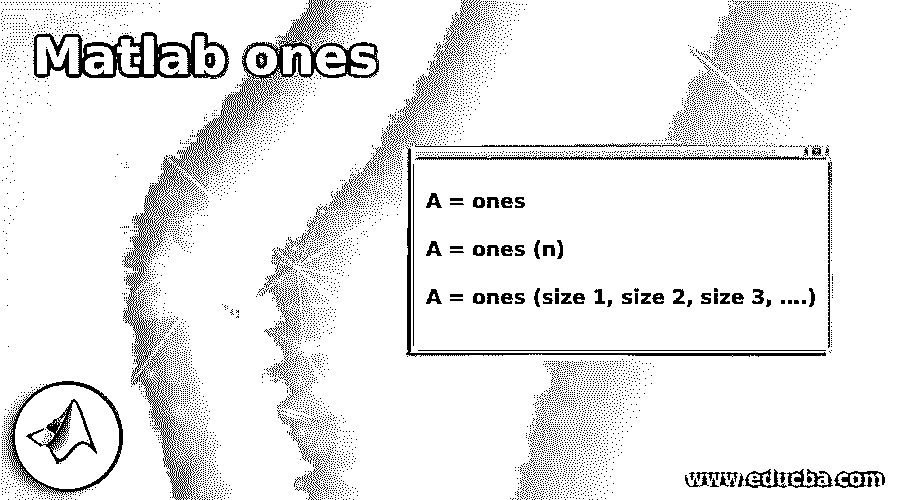
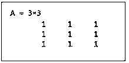
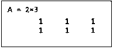
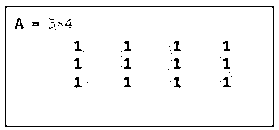

# Matlab 的

> 原文：<https://www.educba.com/matlab-ones/>

## Matlab ones 简介

Matlab one 的函数用于获取一个标量或一个以全“1”(1)为元素的向量。像' while' & 'for '这样的循环在每次循环执行时都会增加数据结构的大小。这个过程会对程序的性能产生负面影响。重复调整数组大小需要额外的时间来寻找更大的连续内存块&然后将数组放入这些块中。像 Matlab 这样的函数用于通过预先分配输入数组所需的空间来提高代码性能。

**Matlab 中函数‘ones’的语法:**

<small>Hadoop、数据科学、统计学&其他</small>

`A = ones`

`A = ones (n)`

`A = ones (size 1, size 2, size 3, ….)`

**描述:**

*   A = ones 将返回标量 1 作为输出。
*   A = ones (n)将返回 n X n 阶的方阵。
*   A =一个(1 号、2 号、3 号……)。)将返回所需维度的矩阵。

### Matlab 的例子

以下是 Matlab 的例子:

#### 示例#1

在第一个示例中，我们将使用“one's function”创建一个元素全为 1 的 3 阶方阵。

下面是我们在这个例子中要遵循的步骤:

*   首先，将所需的顺序作为参数传递给函数。
*   显示输出。

**代码:**

A =个(3)

[Using ‘ones function’ with ‘3’ as the argument. Please note that we have passed ‘3’ as an argument because we need the matrix with 1s to be of order 3 x 3 ]

英语字母表中第一个字母

[Displaying the output]

这是我们的输入和输出在 Matlab 命令窗口中的样子:

**输入:**

`A = ones(3)
A`

**输出:**

正如我们在输出中看到的，函数“ones”给了我们一个 3 阶的矩阵，它的元素是 1。

#### 实施例 2

在本例中，我们将使用一个函数来创建一个元素全为 1 的 4 阶方阵。

下面是我们在这个例子中要遵循的步骤:

*   首先，将所需的顺序作为参数传递给函数。
*   显示输出。

**代码:**

A =个(4)

[Using ones function with ‘4’ as the argument. Please note that we have passed ‘4’ as an argument because we need the matrix with 1s to be of order 4 x 4 ]

英语字母表中第一个字母

[Displaying the output]

这是我们的输入和输出在 MATLAB 命令窗口中的样子。

**输入:**

`A = ones(4)
A`

**输出:**

正如我们在输出中看到的，函数“ones”给了我们一个 4 阶的矩阵，它的元素是 1。

在上面的两个例子中，我们使用了“一的函数”来创建一个全是一的方阵。接下来，我们将看到创建所需订单矩阵的语法。即不是正方形矩阵的矩阵。

#### 实施例 3

在本例中，我们将使用“ones function”来创建一个元素全为 1 的矩阵，其顺序为 2 x 3 ( 2 行 3 列)。

下面是我们在这个例子中要遵循的步骤:

*   首先，将所需的顺序作为参数传递给 ones 函数。
*   显示输出。

**代码:**

A =一(2，3)

[Using ones function with ‘2’ and ‘3’ as the arguments. Please note that we have passed 2, 3 as the arguments because we need the matrix with 1s to be of order 2 x 3 ]

英语字母表中第一个字母

[Displaying the output]

这是我们的输入和输出在 MATLAB 命令窗口中的样子。

**输入:**

`A = ones(2, 3)
A`

**输出:**

正如我们在输出中看到的，函数“ones”给了我们一个 2 x 3 阶的矩阵，元素为 1。

#### 实施例 4

在本例中，我们将使用“ones function”创建一个元素全为 1 的矩阵，其顺序为 3 x 4 ( 3 行 4 列)。

下面是我们在这个例子中要遵循的步骤:

*   首先，将所需的顺序作为参数传递给 ones 函数。
*   显示输出。

**代码:**

a = 1(3，4)

[Using ‘ones function’ with ‘3’ and ‘4’ as the arguments. Please note that we have passed 3, 4 as the arguments because we need the matrix with 1s to be of order 3 x 4 ]

英语字母表中第一个字母

[Displaying the output]

这是我们的输入和输出在 MATLAB 命令窗口中的样子:

**输入:**

`A = ones(3,4)
A`

**输出:**

正如我们在输出中看到的，函数“ones”给了我们一个 3 x 4 阶的矩阵，元素为 1。

### 结论

Ones 函数用于获得一个标量或向量，其元素全部为“一”(1)。Matlab ones 用于通过预分配输入数组所需的空间来提高代码性能。我们可以使用不同形式的一个函数来根据我们的要求得到矩阵的阶。

### 推荐文章

这是一个 Matlab 的指南。在这里，我们讨论了 Matlab 的介绍以及相应的例子，分别。您也可以看看以下文章，了解更多信息–

1.  [Matlab 注释](https://www.educba.com/matlab-annotation/)
2.  [Matlab 编写](https://www.educba.com/matlab-fwrite/)
3.  [Matlab 图像调整大小](https://www.educba.com/matlab-image-resize/)
4.  [卷积 Matlab](https://www.educba.com/convolution-matlab/)

