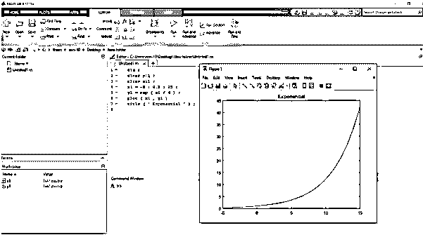
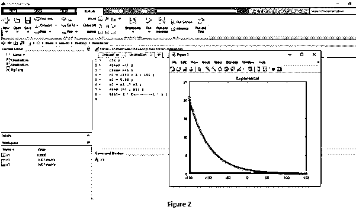
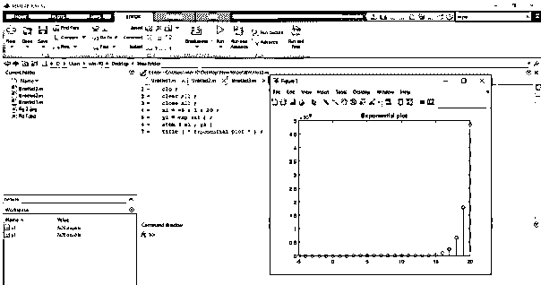

# Matlab 中的指数

> 原文：<https://www.educba.com/exponential-in-matlab/>

## Matlab 中的指数函数介绍

在日常生活中，我们需要数学。数学中有很多函数，指数函数是其中一个重要的函数。很多时候需要数据的指数值。为了在 Matlab 中得到指数值，我们使用了指数语句。以及在某些情况下，需要绘制指数图。首先，我们有指数数据，这在 MATLAB 中通过使用指数语句是可能的。

**语法:**

<small>Hadoop、数据科学、统计学&其他</small>

Matlab 中的指数语法如下所示:

*   `y1 = exp(x1)`

### 如何在 Matlab 中做指数？

对于数据的指数绘图，我们使用 exp 和 plot 语句。

使用 exp 和 plot 语句对数据进行指数绘图的步骤如下

**步骤 1:** 我们取变量，赋值。

**第二步:**然后我们用 exp 得到变量的指数值。

**第三步:**然后我们使用带有适当语法的 plot 语句来绘制指数图，以可视化指数数据。

### 例子

让我们在 Matlab 中讨论指数的例子。

#### 示例#1

让我们看一个 Matlab 中与指数相关的例子，对于指数，我们使用 Matlab 语法“exp ”, exp 在括号中，我们取变量名，或者我们直接取指数的方程。在本例中，我们也使用绘图函数显示指数信号。首先，我们取-5 轴到 15 轴的范围，差值为 0.5，这个范围是一个 x1 变量。然后，我们使用 exp 函数编写一个指数方程，我们将括号中的 exp x1 除以 4，并将这些指数值分配给变量 y1，方程为 y1 = e x1/4 ，x1 的值从-5 变化到 15，并据此将不同的值分配给 y1 变量。然后，我们使用 x1 和 y1 变量和 plot 函数绘制信号，plot 是 Matlab 中的内置函数，它绘制 y1 中的数据与 x1 中的相应值的关系，x 轴是 x1，它在-5 到 15 之间变化，y 轴是 x1 的函数。这是一个与给定方程相关的指数信号。

**Matlab 代码示例 1-**

`clc;
clear all;
close all;
x1 = -5 : 0.5 : 15 ;
y = exp ( x1 / 4 );
plot ( x1 , y )
title ( ' Exponential ' );`

**输出:**

#### 实施例 2

让我们看一个 Matlab 中指数的例子，指数信号定义为 n1 的 x1 等于 n1 的 alpha (a1)次幂 n1 U。其中α是指数信号增加或减少的速率，n1 是一个独立变量，从负无穷大变化到正无穷大，因此有两个参数，一个是α，另一个是独立变量 n1，让我来定义这两个，n1 通常从负无穷大变化到正无穷大，但因为我们无法达到无穷大，所以从-150 到 150 开始，步长为 1。现在，我们将 a1 定义为等于 0.98，这是我的 alpha，有一个条件是，如果 alpha 大于 1，n 1 的信号 x1 呈指数增加，如果 alpha (a1)在 0 到 1 之间，则 n 的信号 x1 呈指数减少，因此我们的示例中，alpha 的值为 0.98，所以它会给出指数减少的信号。现在定义 n1 的 x1 等于α点功率 n1，然后是 stem，stem 为离散信号，x 轴是 n1，它在-150 到 150 逗号之间变化，y 轴是 n1 的函数。

**Matlab 代码示例 2:**

`clc;
clear all;
close all;
n1 = -150 : 1 : 150 ;
a1 = 0.98;
x1 = a1 .^ n1;
stem (n1 , x1);
title ( ' Exponential ' );`

**输出:**

#### 实施例 3

让我们看一个 Matlab 中与指数相关的例子，对于指数，我们使用 Matlab 语法“exp ”, exp 在括号中，我们取变量名，或者我们直接取指数的方程。首先，我们取轴-5 到轴-20 的范围，差值为 1，这个范围是一个 x1 变量。然后我们用指数函数写出指数方程，我们在括号中取一个指数 x1 乘以 2，这些指数值赋给变量 y1，方程是 y1 = e^x，x1 的值从-5 到 20 不等，据此不同的值赋给 y1 变量。然后，我们使用 x1 和 y1 变量以及 stem 函数绘制一个信号，stem 是 Matlab 中的内置函数，它绘制 y1 中的数据相对于 x1 中相应值的区域信号，x 轴是 x1，范围为-5 至 20，y 轴是 x1 的函数。这是一个与给定方程相关的指数信号。然后我们用一个标题函数给这个图加一个标题。

**Matlab 代码示例 3:**

`clc ;
clear all ;
close all ;
x1 = -5 : 1 : 20 ;
y1 = exp (x1 ) ;
stem ( x1 , y1 )
title ( ' Exponential plot ' ) ;`

**输出:**

### 结论

在本文中，我们看到了 Matlab 中指数的概念。基本上，指数用于返回指数值。然后看到了与指数相关的语法，以及如何在 Matlab 代码中使用。此外，我们还在 Matlab 上看到了一些与指数及其输出相关的示例。

### 推荐文章

这是一个 Matlab 中的指数指南。这里我们讨论一下入门，如何在 Matlab 中做指数？和代码实现的例子。您也可以看看以下文章，了解更多信息–

1.  [费瓦尔 Matlab](https://www.educba.com/feval-matlab/)
2.  [MATLAB 工具箱](https://www.educba.com/matlab-toolbox/)
3.  [MATLAB 冒号](https://www.educba.com/matlab-colon/)
4.  [Matlab 积分](https://www.educba.com/matlab-integral/)

