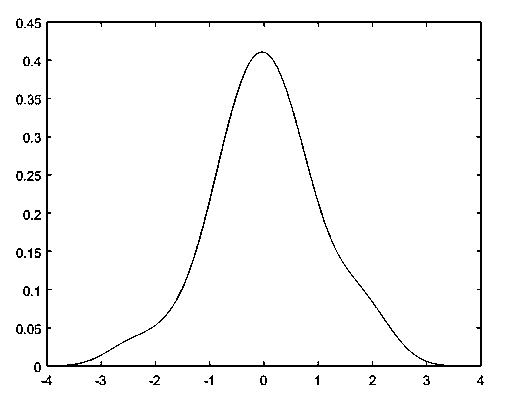
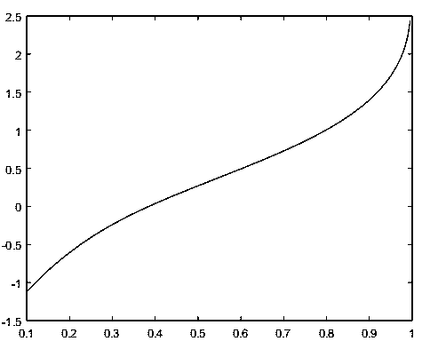
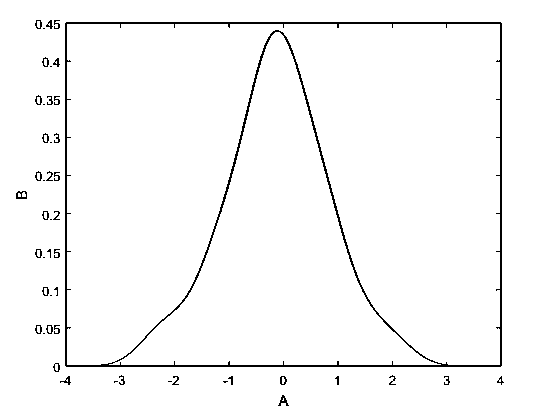

# Matlab ksdensity

> 原文：<https://www.educba.com/matlab-ksdensity/>

## Matlab 密度函数的定义

在 Matlab 中，“ks 密度”函数用于计算概率密度函数响应。这个函数处理数组、向量和多维数据。概率密度函数使用正态核函数计算密度。通过应用上述函数，我们得到密度值以及函数的密度响应曲线。在 x 时间间隔轴上等距点上执行函数的评估。它分别计算单变量样本和双变量样本的百点密度和九百点密度。除了实例值，它还接受其他参数，如名称、值、轴和点。

**语法:**

<small>Hadoop、数据科学、统计学&其他</small>

*   `[A, B] = ksdensity (input);`

[Variable name 1, Variable name 2] = ksdensity (input variable name )

*   `Ksdensity (input, A, 'Function', 'icdf' )`

Ksdensity(输入变量名，变量名 1，'函数'，' icdf ')

*   `[A, B, Bandwidth] = ksdensity (input)`

[Variable name 1, Variable name 2, Bandwidth] = ksdensity (input variable name )

### ksdensity 函数在 Matlab 中是如何工作的？

密度函数有两种不同的度量，概率密度函数和累积密度函数。概率密度函数可以通过积分累积密度函数来获得，累积密度函数可以通过微分概率密度函数来获得。该函数用于解释每个给定样本的值。我们可以通过密度函数传递多个参数，如密度函数、样本位置、带宽、输入样本、CDF 或 pdf。为了最初应用函数，我们需要创建连续值或样本的输入，然后只有我们可以应用 ksdensity 函数。

### 例子

让我们讨论 Matlab ksdensity 的例子。

#### 示例#1

为了应用 ksdensity 函数，我们首先需要创建样本数据库，这里我们已经创建了输入样本数据，它被声明为' input '。输入是两个正态随机分布的组合。使用 randn 函数创建随机正态分布。第一个随机函数将给出 25 乘 1 矩阵随机值，第二个随机函数将给出 10 乘 1 矩阵随机值。该函数将跟踪输入范围内的所有值。这里' A '是概率密度函数，该函数估计基于点' B'。

**代码:**

`clc ;
clear all ;
disp ('output')
input = [randn(25, 1); randn(10, 1)];
[ A, B ] = ksdensity (input);
figure
plot (B, A);`

**输出:**

#### 实施例 2

在这个例子中，我们将在 ksdensity 函数中使用另一个函数。最初，输入样本由变量名“input”声明。输入由行空间函数创建，该函数将创建从 1 到 200 的向量行。行空间将通过调整样本 1 的步调来创建数组或向量。然后，我们使用了带有多个参数的 ksdensity 函数，我们将输入和 A 传递给该函数。通过组合两个随机函数来创建输入；第一个随机函数将创建 50 比 1 范围内的样本，这意味着 50 乘 1 的矩阵，第二个随机函数将创建 10 比 1 范围内的随机样本，这意味着 10 乘 1 的矩阵。这里“A”是概率密度函数，该函数估计基于输入点。除了这两个参数，通过该函数的其他参数是“函数和 icdf”。这里 function 是“icdf”的关键字，icdf 是逆累积分布函数，它将执行累积分布函数的逆运算。

**代码:**

`clc ;
clear all ;
disp ('output')
input = [randn(50, 1); randn(10, 1)];
A = linspace(.1, 1, 200);
figure
ksdensity (input, A, 'Function', 'icdf');`

**输出:**

#### 实施例 3

在本例中，我们将考虑一个新术语，即带宽。带宽指定通过函数的采样速率。这里我们创建了输入样本数据，它被声明为“input”。输入是两个正态随机分布的组合。使用 randn 函数创建随机正态分布。第一个随机函数将给出 15 乘 1 矩阵随机值，第二个随机函数将给出 50 乘 1 矩阵随机值。该函数将跟踪输入范围内的所有值。这里' A '是概率密度函数，该函数估计基于点' B'。我们给这个函数三个变量的格式，这样 ksdensity 函数将自动返回 A，B 和带宽的值。

**代码:**

`clc ;
clear all ;
disp ('output')
input = [randn(15, 1) ; randn(50, 1)];
[ A, B, Bandwidth] = ksdensity (input);
Bandwidth
figure
plot (B, A);
xlabel ('A')
ylabel ('B')
hold on`

**输出:**

### 结论

在本文中，我们已经看到了 ksdensity 函数的实现。它包括概率密度函数和累积密度函数的实现。该函数给出了连续信号所有可能情况下的密度值，并给出了函数对输入信号的曲线响应。

### 推荐文章

这是一个 Matlab ksdensity 的指南。这里我们讨论一下 ksdensity 函数的定义，如何在 Matlab 中工作？和代码实现的例子。您也可以看看以下文章，了解更多信息–

1.  [uigetfile Matlab](https://www.educba.com/uigetfile-matlab/)
2.  [费瓦尔 Matlab](https://www.educba.com/feval-matlab/)
3.  [MATLAB 冒号](https://www.educba.com/matlab-colon/)
4.  [Matlab 积分](https://www.educba.com/matlab-integral/)

