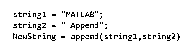
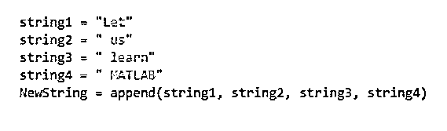
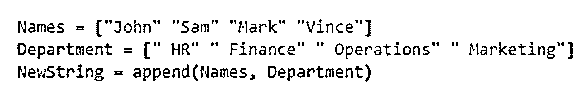

# Matlab 追加

> 原文：<https://www.educba.com/matlab-append/>

## Matlab Append 简介

Matlab append 方法可以用来追加一个字符串，并向其中添加另一个字符串。当组合多个字符串并获得单个字符串作为输出时，这种方法非常方便。

例如，如果我们接受两个字符串，“名字”和“姓氏”，作为用户的输入，稍后我们可能需要将这两个字符串组合起来，得到一个能给出全名的字符串。这就是我们在 Matlab 中使用 append 方法的地方。

<small>Hadoop、数据科学、统计学&其他</small>

**语法:**

*   NewString = append (string1，string2，…stringN)用于在 Matlab 中组合各种字符串。字符串将按照作为参数传递的顺序进行组合。
*   从语法上可以明显看出，我们可以使用 append 方法组合多个字符串。

### Matlab 附加示例

下面给出了如何在 Matlab 中使用 append 方法组合字符串:

#### 示例#1

在这个例子中，我们将使用 append 方法来合并两个字符串。

本例中要遵循的步骤是:

*   初始化要组合的字符串。
*   将上述字符串作为参数传递给 append 函数。

**代码:**

1.  string1 = "MATLAB "

[Initializing the 1st string]

2.  string2 = "Append "

[Initializing the 2nd string]

3.  NewString = append(string1，string2)

[Passing the above 2 strings to the append method. Please note that the order of arguments must be the same in which we want the strings to be combined]

这是我们的输入和输出在 Matlab 命令窗口中的样子:

**输入:**

**输出:**

正如我们在输出中看到的，我们获得了一个组合了 string1 和 string2 的字符串。

在上面的例子中，我们看到两个输入字符串被组合在一起，但是在最终的输出中它们之间没有空格。

接下来，我们将看到如何在两个字符串之间添加一个空格或任何特殊字符。

#### 实施例 2

在这个例子中，我们将使用 append 方法组合两个字符串，两个字符串之间有一个空格。

本例中要遵循的步骤是:

*   初始化要组合的字符串。
*   在第二个和第二个字符串的开头添加一个额外的空格。
*   将上述字符串作为参数传递给 append 函数。

**代码:**

1.  string1 = "MATLAB "

[Initializing the 1st string]

2.  string2 = " Append "

[Initializing the 2nd string. Please note that we have added an extra space at the beginning of string2\. This is done to get a space in the combined string]

3.  NewString = append(string1，string2)

[Passing the above 2 strings to the append method. Please note that the order of arguments must be the same in which we want the strings to be combined]

这是我们的输入和输出在 Matlab 命令窗口中的样子:

**输入:**

**输出:**

正如我们在输出中看到的，我们获得了一个组合了 string1 和 string2 的字符串。如果我们将这个输出与示例 1 中的输出进行比较，我们会注意到现在两个字符串之间有一个空格。

在上面的例子中，我们组合了 2 个字符串；接下来，我们将看到使用 append 方法组合两个以上的字符串。

#### 实施例 3

在这个例子中，我们将使用 append 方法组合多个字符串，字符串之间有一个空格。

本例中要遵循的步骤是:

*   初始化要组合的字符串。
*   在所有字符串的开头添加一个额外的空格，除了第一个。
*   将上述字符串作为参数传递给 append 函数。

**代码:**

1.  string1 = "Let "

[Initializing the 1st string]

2.  string2 = " us "

[Initializing the 2nd string. Please note that we have added an extra space at the beginning of string2\. This is done to get a space in the combined string]

3.  string3 = " learn "

[Initializing the 3rd string. Again, there is an extra space]

4.  string4 = " MATLAB "

[Initializing the 4th string]

5.  NewString = append(string1，string2，string3，string4)

[Passing the above 4 strings to the append method. Please note that the order of arguments must be the same in which we want the strings to be combined]

这是我们的输入和输出在 Matlab 命令窗口中的样子:

**输入:**

**输出:**

正如我们在输出中看到的，我们获得了一个组合了所有输入字符串的字符串。

#### 实施例 4

在这个例子中，我们将使用 append 方法来组合向量的字符串数组。这些字符向量被逐个元素地组合。

本例中要遵循的步骤是:

*   初始化要组合的字符串数组。
*   将上述字符串数组作为参数传递给 append 函数。

**代码:**

1.  Names = ["约翰" "萨姆" "马克" "文斯"]

[Initializing the 1st string array]

2.  部门= ["人力资源" "财务" "运营" "营销"

[Initializing the 2nd string array]

3.  NewString = append(姓名，部门)

[Passing the above 2 string arrays to the append method. Please note that the order of arguments must be the same in which we want the arrays to be combined]

这是我们的输入和输出在 Matlab 命令窗口中的样子:

**输入:**

**输出:**

正如我们在输出中看到的，我们获得了两个字符串数组的组合。

### 结论

在 Matlab 中使用 Append 来组合两个或更多的字符串。我们还可以使用 append 方法组合字符串数组。如果需要，可以添加像“空格”这样的特殊字符。

### 推荐文章

这是一个 Matlab 附加指南。在这里，我们讨论 Matlab Append 的介绍，并举例说明，以便更好地理解。您也可以看看以下文章，了解更多信息–

1.  [Matlab 绘图标题](https://www.educba.com/matlab-plot-title/)
2.  [Matlab fplot()](https://www.educba.com/matlab-fplot/)
3.  [Matlab 堆积条形图](https://www.educba.com/matlab-stacked-bar/)
4.  [点积 MATLAB](https://www.educba.com/dot-product-matlab/)

