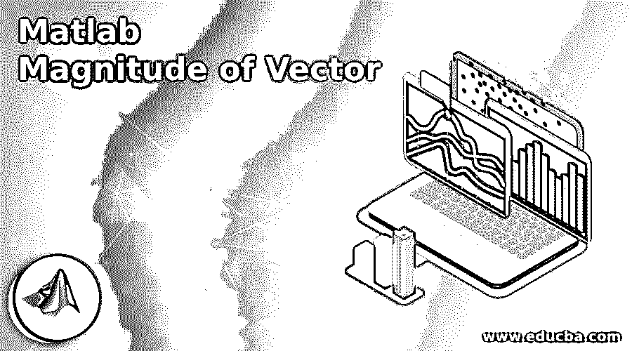
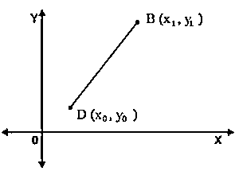
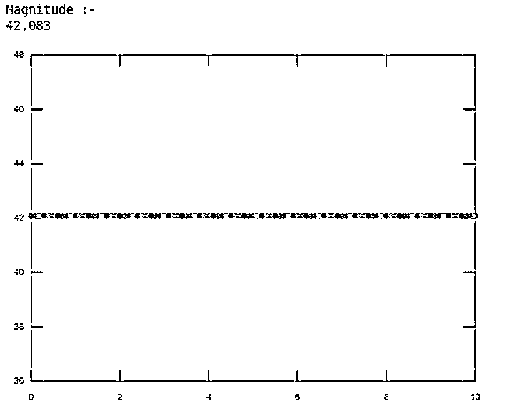
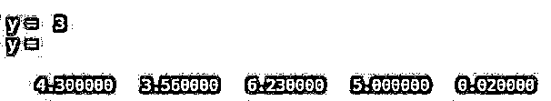

# Matlab 矢量幅度

> 原文：<https://www.educba.com/matlab-magnitude-of-vector/>

## Matlab 矢量的幅值介绍

向量的大小 Matlab 的定义是一个既有方向又有大小的量叫做向量。在运动的研究中，这两个矢量都起着非常重要的作用。力、速度、加速度、位移和动量是矢量的一些例子。向量的大小等于向量 s 的长度，向量的大小表示为。

**矢量的 Matlab 幅度语法**

<small>Hadoop、数据科学、统计学&其他</small>

您可以使用以下语法来生成幅度向量:

`u1 = [ 1 : 2 : 22 ] ;`

`su1 = u1 .* u1 ;`

`p1 = sum ( su1 ) ;`

`mag1 = sqrt ( p1 )`

`el = abs(D)`

*   el = abs(D)返回数组 D 中每个元素的绝对值。
*   如果 D 是复数，abs(D)返回复数的幅度。

### 向量的幅值怎么做 Matlab？

具有元素 u1，u2，u3，…，un 的向量 u 的幅度由以下等式给出:

| u | = √ ( u12 + u22 + u32 + … + un2 )

您需要采取以下步骤来计算矢量的大小:

*   使用数组乘法( .* ).这就产生了一个向量 su，它的元素是向量 u 的元素的平方。
*   使用 sum 函数获得向量 u 的元素的平方和。这也称为向量 u 的点积。
*   使用 sqrt 函数得到和的平方根，这也是向量 u 的大小。

**矢量公式的大小:**

假设 DB 是一个既有大小又有方向的矢量。为了计算向量 DB 的大小，我们必须计算初始点 D 和端点 B 之间的距离。在 X-Y 平面中，设 D 的坐标为(x0，y0)，B 的坐标为(x1，y1)。

因此，通过距离公式，矢量→DB 的大小可以写成:

|→DB| =√ (x1–x0)2+(y1–y0)2

现在，如果端点 B 在原点，那么矢量公式的大小变成:

|→DB| = √x2+y2

### 矢量的 Matlab 幅值示例

以下是 Matlab 矢量幅度的示例:

#### 示例#1

让我们考虑一个例子；在这个例子中，我们可以创建一个向量“u”。然后我们取一个点积(。*)的向量 u 与自身。这会产生一个向量“su ”,其元素是向量 u 的元素的平方。然后，我们使用 sum 函数来获得向量 u 的元素的平方之和。然后，我们使用平方根函数来获得向量 u 的大小，并通过 disp 函数来显示它。

**代码:**

`clc ;
clear all ;
u = [ 2 : 4 : 22 ] ;
su = u .* u ;
p = sum ( su ) ;
mag = sqrt ( p ) ;
disp ( ' Magnitude :-  ' );
disp ( mag );`

**输出:**

**

** 

#### 实施例 2

让我们举另一个例子；在第一个例子中，我们只能显示矢量幅度值。但是在这个例子中，我们也可以画出矢量幅度的图形。为此，我们可以首先创建一个向量 u1。通过取向量 u1 与其自身的点积来平方向量 u1，结果将存储在 su1 中。然后使用 sum 函数，我们可以对元素向量 u1 的平方求和。然后，使用 sqrt 函数，我们得到大小。为了绘制图形，我们将使用 Matlab 中内置的绘图功能。对于这个函数，我们可以先根据需要决定时间尺度；让我们假设时间尺度是 0: 0.1:10。然后我们可以使用 plot 函数与时间和幅度(mag)来查看图形。

**代码:**

`clc ;
clear all ;
close all ;
time = 0: 0.1:10;
u1 = [ 1 : 2 : 22 ] ;
su1 = u1 .* u1 ;
p1 = sum ( su1 ) ;
mag1 = sqrt ( p1 ) ;
disp ( ' Magnitude :-  ' );
disp ( mag1 );
plot ( time , mag1 );`

**输出:**

**

** 

#### 实施例 3

让我们看另一个例子，用矢量幅度来创建绝对值和复数幅度。创建一个实数值的数值向量(标量的绝对值)。

**代码:**

`clc;
clear all;
y = abs(-3)
x = [4.3 -3.56 6.23 -5 -0.02];
y = abs(x)`

**输出:**

### 结论

在这篇文章中，我们已经看到了如何使用 Matlab 中的向量幅度函数。在 Matlab 中，矢量的大小是矢量的长度，在编程中，可以通过引用其他主要术语来生成另一个矢量。通过使用向量大小函数，我们可以找到向量的大小，也就是向量的长度。

### 推荐文章

这是一个 Matlab 矢量大小指南。这里我们讨论一下入门，如何在 Matlab 中做向量的大小？和示例。您也可以看看以下文章，了解更多信息–

1.  [拉普拉斯变换 MATLAB](https://www.educba.com/laplace-transform-matlab/)
2.  [MATLAB 特征值](https://www.educba.com/matlab-eigenvalues/)
3.  [Matlab 表单](https://www.educba.com/matlab-forms/)
4.  [Matlab 格式](https://www.educba.com/matlab-format/)

