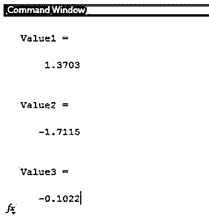
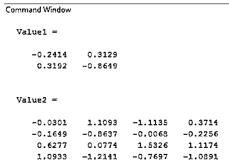
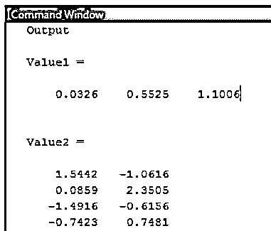
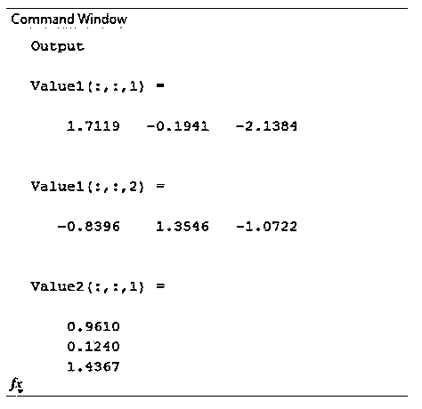
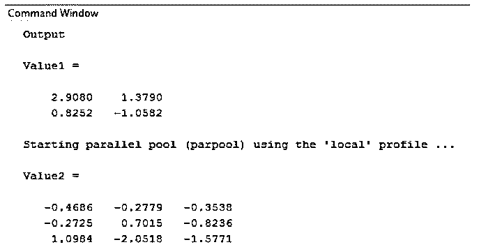
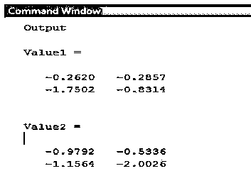
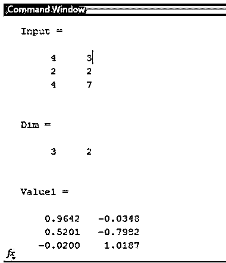
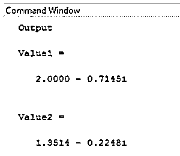

# Matlab randn

> 原文：<https://www.educba.com/matlab-randn/>

## Matlab randn 简介

在 Matlab 中,‘randn’函数用于正态分布；它给出随机值作为输出。该函数根据通过函数定义传递的参数工作。我们可以在 randn 函数中传递单个或多个值作为参数。如果没有声明参数，并且 randn 函数是单独编写的，它将只打印一个随机值。我们也可以提及我们希望在函数中给出的大小；它可以是一维的，也可以是多维的。除了大小，我们还可以提到我们想要什么样的分布，单个或两个或分布式。

**语法:**

<small>Hadoop、数据科学、统计学&其他</small>

`Value 1 = randn
Variable name = randn`

`Value 1 = randn(5)
Variable name = randn (no. of rows and columns)`

`Value 1 = randn (1 ,3)
Variable name = randn (no. of rows , no. of columns)`

`Value 1 = randn (1, 3, 2)
Variable name = randn (no. of rows, no. of columns, no of matrices)`

`Value 1 = randn (2, 'single')
Variable name = randn (no. of rows and columns, ‘type’)`

`Value 1= randn ( Dim )
Variable name = randn (size)`

`Value 1 = 2 + i * randn
Variable name = Integer + complex variable * randn`

### randn 函数在 Matlab 中如何工作？

*   randn 函数处理随机值，因为它向用户提供随机数值。ir 创建任意类型的随机值，如整数、浮点数、复数等。
*   默认情况下，randn 只创建一个随机值，根据参数，它可以创建多个值。
*   在这个函数的括号里面，我们可以给出输出的维数；可以是一维，也可以是多维。
*   值根据用户的要求进行分配。

### Matlab randn 示例

下面给出了 Matlab randn 的例子:

#### 示例#1

让我们考虑一个简单的例子；在本例中，值 1 是存储随机值的输入变量。该函数没有传递任何参数，因此它将只打印一个值，如示例所示。如果我们在同一个代码中重复编写 randn 函数，它会打印出不同的随机值。例如，一个函数写了三次，它会给出三个随机值作为输出。

**代码:**

`clc ;
clear all ;
disp('Output');
Value1 = randn`

**输出:**

**代码:**

`clc ;
clear all ;
disp ('Output');
Value1 = randn
Value2 = randn
Value3 = randn`

**输出:**

#### 实施例 2

在本例中，我们将在 randn 函数中将维度视为自变量。例如，我们可以看到一个值通过一个函数传递。如果括号内只有一个值，那么它代表输出矩阵的行数和列数。因此，输出尺寸是二乘二和四乘四。例如，括号内写有两个值。第一个值表示行数，第二个值表示列数。函数括号中有三个值；第一个值表示行数，第二个值表示列数，第三个值表示示例中所示的矩阵数。

**代码:**

`clc ;
clear all ;
disp('Output');
Value1 = randn(2)
Value2 = randn(4)`

**输出:**

**代码:**

`clc ;
clear all ;
disp('Output');
Value1 = randn (1,3)
Value2 = randn (4,2)`

**输出:**

**代码:**

`clc ;
clear all ;
disp ('Output');
Value1 = randn (1, 3, 2)
Value2 = randn(3, 1, 2)`

**输出:**

#### 实施例 3

示例三显示了我们希望创建的数据类型。除了维度，我们还可以在输出中提到我们想要的输入类型，如 single、distributed 或 double，如示例中所示。如果我们执行矩阵运算，那么根据规则，所有矩阵的大小应该相同；因此，为了保持矩阵的大小，我们可以在 randn 函数中使用“size”语法，如示例所示。

**代码:**

`clc ;
clear all ;
disp('Output');
Value1 = randn(2, 'single')
Value2 = randn (3, 'distributed')`

**输出:**

**代码:**

`clc ;
clear all ;
disp('Output');
Value1 = randn( 2,'single')
Value2 = randn (2 ,'double')`

**输出:**

**代码:**

`clc ;
clear all ;
disp('Output');
Input = [ 4,3; 2,2; 4,7] Dim = size (Input)
Value1= randn (Dim)`

**输出:**

#### 实施例 4

在前面的例子中，输入数据是实数，但是我们也可以在 randn 函数中处理复数。在本例中，我们乘以复数变量“I ”,得到一个复数形式的数字。以及我们对随机数执行的操作，这是说明性的。

**代码:**

`clc ;
clear all ;
disp('Output');
Value1 = 2+ i * randn
Value2 = randn + i * randn`

**输出:**

### 结论

在本文中，我们已经看到了如何使用不同参数的“randn”函数。randn 函数作用于自变量，或者我们可以用括号来表示函数传递的维数。该函数的工作方式与“rand”函数完全一样；唯一不同是 rand 函数在区间 0 到 1 之间创建随机值。

### 推荐文章

这是一个 Matlab randn 的指南。这里我们讨论一下介绍，randn 函数在 MatLab 中是如何工作的？和示例。您也可以看看以下文章，了解更多信息–

1.  [拉普拉斯变换 MATLAB](https://www.educba.com/laplace-transform-matlab/)
2.  [Matlab 表单](https://www.educba.com/matlab-forms/)
3.  [信号处理 Matlab](https://www.educba.com/signal-processing-matlab/)
4.  [Matlab 自相关](https://www.educba.com/matlab-autocorrelation/)

