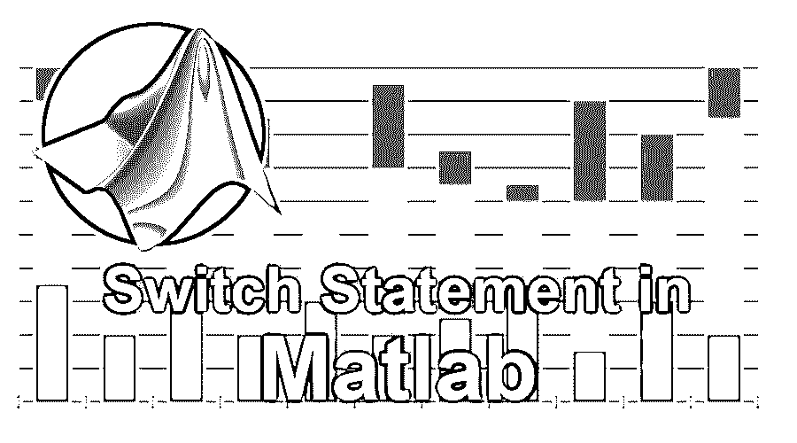
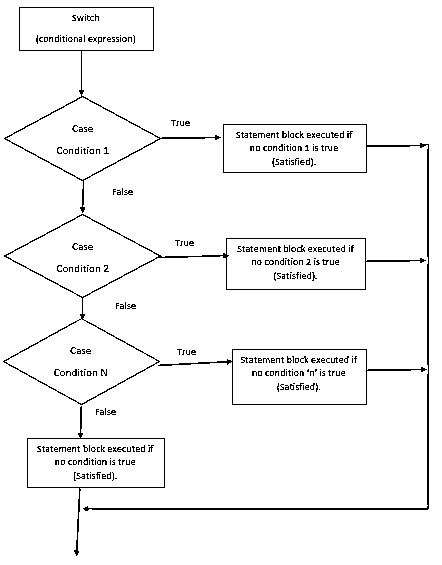

# Matlab 中的 Switch 语句

> 原文：<https://www.educba.com/switch-statement-in-matlab/>

## Matlab Switch 语句是什么？

在本文中，我们将看到 Matlab 中的 Switch 语句。在此之前，让我们看看什么是 Matlab。
MATLAB 这个名字是矩阵实验室的简称。对于科学家和技术计算来说，MATLAB 是最好的编程语言之一。它包含一个用于计算、数据可视化和逻辑编程的环境。它包含内置的编辑和错误调试工具，并且支持 OOP 的[思想。这些因素使得 MATLAB 大有用武之地，成为学术教学和研究的首选工具。](https://www.educba.com/what-is-oop/)

我们熟悉 MATLAB 的基本概念。我们知道 MATLAB 数据类型，MATLAB 中的基本运算和循环。在本文中，我们将重点讨论交换机。Switch 语句是 MATLAB 中另一个广泛使用的控制流逻辑。让我们来了解一下开关。

<small>Hadoop、数据科学、统计学&其他</small>

一般来说，我们可以使用 if-else、if 语句创建多个可选的选择逻辑。然而，这种方法使得代码很长，也很难阅读和调试，我们有另一种好方法，或者说更好的方法来进行这些选择。switch 语句帮助我们使用更容易阅读的代码从多个选项中选择一个选项，并且减少了键入和编辑的时间。这两种方法的结果本质上是相同的，但是实现的方法不同。

### Matlab 中 Switch 语句的语法

在本节中，我们提供了 switch 语句的标准语法，并提供了分步解释。
`switch switch_condition
case case_condition
statements_if_true
case case_condition
statements_if_true
...
Otherwise_condition
Statements_if_true
end`

#### 说明

前两行“switch_ condition，case_ condition，end”执行表达式的计算，然后选择执行几个语句中的一个。每个这样的选择被称为一个案例。

switch 块对每个 case 执行测试，直到发现其中一个 case 表达式为真。当满足以下条件时，情况被定义为真实:

*   对于数字，其 case_ condition 等于 switch_ condition。
*   对于字符数据类型，其 strcmp(case_ condition，switch_ condition)等于 1。
*   在对象支持等式类函数的情况下，case_ condition 应该等于 switch_ condition。
*   在单元数组类型数据结构最小值的情况下，单元数组的给定元素之一将与给定的 switch_ condition 匹配。
*   当发现一个 case 条件为真时，MATLAB 执行该语句，执行后从开关中出来
*   为了使它正常工作，计算的 switch_ condition 应该是标量数据类型或字符向量数据类型。
*   否则块是可选的，并且当没有发现任何情况为真时执行。

### Matlab 中 Switch 语句的流程图

在本节中，为了便于理解，我们提供了上述语法的流程图。如果你简单地阅读每一组语句，你就能理解开关的工作原理。这就是流程图的强大之处，也是每个初学编程的人都要学习它的原因。在实际编写代码之前，它可以帮助您构建逻辑并设计无错误的代码。

### MATLAB 中 Switch 语句如何工作？

我们理解 switch 语句的技术细节。以免现在把更多的注意力放在它的工作上。

如前所述，switch 块根据几个选项中的标准有条件地执行一组语句。每个选项都包含在一个 case 语句中。

当我们在下一节中看到示例时，switch 语句的结构及其功能将会更加清晰。我们可以注意到，MATLAB 中的 switch 语句可能与其他编程语言略有不同。例如，MATLAB 开关构造在某些方面不同于开关的 C 编程语言构造。C switch 构造允许在执行停止之前执行通过许多案例组。在 C 中，我们可以使用 break 语句来控制执行。然而，这个想法在 MATLAB 中是不同的，其中 switch 构造只执行一个 case 组，因此它不需要 break 语句。

### Matlab 中 Switch 语句的例子

让我们看看 Matlab 中 switch 语句的一些例子。

#### 示例#1

这个例子做了一件非常简单的工作。核心思想是传递一个 switch 语句，并根据某种条件输出消息。我们创建了一个匹配数字并基于数字提供输出的基本逻辑。
`N = input('Enter a number of your choice: ');
switch N
case -2
disp('negative one selected')
case 0
disp('zero selected')
case 2
disp('positive one selected')
otherwise
disp('Some other value')
end`

**输出**:

在命令提示下，输入数字-2。

负二

重复代码并输入数字 5。

一些其他值

#### 实施例 2

在这个 Matlab 中的 Switch 语句的例子中，我们根据获得的等级进行分类区分。
`Enter_grade = 'A';
switch(enter_grade)
case 'A'
fprintf('Excellent performance!\n' );
case 'B'
fprintf('Well done performance\n' );
case 'C'
fprintf('Very Good performance\n' );
case 'D'
fprintf('You passed.. Congratulations\n' );
case 'F'
fprintf('Better luck next time\n' );
otherwise
fprintf('Invalid grade. Please enter correct value\n' );
end` 
**输出**:

运行后，它将显示出色的性能，因为在第一行代码中选择的等级是 A。用 B 替换该 A，然后再次运行，您将得到性能良好的输出。所以，基于所选的等级，区别就来了，所有这些都可以通过大约 10 行代码来完成。想象一下，做同样的用户 if-else 逻辑，代码会更长，并且会包含许多附加的条件语句。

### 结论

因此，在本文中，介绍了 MATLAB 中的 switch 语句，并提供了示例代码来展示其工作原理。建议学生尽可能多地学习和练习代码。这将确保概念得到很好的理解，并且学生对编写无错误的代码充满信心。如果有任何具体的问题，或者如果他们在执行代码时遇到错误，他们可以对本文发表评论，或者联系我们以获得进一步的澄清。对于使用 switch 语句的更多示例和案例研究，建议学生使用 google 搜索或查看官方 MATLAB 文档。参考官方文档总是好的，因为它提供了全面的讨论和许多相关场景的边缘案例。

### 推荐文章

这是一个在 Matlab 中切换语句的指南。这里我们讨论了 Matlab 中 Switch 语句的基本概念、工作流程图和一些例子。您也可以浏览我们推荐的其他文章，了解更多信息——

1.  [Python vs Matlab](https://www.educba.com/python-vs-matlab/)
2.  [Matlab 运算符](https://www.educba.com/matlab-operators/)
3.  [六大 AWS 备选方案](https://www.educba.com/aws-alternatives/)
4.  [Java 中的 Case 语句是什么？](https://www.educba.com/case-statement-in-java/)
5.  [Matlab 编译器| Matlab 编译器的应用](https://www.educba.com/matlab-compiler/)

