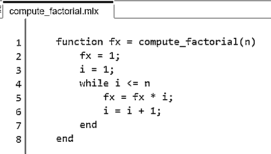
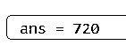
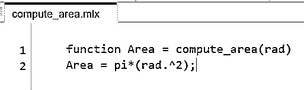
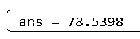
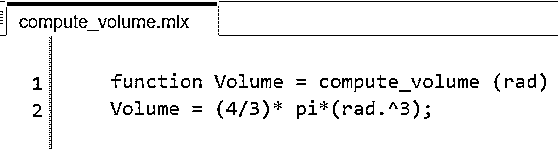
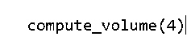
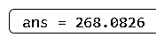

# Matlab 用户自定义函数

> 原文：<https://www.educba.com/matlab-user-defined-function/>

## MATLAB 用户自定义函数介绍

MATLAB 中的用户定义函数是一段代码或一个程序，我们可以在以后创建和使用它作为任何其他内置函数。我们需要做的就是将代码保存为文本文件，并确保函数的名称与保存它的文件名称相同。

函数通常有输入参数和输出变量，它们可以是矩阵、向量或标量。根据我们的要求，我们可以有“n”个输入和输出参数。

<small>Hadoop、数据科学、统计学&其他</small>

**创建用户自定义函数的语法:**

`function [o1, o2, o3…, on] = func_name (i1, i2, i3, …,im)`

**语法描述:**

1.  func_name 是我们函数的名称
2.  o1，o2，o3，…，on 是我们函数的输出
3.  i1，i2，i3，…，im 是我们函数的输入

请注意，func_name 是必需的，而输入和输出参数可以是零。

此外，我们定义的函数名和保存它的文件名必须相同。

### Matlab 用户定义函数示例

现在让我们理解在 MATLAB 中创建用户定义函数的代码

#### 示例#1

在这个例子中，我们将创建一个用户定义的函数来计算一个数的阶乘。我们将我们的函数命名为 compute_factorial，因此我们的文件名也将是 compute_factorial。以下是需要遵循的步骤:

1.  初始化函数 compute_factorial
2.  编写计算一个数的阶乘的逻辑
3.  以 compute_factorial 的名称保存文件
4.  使用名称并传递参数，在新的 Matlab 窗口中调用此函数

**代码:**

`function fx = compute_factorial (n)
[Initializing the function and naming it compute_factorial] fx = 1;
i = 1;
while i <= n
fx = fx * i;
i = i + 1;
end
end
[Writing the logic to compute the factorial of a number] Next, we will call this function from a new MATLAB window
compute_factorial (6)
[Passing the input argument as 6 to the compute_factorial function]`

这是我们的输入和输出在 MATLAB 中的样子:

**输入 1(创建函数):**

(请注意，该文件的名称与用户定义函数的名称相同)

**输入 2(调用函数):**

**输出:**

正如我们在输出中看到的，我们的用户定义函数给出了 6 的阶乘，即 720。

#### 实施例 2

在本例中，我们将创建一个用户定义的函数来计算圆的面积。我们将我们的函数命名为 compute_area，因此我们的文件名也将是 compute_area。以下是需要遵循的步骤:

1.  初始化函数 compute_area
2.  写出计算圆的面积的逻辑
3.  以名称 compute_area 保存文件
4.  使用名称并传递参数，在新的 Matlab 窗口中调用此函数

**代码:**

`function Area = compute_area (rad)
[Initializing the function and naming it compute_area. Here ‘rad’ signifies the radius of the circle whose area we want to compute] Area = pi*(rad.^2)
[Writing the logic to compute the area of a circle] Next, we will call this function from a new MATLAB command window
compute_area (5)
[Passing the input argument as 5 to the compute_area function]`

这是我们的输入和输出在 MATLAB 中的样子:

**输入 1(创建函数):**

(请注意，该文件的名称与用户定义函数的名称相同)

**输入 2(调用函数):**

**输出:**

正如我们在输出中看到的，我们的用户定义函数给出了半径为 5 的圆的面积，即 78.5398

#### 实施例 3

在本例中，我们将创建一个用户定义的函数来计算球体的体积。我们将我们的函数命名为 compute_volume，因此我们的文件名也将是 compute_volume。以下是需要遵循的步骤:

1.  初始化计算体积函数
2.  写出计算球体体积的逻辑
3.  以 compute_volume 的名称保存文件
4.  使用名称并传递参数，在新的 Matlab 窗口中调用此函数

**代码:**

`function Volume = compute_volume (rad)
[Initializing the function and naming it compute_volume. Here ‘rad’ signifies the radius of the sphere whose volume we want to compute] Volume = (4/3)* pi*(rad.^3);
[Writing the logic to compute the volume of a sphere] Next, we will call this function from a new MATLAB command window
compute_volume (4)
[Passing the input argument as 4 to the compute_volume function]`

这是我们的输入和输出在 MATLAB 中的样子:

**输入 1(创建函数):**

(请注意，该文件的名称与用户定义函数的名称相同)

**输入 2(调用函数):**

**输出:**

**

** 

正如我们在输出中看到的，我们的用户定义函数给出了一个半径为 4 的球体的体积，即 268.0826

### 结论

1.  我们可以在 MATLAB 中创建用户定义的函数来作为内置函数使用
2.  这些用户定义的函数存储为文本文件，需要时可以调用
3.  这些文本文件的名称必须与我们函数的名称相同

### 推荐文章

这是一个 Matlab 用户自定义函数的指南。这里我们讨论 Matlab 用户自定义函数以及输入和输出的例子。您也可以看看以下文章，了解更多信息–

1.  [Matlab 对](https://www.educba.com/matlab-mod/)的影响
2.  [Matlab 反斜杠](https://www.educba.com/matlab-backslash/)
3.  [Matlab 单位阶跃函数](https://www.educba.com/matlab-unit-step-function/)
4.  [Matlab polyfit()](https://www.educba.com/matlab-polyfit/)

