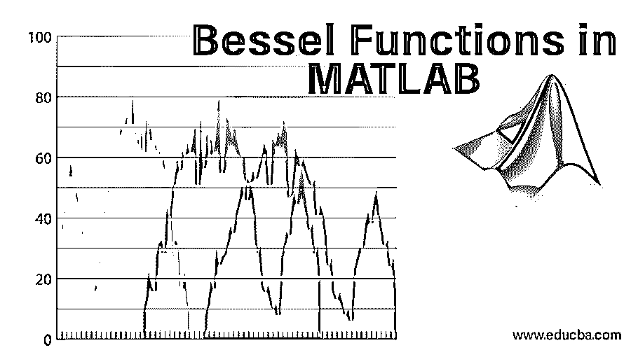

# MATLAB 中的贝塞尔函数

> 原文：<https://www.educba.com/bessel-functions-in-matlab/>

## 贝塞尔函数介绍

贝塞尔函数，也称为圆柱函数，由数学家丹尼尔·伯努利定义，然后由弗里德里希·贝塞尔推广，是二阶贝塞尔微分方程的解，称为贝塞尔方程。这些方程的解可以是第一类和第二类。

`x^2y"+xy'+(x^2-n^2) y=0`

<small>Hadoop、数据科学、统计学&其他</small>

当分离变量法应用于拉普拉斯方程或求解热和波传播方程时，它们导致贝塞尔微分方程。MATLAB 提供了这个复杂而高级的函数“bessel ”,后面跟着关键字的字母决定了第一类、第二类和第三类 Bessel 函数。

### MATLAB 中贝塞尔函数的类型

贝塞尔微分方程的一般解有两个线性相关的解:

`Y= A Jν(x)+B Yν(x)`

#### 1.第一类贝塞尔函数

第一类贝塞尔函数，Jν(x)对于 v 的所有实数值在 x=0 处是有限的，在 MATLAB 中，它由关键字 besselj 表示，遵循以下语法:

*   **Y =** **besselj(nu，z)** **:** 返回数组 z 中每个元素的第一类贝塞尔函数
*   **Y = besselj(nu，Z，scale)** :指定是否对贝塞尔函数进行指数缩放。缩放值可以是 0 或 1，如果是 0，则不需要缩放，如果是 1，则我们必须缩放输出。
*   输入参数是 nu 和 z，其中 nu 是指定为向量、矩阵等的方程阶数。而且是实数。z 可以是向量、标量或多维数组。Nu 和 z 必须大小相同，或者其中一个是标量。

#### 2.第二类贝塞尔函数(Yν(x))

它也被称为韦伯或诺依曼函数，在 x=0 处是奇异的。在 MATLAB 中，它由关键字 bessely 表示，遵循以下语法:

*   **Y =** **bessely(nu，Z):** 计算数组 Z 中每个元素的第二类贝塞尔函数 Yν(x)
*   **Y =贝塞尔函数(nu，Z，scale)** :指定是否按指数比例缩放贝塞尔函数。缩放值可以是 0 或 1，如果是 0，则不需要缩放，如果是 1，则我们必须缩放输出。
*   输入参数是 nu 和 z，其中 nu 是指定为向量、矩阵等的方程阶数。而且是实数。z 可以是向量、标量或多维数组。Nu 和 z 必须大小相同，或者其中一个是标量。

#### 3.第三类贝塞尔函数

它由关键字 besselh 表示，遵循以下语法:

*   **H = besselh(nu，Z)** :计算数组 Z 中每个元素的 Hankel 函数
*   **H** **= besselh(nu，K，Z** ):计算数组 Z 中每个元素的第一类或第二类 Hankel 函数，其中 K 可以是 1 或 2。如果 K 是 1，则它计算第一类贝塞尔函数，如果 K 是 2，则它计算第二类贝塞尔函数。
*   **H = besselh(nu，K，Z，scale** ):指定是否指数缩放贝塞尔函数。缩放值可以是 0 或 1，如果是 0，则不需要缩放；如果值是 1，则我们必须根据 k 的值缩放输出。

### 修正贝塞尔函数

以下是修正的贝塞尔函数。

#### 1.第一类修正贝塞尔函数

它由关键字 besseli 表示，遵循以下语法:

*   **I = besseli(nu，Z):** 为数组 Z 中的每个元素计算第一类修正的 Bessel 函数 I ν *(* z *)*
*   **I = besseli(nu，Z，scale):** 指定是否按指数比例缩放贝塞尔函数。如果标度为 0，则不需要缩放；如果标度为 1，则需要缩放输出。
*   输入参数是 nu 和 z，其中 nu 是指定为向量、矩阵等的方程阶数。而且是实数。z 可以是向量、标量或多维数组。Nu 和 z 必须大小相同，或者其中一个是标量。

#### 2.第二类修正贝塞尔函数

它由关键字 besselk 表示，遵循以下语法:

*   **K = besselk(nu，Z):** 这为数组 Z 中的每个元素计算第二类修正的 Bessel 函数 K ν (z)
*   **K =贝塞尔函数(nu，Z，scale)** **:** 指定是否按指数比例缩放贝塞尔函数。如果标度为 0，则不需要缩放，标度为 1，则输出需要缩放。
*   输入参数是 nu 和 z，其中 nu 是指定为向量、矩阵等的方程阶数。而且是实数。z 可以是向量、标量或多维数组。Nu 和 z 必须大小相同，或者其中一个是标量。

### 贝塞尔函数的应用

下面是贝塞尔函数的不同应用:

*   **电子和信号处理**:使用贝塞尔滤波器，该滤波器遵循贝塞尔函数，以保持通带内的波形信号。这主要用于音频交叉系统。它也用于 FM(调频)合成，解释一个正弦波信号被另一个正弦波信号调制后的谐波分布。遵循贝塞尔函数的凯泽窗可用于数字信号处理。
*   **声学**:用于解释鼓等不同声学膜片的不同振动模式。
*   它解释了一个自由粒子在球坐标和柱坐标中的薛定谔方程的解。
*   它解释了浮体的动力学。
*   **热传导:**空心无限长圆柱体中的热流和热传导方程可以由贝塞尔微分方程生成。

### 结论

还有许多其他应用使用贝塞尔函数，如麦克风设计、智能手机设计等。因此，选择合适的坐标系是必要的，如果我们处理任何涉及柱坐标或球坐标的问题，贝塞尔函数自然会出现。

### 推荐文章

这是 MATLAB 中贝塞尔函数的指南。在这里，我们讨论了在 MATLAB 中贝塞尔函数的介绍和类型，修正函数以及贝塞尔函数的应用。您也可以浏览我们推荐的其他文章，了解更多信息——

1.  [Talend 数据整合](https://www.educba.com/talend-data-integration/)
2.  [MATLAB 函数](https://www.educba.com/matlab-functions/)
3.  [Talend 工具](https://www.educba.com/talend-tools/)
4.  [Matlab 编译器| Matlab 编译器的应用](https://www.educba.com/matlab-compiler/)
5.  [什么是数据集成？](https://www.educba.com/what-is-data-integration/)

