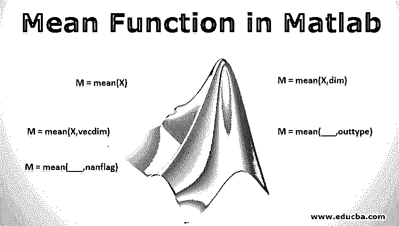
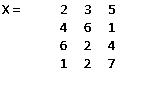
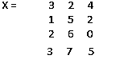
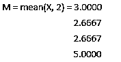

# Matlab 中的均值函数

> 原文：<https://www.educba.com/mean-function-in-matlab/>

## Matlab 中均值函数概述

MATLAB 是一种用于技术计算的语言。我们大多数人都会同意，一个易于使用的环境是集成计算、可视化和最终编程任务所必需的。MATLAB 通过提供一个不仅易于使用，而且我们得到的解以我们大多数人都熟悉的数学符号的形式显示出来的环境来做同样的事情。在本文中，我们将在 Matlab 中详细讨论均值函数。

### MATLAB 的用途包括(但不限于)

*   计算
*   算法的发展
*   造型
*   模拟
*   样机研究
*   数据分析(数据的分析和可视化)
*   工程和科学制图
*   应用开发

MATLAB 为其用户提供了一篮子函数，在本文中我们将了解一个强大的函数，称为“均值函数”。

<small>Hadoop、数据科学、统计学&其他</small>

### Matlab 中均值函数的语法

让我们了解一下 MATLAB 中均值函数的语法

*   M =平均值(X)
*   M =平均值(X，dim)
*   M =平均值(X，vecdim)
*   M =平均值(___，outtype)
*   M =均值(___，nanflag)

现在让我们借助例子来逐一理解这一切

但在此之前，请记住，在 MATLAB 中，矩阵有以下维数:

1 =行，2 =列，3 =深度

均值函数在 Matlab 中的描述

#### 1.M =平均值(X)

*   该函数将返回“X”的所有元素的平均值，沿着非单例数组的维度，即大小不等于 1(它将考虑非单例数组的第一维)。
*   如果 X 是一个向量，mean(X)将返回元素的平均值。
*   如果 X 是一个矩阵，mean(X)将返回一个行向量，它将包含每一列的平均值。
*   如果 X 是一个多维数组，mean(X)将沿着第 1 个数组维操作，其大小是非单值的(不等于 1 ),并将所有元素视为向量。该尺寸将变为 1，其他尺寸的大小不会改变。

**例子**

x =[2 3 5；4 6 1;6 2 4;1 2 7]

所以，

**解** : M =均值(X) = 3.2500 3.2500 4.2500

这里，因为没有提到维度，所以沿着行元素取平均值{对于第一组行元素，我们将得到(2 + 4 + 6 + 1)除以 4，即 3.2500 等等}

#### 2.M =平均值(X，dim)

该函数将导致沿维度 dim 的平均值。传递的维度将是一个标量。

**例子**

x =[3 2 4；1 5 2;2 6 0;**3 7 5】**

所以，

**解决方案**

#### 3.M =平均值(X，vecdim)

该函数将根据 vecdim 向量中指定的尺寸计算平均值。例如，如果我们有一个矩阵，那么平均值(X，[1 ^ 2])将是 A 中所有元素的平均值，因为矩阵 A 的每个元素都将包含在由维度 1 和 2 定义的数组切片中(正如已经提到的，请记住维度 1 是行，维度 2 是列)

**例子**

让我们首先创建一个数组:

x(:，:，1)=[3 5；2 6];
X(:，:，2)=[2 7；1 3];

我们需要找到 M = mean(X，[1，2])

**解:** M1 =
M1(:，:，1) = 4
M1(:，:，2) = 3.2500

从 R2018b 开始，MATLAB 中还引入了一个新特性。这有助于我们计算数组所有维度的平均值。我们可以简单地将“all”作为参数传递给我们的函数。

因此，如果我们再次考虑上述示例并使用函数 M = mean(X，' all ')，我们将得到输出为 3.6250(实际上是上面获得的 4 和 3.25 的平均值)

#### 4.M =平均值(___，outtype)

它将使用前面语法的任何输入参数，并返回指定数据类型(outtype)的平均值

Out 类型可以是以下三种类型:

*   默认
*   两倍
*   当地的

让我们在两种情况下理解这一点:

*   当一个论点是本土的
*   当参数为“double”时

**例 1(自变量是原生的)**

x = int 32(1:5)；
M =均值(A，‘原生’)

**解决方案:**

M = int32
3

其中 int32 是 X 元素的本地数据类型，3 是从 1 到 5 的元素的平均值

**例 2(自变量是“double”)**

X = ones(5，1)；M =平均值(X，' double ')

**解决方案:**

M = 1
在这里，我们可以通过使用:class(M)来检查输出的类，它将返回' double '

#### 5.M =均值(___，nanflag)

该函数将定义是否从任何先前语法的计算中排除或包括 NaN 值。
它有以下两种类型:

*   **Mean(X，' omitNaN'):** 它将从计算中忽略所有 NaN 值
*   **Mean(X，' includeNaN'):** 它会将计算中的所有 NaN 值相加。

**例子**

我们来定义一个向量 X =[1 1 1 NaN 1 NaN]；M =均值(A，' omitnan ')

**解:**这里，我们将得到的输出是去掉 NaN 值后所有值的平均值，即:“1”

如我们所见，MATLAB 是一个系统，它的基本数据元素是一个不需要任何尺寸的数组。这允许我们解决计算问题，特别是矩阵和向量公式的问题。与用标量和非交互式语言(如 c)编写程序相比，所有这一切都要花费少得多的时间。

### 推荐文章

这是一个 Matlab 中均值函数的指南。在这里，我们讨论了 Matlab 的使用，以及 Matlab 中均值函数的语法和各种例子的描述。

1.  [Matlab 中的向量](https://www.educba.com/vectors-in-matlab/)
2.  [Matlab 中的传递函数](https://www.educba.com/transfer-functions-in-matlab/)
3.  [如何安装 MATLAB](https://www.educba.com/install-matlab/)
4.  [Python vs Matlab](https://www.educba.com/python-vs-matlab/)
5.  [MATLAB 函数](https://www.educba.com/matlab-functions/)
6.  [Matlab 编译器| Matlab 编译器的应用](https://www.educba.com/matlab-compiler/)
7.  [Matlab 和运算符的使用](https://www.educba.com/matlab-and-operator/)
8.  [R 中矢量的完整指南](https://www.educba.com/vectors-in-r/)

