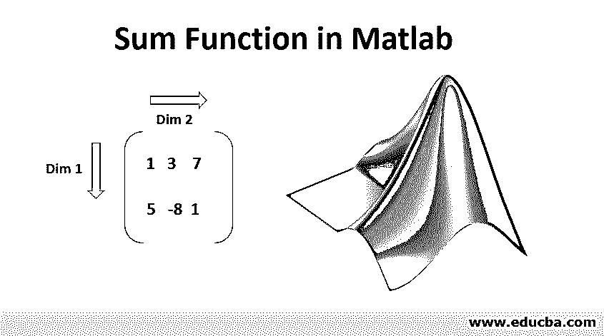
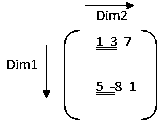
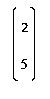
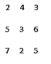
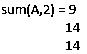

# Matlab 中的求和函数

> 原文：<https://www.educba.com/sum-function-in-matlab/>

## Matlab 中求和函数的介绍

MATLAB 是一种用于技术计算的语言。我们大多数人都会同意，一个易于使用的环境是集成计算、可视化和最终编程任务所必需的。MATLAB 通过提供一个不仅易于使用，而且我们得到的解以我们大多数人都熟悉的数学符号的形式显示出来的环境来做同样的事情。在本文中，我们将深入研究 Matlab 中的 Sum 函数。

### Matlab 的用途包括(但不限于)

*   计算
*   算法的发展
*   造型
*   模拟
*   样机研究
*   数据分析(数据的分析和可视化)
*   工程和科学制图
*   应用开发

MATLAB 为其用户提供了一篮子函数，在本文中我们将了解一个强大的函数，称为“求和函数”。

<small>Hadoop、数据科学、统计学&其他</small>

**语法:**

`S = sum(A)`

`S = sum(A, dim)`

`S = sum(A, vecdim)`

`S = sum(__, outtype)`

`S = sum(__, nanflag)`

### Matlab 中求和函数的描述

现在让我们逐一了解这些功能。

#### 1.S =总和(A)

*   这将返回沿着非单例数组维度的“A”的所有元素的总和，即大小不等于 1(它将考虑非单例的第一维)。
*   如果 A 是 vector，sum(A)将返回元素的和。
*   sum(A)将返回一个行向量，如果 A 是一个矩阵，它将包含每个列的一些内容。
*   如果 A 是多维数组，sum(A)将沿其大小不等于 1 的第 1 个数组维操作，并将所有元素视为向量。该尺寸将变为 1，其他尺寸的大小不会改变。

现在让我们用一个例子来理解 sum(A)。但在此之前，请记住，在 MATLAB 中，矩阵有以下维数:

1 =行，2 =列，3 =深度

**示例# 1–当我们有两行&列**时

如上所述，sum(A)将沿着第一维度做加法，这是非单例的。对于单个行/列，我们将得到一个数字的结果。

`A = [1, 3, 7 ; 5, -8, 1];
S = sum(A);`

**Note**: here S is the resulting sum and A is an array whose sum we need.A =

这里 1 是第一个非单一维度(长度不等于 1 的维度)。因此，一些将沿着行元素，即向下。

S = sum(A) = 6 -5 8

**示例# 2–当我们只有一行时**

`A = [2, 3, 7 ];
B = sum(A);`

这里第一个非单一维度是 2(即列)。因此，总和将与列元素一起

B = sum(A) = 12

**示例# 3–当我们只有 1 列时**

`A = [2 ; 5];`

所以，A =

在这里，第一个非单一维度是 1，所以总和将与行元素一起。

B = sum(A) = 7

#### 2.S = sum(A，dim)

此函数将返回参数中传递的维度的总和。

**例子**

`A = [2 4 3; 5 3 6; 7 2 5]`

所以，A =

S = sum(A，2)

在这里，我们将“2”作为参数传递，因此总和将沿着维度 2。
所以，S =

#### 3.S = sum(A，vecdim)

该函数将根据向量“vecdim”中指定的维度对元素求和。例如，如果我们有一个矩阵，那么 sum(A，[1 ^ 2])将是 A 中所有元素的总和，因为矩阵 A 的每个元素都将包含在由维度 1 和 2 定义的数组切片中(记住维度 1 是行，维度 2 是列)

**例子**

`A = ones(3,3,2);`(这将创建一个所有元素都等于 1 的三维数组)

现在，要对矩阵 A 的每个片上的所有元素求和，我们需要指定要求和的维度(行和列)。我们可以通过提供一个向量维度作为参数来实现这一点。在我们的例子中，两个切片都是一个 3 * 3 的矩阵，所以总和将是 9。

S1 = sum(A，[1 2])
所以，S1 = S1(:，:，1) = 9
&
S1(:，:，2) = 9

#### 4.S = sum(A，outtype)

此函数将返回参数中传递的数据类型的总和。“outtype”可以是“native”、“default”或“double”。

**例子**

`A = int32(5: 10);
S = sum(A, 'native')`

其输出将是:

S = int32
45

其中 int32 是 A 的元素的本机数据类型，45 是从 5 到 10 的元素的总和。

#### 5.S = sum(nanflag)

这将指定我们是否需要在计算中包括或忽略 NaN。

sum(A，' includenan ')将包括计算中出现的所有 nan 值。

sum(A，' omitnan ')将忽略所有 nan 值。

**例子**

`A = [1 -5 3 -2 NaN 4 NaN 9];
S = sum(A, 'omitnan')`

因此，我们将得到的输出是
S = 10
(忽略所有 NaN 值之后)

### 结论

如我们所见，MATLAB 是一个系统，它的基本数据元素是一个不需要任何尺寸的数组。这允许我们解决计算问题，特别是矩阵和向量公式的问题。与用标量和非交互式语言(如 c)编写程序相比，所有这些都要用少得多的时间。

### 推荐文章

这是一个在 Matlab 中求和函数的指南。这里我们分别讨论 Matlab 的用法、语法、例子以及在 Matlab 中 sum 函数的描述。您也可以阅读以下文章，了解更多信息——

1.  [Matlab 中的向量](https://www.educba.com/vectors-in-matlab/)
2.  [Matlab 中的传递函数](https://www.educba.com/transfer-functions-in-matlab/)
3.  [Matlab 运算符](https://www.educba.com/matlab-operators/)
4.  [什么是 Matlab？](https://www.educba.com/what-is-matlab/)
5.  [Matlab 编译器| Matlab 编译器的应用](https://www.educba.com/matlab-compiler/)

