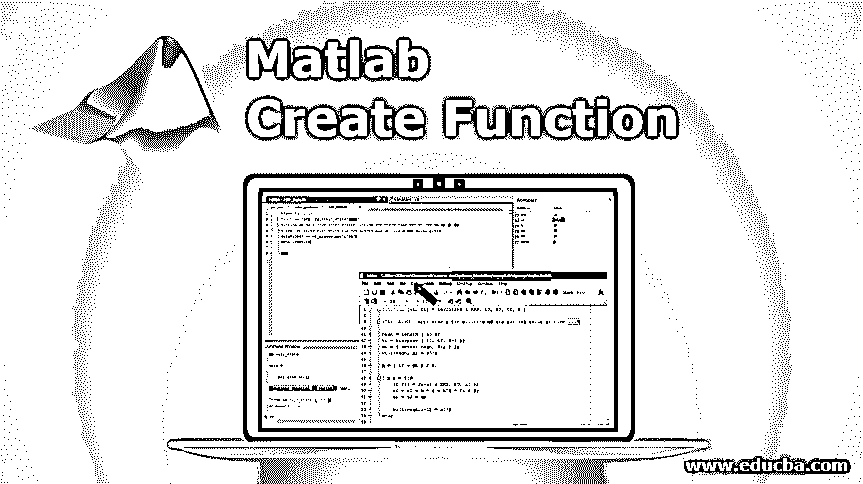

# Matlab 创建函数

> 原文：<https://www.educba.com/matlab-create-function/>

## Matlab 创建函数介绍

Matlab 创建函数对函数实现起重要作用的是函数名和 Matlab 文件名应该相同。Matlab 函数被定义为是在 Matlab 中执行特定操作的一组指令，函数在 Matlab 中需要一个单独的文件。它的实现分为三个部分:函数声明、函数调用和函数定义，即函数体。

在函数声明中，我们声明函数的名字，然后声明在函数体内将要操作的参数。在函数定义中，我们定义函数，这里我们编写实际的程序逻辑和语句，最后一部分是调用函数，在这里我们只在需要的时候调用函数。Matlab Create Function 声明函数可以赋多个参数，可以接受多个值作为输入，在函数的定义中可以返回多个值或多个自变量。Matlab 中有各种函数，如匿名函数、主函数和子函数、嵌套函数和私有函数。在私有函数中，我们可以对不想要的用户隐藏重要的数据，所以私有函数为代码提供了隐私。

<small>Hadoop、数据科学、统计学&其他</small>

### 示例和语法

下面给出了以下示例和语法:

#### 示例 1–简单的函数程序

让我们考虑我们希望解决一个数学方程，这个方程是

eq =(x–y)* 32

**语法:**

`function variable name = function name (parameter list)
Function definition ( statements )
end`

下表是上述示例的程序说明

| **Matlab 编辑器** | **命令窗口** | **输出** |
| function [ eq] = myfunction ( x，y)
eq =(x–y)* 32；
结束
*文件保存为 myfunction。英语字母表中第十三个字母 | x = 4
y = 3
eq = myfunction ( x，y) | x = 4
y = 3
eq = 32 |

#### 示例 2–匿名函数

让我们考虑 x^2 方程——log x

为了解决上述函数，我们需要创建一个匿名函数，然后需要编写一个函数定义。我们可以在命令窗口中编写代码的所有语句。

**语法:**

`Function handle variable = @ input variable
Mathematical equation ( function definition )
Function variable(input variable value)`

下表通过使用匿名函数说明了示例 2 的 Matlab 代码和输出。

| **Matlab 命令窗口** | **输出** |
| y = @ x)x . ^ 2–l g(x)
x(1:1 0)
p = y(x) | y =
@(x)x . ^2–l g(x)
p =
14.6137 |

#### 示例 3–子功能

如果程序中有一个以上的功能，那么第二个功能称为子功能或主功能。

**语法:**

`Function = first function name
Statements ( function body)
End
Function = second function name
Statements
End`

下表通过使用 primary 函数说明了示例 3 的 Matlab 代码和输出

| **Matlab 编辑窗口** | **命令窗口** | **输出** |
| 函数[ xval 1，xval2 ] =二次型(a1，b1，c1 )
op =圆盘型(a1，b1，C1)；
XV al 1 =(-B1+op)/(2 * a1)；
xval 2 =(-B1–op)/(2 * a1)；
end
函数 dis = disc ( a1，b1，C1)
dis =sqrt(b1^2–4 * a1 * C1)；
结束
文件保存为 quadratic.m | 二次(10，43，–54) | ans =1.0158 |

#### 示例 4–嵌套函数

如果一个函数出现在另一个函数内部，那么它就叫做嵌套函数。

让我们考虑一个例子。有两个函数 quadratic2 和 quadratic1，这里 quadratic 1 函数在 quadratic2 函数内部，因此，它被称为嵌套函数。

**语法:**

`Function = main function name ( parameter list )
Function = nested function name ( parameter list )
Statements ( function definition )
End
End`

下表通过使用嵌套函数说明了示例 4 的 Matlab 代码和输出

| **Matlab 编辑窗口** | **命令窗口** | **输出** |
| function [ xval1，xval2 ] = quadratic2 ( r1，r2，R3)
function quadratic 1
op = sqrt(R2 ^ 2–4 * R1 * R3)；
end
quadratic 1；
xval 1 =(–R2+op)/(2 * R1)；
xval 2 =(–R2–op)/(2 * R1)；
end
*文件保存为 quadratic2.m | >>方形 2 ( 45，52，38) | 一个 s =–0.5778+0.7146 I |

### Matlab 创建函数的优势

下面介绍几个优点。

*   函数的主要优点是，它以一种有组织的方式保持程序，避免不必要的重复。
*   它把长码分成更小的块。
*   我们可以通过调用函数名来一次又一次地重用代码。不需要一直写函数定义。
*   由于可重用性，它节省了内存空间，并且易于执行代码。
*   通过在编程中使用函数，我们可以很容易地管理控制流。
*   函数增加了编程的可读性。
*   如果程序中有函数，修改就变得容易了。
*   它减少了错误的发生。
*   它降低了程序的复杂性。

### 结论

函数的主要特性是可重用性，因为如果我们使用函数，复杂的代码变得简单，编程变得高效。Matlab 声明和定义任何函数都非常简单。它增加了程序的可读性，也提高了对程序的理解。

### 推荐文章

这是一个 Matlab 创建函数的指南。这里我们讨论介绍、不同的例子、语法以及优点。您也可以浏览我们推荐的其他文章，了解更多信息——

1.  [Matlab 中的颜色](https://www.educba.com/colors-in-matlab/)
2.  [MATLAB 中的热图](https://www.educba.com/heatmap-in-matlab/)
3.  [Matlab 中的散点图](https://www.educba.com/scatter-plots-in-matlab/)
4.  [MATLAB 中的复数](https://www.educba.com/complex-numbers-in-matlab/)
5.  [Matlab Comet() |步骤和方法](https://www.educba.com/matlab-comet/)

