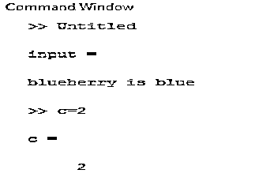
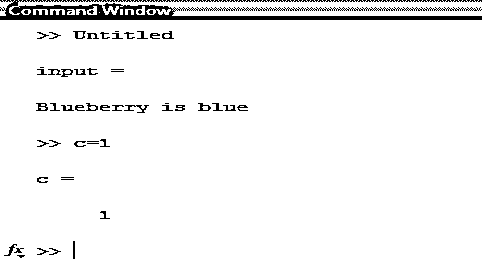
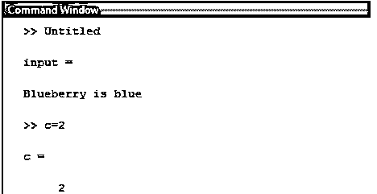
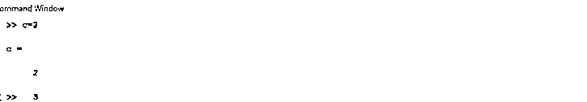
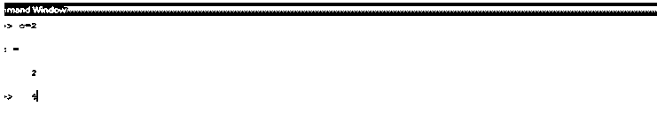

# Matlab 计数

> 原文：<https://www.educba.com/matlab-count/>

## Matlab 计数简介

为了在 Matlab 程序中找到特定事件的存在，使用了 count 命令。如果一个输入是一个字符串，那么通过使用这个命令，我们可以找出一个特定的字符在输入字符串中出现了多少次。我们还可以对数组应用 count 命令。如果输入的是一组数组形式的数字，那么通过使用 count 命令，我们可以找出一个特定的数字在数组中出现的时间。根据参数列表，count 命令有两种用法。

### Matlab 中计数是如何工作的？

count 命令有两种用法。一个区分大小写，另一个不区分大小写。这个命令主要用于字符串操作，我们需要找出字符的出现。但是输入字符串一个字符可能出现多次，并且是大写和小写两种情况。因此，第二种方法用于忽略字母的大小写。

<small>Hadoop、数据科学、统计学&其他</small>

使用“计数”命令的步骤-

**第一步:**接受输入的字符串。

**第二步:**声明变量存储计数，应用命令计数。

**第三步:**显示结果。

**语法:**

`Variable name = count (input, ‘event’)
Variable name = count (input, ‘event’, ‘ignoreCase’, true)`

### Matlab 计数示例

下面给出以下的例子:

#### 示例#1

假设输入字符串是“blueberry is blue ”,我们需要找出“blue”在给定字符串中的出现次数。表 1 举例说明了 Matlab 代码，例如，1 .这里的输出是 2，因为蓝色出现了两次，一次出现在单个字符串中，另一次出现在另一个字符串中(蓝莓)。

**代码:**

`clc ;
input = ‘blueberry is blue’
c= count( input , ‘blue’)`

**输出:**

#### 实施例 2

假设输入字符串是“Blueberry is blue ”,我们需要找出“blue”在给定字符串中的出现次数。这里的输出是 1，因为蓝色出现了两次，一次出现在一个字符串中，另一次出现在另一个字符串中(蓝莓)。但是用大写字母，因此如果我们使用第二种方法来写 count 命令，那么输出将是 2。表 2(a)示出了使用第一种方法的示例 2 的 Matlab 代码。表 2(b)示出了使用第二种方法的示例 2 的 Matlab 代码。

**代码:**

`input = ‘Blueberry is blue’
c= count( input , ‘blue’)`

**输出:**

**代码:**

`input = ‘Blueberry is blue’
c= count( input , ‘blue’ ,IgnoreCase’ ,true)`

**输出:**

#### 实施例 3

让我们把多维数组中的输入字符串看作“一、五、十一、五、四、十、一、四、三”；“一，零，十，零，十，一，二，十，一，八”，我们需要找出“一”在给定字符串中的出现。这里，不同行的输出是不同的。由“；”分隔的两行元素.表 3 展示了示例 3 的 Matlab 代码。

**代码:**

`Input = [“ one, five, eleven, five, four, ten, one, four, three ”; “ one, zero, ten, zero, ten, one, two, ten, one, eight ”] c=count(input , “one”)`

**输出:**

#### 实施例 4

让我们把多维数组中的输入字符串看作“一、五、十一、五、四、十、一、四、三”；“一，零，十，零，十，一，二，十，一，八”，我们需要找出两个事件同时发生。给定字符串中的“一”、“二”。这里，不同行的输出是不同的。由“；”分隔的两行元素.表 4 举例说明了 Matlab 代码，例如，4。这里的输出是 2 和 4，因为在第一个字符串中,“1”出现了两次,“2”出现了零次。在第二个字符串中,“一”出现三次,“二”出现一次。

**代码:**

`Input = [“ one, five, eleven, five, four, ten, one, four, three ”; “ one, zero, ten, zero, ten, one, two, ten, one, eight ”] c=count(input , [“one”,“two”]`

**输出:**

### 结论

正如我们在上面的例子中看到的，count 命令有多种用法。我们可以在一维以及多维数组中应用这个命令。count 命令主要用于字符串操作，以任何方式计算字母的出现次数。

### 推荐文章

这是一个 Matlab 计数指南。在这里，我们讨论介绍，如何在 Matlab 中计数工作，以及语法，代码和输出的例子。您也可以浏览我们的其他相关文章，了解更多信息——

1.  [Matlab 中的等高线图](https://www.educba.com/contour-plot-in-matlab/)
2.  [列向量 Matlab](https://www.educba.com/column-vector-matlab/)
3.  [Matlab 线宽](https://www.educba.com/matlab-linewidth/)
4.  [Matlab 中的平方根](https://www.educba.com/square-root-in-matlab/)

