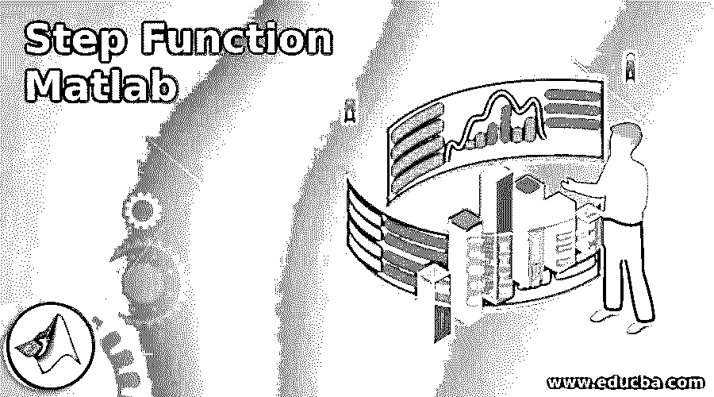
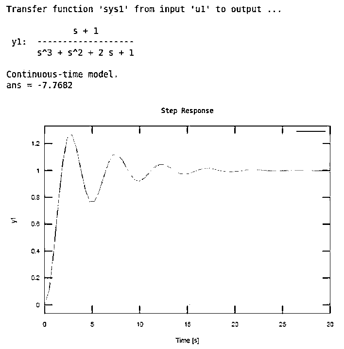
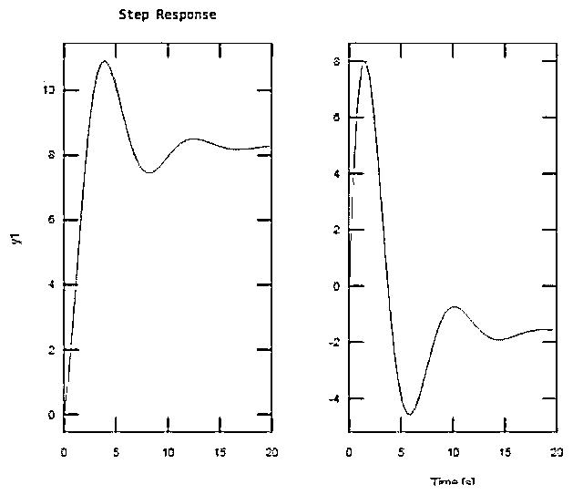
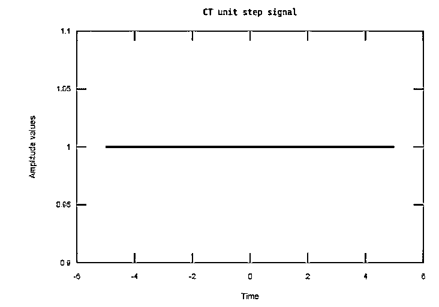

# 阶跃函数 Matlab

> 原文：<https://www.educba.com/step-function-matlab/>

> 
> 
> 

## 阶跃函数 Matlab 简介

利用 Matlab 中的阶跃函数进行设计控制。我们使用步长和单位步长来直接绘制标量输入，而不使用 Matlab 中的任何特殊工具箱。不连续函数对于负变元具有零值，对于正变元具有一个值，称为单位阶跃函数。我们可以将阶跃函数与任何其他函数(也称为系统函数)一起使用。一旦定义了系统函数，我们就可以通过阶跃函数来传递这个函数。

**语法:**

阶跃函数 Matlab 的语法如下所示:

<small>Hadoop、数据科学、统计学&其他</small>

`Step (sys)`

### 阶跃函数 Matlab 怎么做？

在这里，我们将看到如何编写一个 matlab 代码来生成一个先进的或延迟的单位阶跃函数。

步骤如下:

**步骤 1:** 从用户处获取间隔或由程序员决定。

**步骤 2:** 接受用户或程序员选择的高级或延迟功能。

**第三步:**定义时间轴。

**步骤 4:** 创建第 0 行向量，避免垃圾值。

**第五步:**写单元步进命令。

**第六步:**最后绘制函数。

我们还使用阶跃函数绘制了传递函数响应。

步骤如下:

**第一步:**取一个变量中的分子。

**第二步:**取另一个变量中的分母。

**步骤 3:** 使用‘TF’函数生成传递函数，并赋给 sys1 变量。

**步骤 4:** 使用阶跃函数绘制响应。

### 阶跃函数 Matlab 示例

下面是一些例子:

#### 示例#1

本例中，我们学习如何使用 matlab 中的阶跃响应功能来绘制阶跃响应传递函数，我们得到 s 的 G1 等于 s+1 除以 s 的立方加 s 的平方加 2s+1。现在我们需要以 matlab 理解的格式输入这个阶跃函数，方法是写下代表分子的向量。所以我们用两个变量来表示分子和分母，这两个变量分别是 num1 和 den1。所以，这里的分子是 a num1 = [ 1 1 ]，前 1 对应 s，2 nd 1 对应常数，这里的分母是 den1 = [ 1 1 2 1 ]，1ST1 对应 s 的立方，2nd1 对应 s 的平方，2 对应 s，最后 1 对应常数。然后，我们假设 sys1 等于 TF 是一个标准函数，用于在 s 域中生成一个传递函数，s 域是一个拉普拉斯域，给定分子(num1)和分母(den1)，我们在 sys1 变量中有一个传递函数。现在我们用一个阶跃函数来描绘系统的阶跃响应。然后，我们还使用网格函数来查看图上的网格。

**代码:**

`clc;
close all;
clear all;
num1 = [ 1 1 ];den1 = [ 1 1 2 1 ];sys1 = tf (num1, den1)step(sys1)grid on`

**输出:**

#### 实施例 2

让我们看一个例子，在这个例子中我们绘制了一个 2 和阶状态空间模型。我们取 4 个变量 a1、b1、c1 和 d1，这是 Nx 乘 Nx 的实值或复值矩阵。在我们的例子中，d1 的值为零。而这 4 个变量都是从 ss 函数传过来的，ss 是一个状态空间模型。sys1 = ss (a1，b1，c1，d1)创建以下形式的离散时间状态空间模型对象:x[n+1]=a1x[n]+b1u[n]和 y[n]=c1x[n]+d1u[n]。且这被分配给 sys1。然后我们用阶跃函数来绘制响应，它显示了两个响应。

**代码:**

`clc;
close all;
clear all;
a1 = [-0.55, -0.78; 0.78,0];b1 = [1,-1;0,2];c1 = [1.96, 6.44];d1 = 0;sys1 = ss(a1, b1, c1, d1);step(sys1)grid on`

**输出:**

第一个输入通道的阶跃响应如左图所示，第二个输入通道的阶跃响应如右图所示。

#### 实施例 3

让我们看一个产生延迟或提前单位阶跃信号的例子，1 st 我们要求用户输入想要获得阶跃信号的间隔，为了获取用户值，我们使用了一个输入函数，它要求用户输入用户输入的数字，该数字存储在常数变量中，然后我们还要求用户关闭信号延迟(+ve 号)或提前(-ve 号)。然后我们在 x1 变量中定义一个时间轴。然后，我们创建第 0 行向量，以避免垃圾值，这等于单位 step_CT 变量。然后，我们使用绘图函数根据延迟或提前绘制单位步长。然后，我们使用 xlabel 和 ylabel 函数将该图标记为 x 轴是时间，y 轴是振幅。使用标题函数，我们给这个响应一个标题。我们还使用一个网格函数在绘图上显示网格。

**代码:**

`clc;
close all;
clear all;
n = input('Enter the interval for which you want to get unit step signal: - ');
d = input ('Enter the delayed (+ve no. ) or advanced ( -ve no. ):- ');
x1 = -5:0.01:5;
unitstep_CT = zeros(size(x1));
unitstep_CT(x1>=0 + (d)) = 1;
plot(x1,unitstep_CT,'b','linewidth',2);
xlabel('Time');
ylabel('Amplitude values');
title('CT unit step signal');
grid on`

**输出:**

### 结论

在本文中，我们看到了 matlab 中阶跃函数的概念。基本上，阶跃函数用于控制设计。然后看到了与阶跃函数相关的语法以及如何在 matlab 代码中使用。此外，我们还在 matlab 上看到了一些与阶跃函数及其输出相关的示例。

### 推荐文章

这是一个阶跃函数的 Matlab 指南。这里我们分别讨论入门，如何做 matlab 阶跃函数，以及例子。您也可以看看以下文章，了解更多信息–

1.  [Matlab 中的字符串数组](https://www.educba.com/string-array-in-matlab/)
2.  [梯形法则 Matlab](https://www.educba.com/trapezoidal-rule-matlab/)
3.  [Matlab 梯形()](https://www.educba.com/matlab-trapz/)
4.  [MATLAB 导数](https://www.educba.com/matlab-derivative/)

