# Matlab 极限

> 原文：<https://www.educba.com/matlab-limit/>

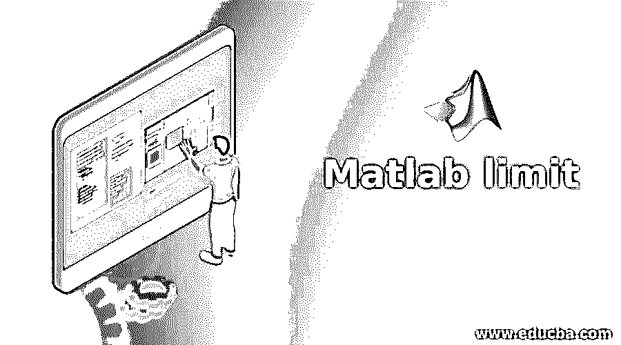

## Matlab 极限简介

limit()函数用于对符号表达式的最小值和最大值施加限制，以便将它们保持在定义的特定范围内。使用 xlim、ylim 和 zlim 命令，这些限制也可以应用于任何 Matlab 绘图。这些限制对于不同数据值范围内的各种数据分析和行为非常有用。

### Matlab 极限的语法

下面给出了 Matlab 极限的语法:

<small>Hadoop、数据科学、统计学&其他</small>

| **语法** | **描述** |
| 极限(f，var，a) | 函数的 limit(f，var，a)形式用于返回符号表达式 f，当 var 趋向于 a 时施加双向限制。 |
| 极限(f，a) | 函数的 limit(f，a)形式用于在 symvar 找到的默认变量趋向于达到值 a 时，返回施加了双向限制的符号表达式 f。 |
| 极限(f) | 函数的 limit(f)形式用于返回值被限制为值 0 的符号表达式 f。 |
| 极限(f，var，a，'左') | 函数的 limit(f，var，a，' left ')形式用于返回符号表达式 f，该表达式的值被' f '的左侧界限限制为值，因为 var 趋向于达到值 a |
| 极限(f，var，a，'右') | 函数的 limit(f，var，a，' right ')形式用于返回符号表达式 f，当 var 趋向于达到值 a 时，该符号表达式 f 的值被“f”的右侧极限限制为值 |

### 输入参数

下面给出了输入参数:

*   **输入(f):** 函数的输入表示为 f，可以指定为函数、符号表达式、矩阵或向量。
*   **自变量(var):** 自变量是一个符号变量，记为‘var’。当 var 没有明确定义时，那么“symvar”确定一个默认变量作为自变量。
*   **极限点(a):** 输入‘f’的极限值可以用数字或符号数、变量或表达式来指定。

#### 示例#1

**代码:**

`syms var delta
func = cos(var)/var; //function1 expression as input
limit(func,var,0)// limit of var tends to 0
func = (cos(var+delta)-cos(var))/delta; //function2 expression as input
limit(func,delta,0)//limit of delta tends to 0`

**输出:**

*   **输出 1:**var = 0 时 func 函数的阈值。
*   **输出 2:** 函数 func 的阈值，其中 delta=0。

考虑一个正弦函数。

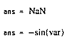

#### 实施例 2

**代码:**

`syms var delta
func = sin(var)/var; // sin(var)/var is input to the function
limit(func,var,0) // evaluating function func where var tends to 0
f = (sin(var+delta)-sin(var))/delta; //(sin(var+delta)-sin(var))/delta is input
//to the function
limit(func,delta,0) //evaluating function where delta tends to 0`

**输出:**

考虑一个 cos 函数。

*   **输出 1:**var = 0 时 func 函数的阈值。
*   **输出 2:** 函数 func 的阈值，其中 delta=0。

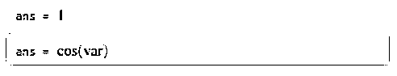

#### 实施例 3

**代码:**

`syms var
func = 1/(2*var); //Input to right side limit function
limit(func,var,0,'right') //Executing right side limit function on the input
//function func`

**输出:**

输出是函数 func 的值的结果，其中 var 的值接近 0，为正值。

**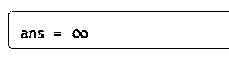

** 

#### 实施例 4

**代码:**

`syms var
func = 1/(2*var); //Function as input for left side limit function
limit(func,var,0,'left') //Executing left side function on input function`

**输出:**

输出是函数 func 的值的结果，其中 var 的值接近 0，为负值。

**<u>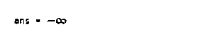

</u>** 

### 符号向量中表达式的极限

Matlab 中的极限函数也支持施加符号向量。在这种情况下，函数作用于向量元素。

#### 例子

**代码:**

`syms var delta
Vector = [(1+delta/var)^var exp(-var)]; //The vector on which the limit is
//imposed
limit(Vector,var,Inf) //Executing limit function on the vector`

**输出:**

2×1 向量形式的输出作为 2×1 向量“vector”的每个元素的 var 值 inf 产生。

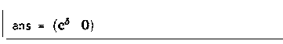

### 指定轴限制

可以控制任何 Matlab 绘图上的数据点的范围，并且要出现在 x 轴、y 轴和 z 轴上的数据坐标具有分别使用 xlim、ylim 和 zlim 对相应轴施加的限制。在只有 2-D 图的情况下，沿着 x 轴和 y 轴的线条的外观可以相对于沿着每个轴以递增顺序显示值的方向改变或颠倒。

#### 示例#1

**代码:**

`xdata = linspace(-15,15,150); //Defining data points along x-axis
ydata = sin(4*xdata)./exp(xdata); //Defining data points along y-axis
plot(xdata,ydata) //Creating the 2 dimensional plot
xlim([0 10]) //Imposing limits on data points along x-axis
ylim([-0.5 0.7]) //Imposing limits on data points along y-axis`

**输出:**

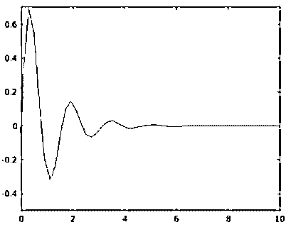

#### 实施例 2

二维绘图的限制可以由程序明确决定，也可以由 Matlab 根据函数和轴上的可接受值选择任何默认值。

在下面的示例中，x 轴上的最大限值设置为 0，y 轴上的最小值设置为-1。其他边的极限值由 Matlab 选择。为了结合自动计算过程来决定最小和最大限制，分别使用值-inf 或 inf。

**代码:**

`xdata = linspace(-15,15,150); //Defining data points across x-axis
ydata = sin(4*xdata)./exp(xdata);//Defining function across y-axis
plot(xdata,ydata) //Creating the 2 dimensional plot
xlim([-inf 0])  //Imposing partial limit on x-axis data points having upper value
//limit fixed to 0
ylim([-1 inf]) //Imposing partial limit on y-axis data points having lower value
//limit fixed to -1`

**输出:**

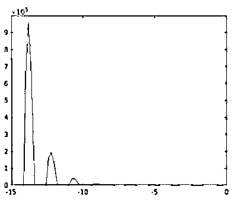

根据算法或用户的要求，可以使用 xlim、ylim 或 zlim 后跟关键字“auto”将限值恢复为二维图中的默认值。

**代码:**

`xdata = linspace(-15,15,150); // Defining the data points across x-axis
ydata = sin(4*xdata)./exp(xdata); //Defining the function for y-axis
plot(xdata,ydata) //Creating the 2 dimensional plot
xlim([-inf 0]) //Imposition of limits on x-axis values
ylim([-1 inf]) //Imposition of limits on y-axis values
xlim auto //Reverting limits on x-axis data points to default value
ylim auto //Reverting limits on y-axis data points to default value`

**输出:**

**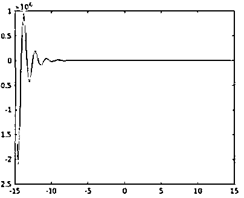

** 

**补充说明:**

Matlab 中的 limit()函数有 3 种应用限制的情况，例如:

1.这适用于包括双向限制:

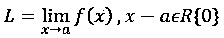

2.这适用于包括左侧限制:

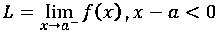

3.这适用于包括右侧限制:

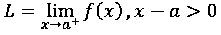

### 推荐文章

这是一个 Matlab 极限指南。这里我们讨论符号向量中表达式的引入、限制和指定轴限制。您也可以看看以下文章，了解更多信息–

1.  [震级 Matlab](https://www.educba.com/magnitude-matlab/)
2.  [Matlab 2 cell Matlab](https://www.educba.com/mat2cell-matlab/)
3.  [评估功能 MATLAB](https://www.educba.com/eval-function-matlab/)
4.  [Matlab 对象](https://www.educba.com/matlab-object/)

