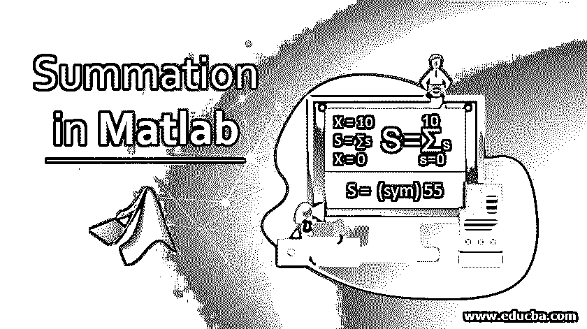
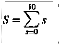
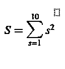
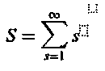
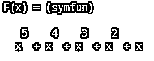
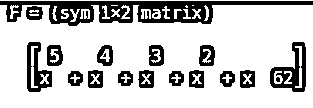

# Matlab 中的求和

> 原文：<https://www.educba.com/summation-in-matlab/>

## Matlab 中求和函数的介绍

MATLAB 为它的用户提供了各种各样非常实用的函数。这篇文章的重点是理解一个强大的函数，叫做“求和函数”。在这个主题中，我们将学习 Matlab 中的求和。

数学公式通常需要添加一些变量。求和，也称为 sigma，是一种简单方便的符号，用于表示给定变量的值的和的表达式。

<small>Hadoop、数据科学、统计学&其他</small>

设 a1，a2，a3，…an 表示一组 n 个随机数。a1 是集合的第 1 个号到第 1 个号。“ai”代表这个集合的第“I”个数字。

### 求和符号

符号包括:

**1。求和/sigma 符号:**这由符号 S 定义。求和的符号是大写的希腊字母 S。这个求和符号表示我们需要将序列的元素相加。我们正在求和的给定序列的元素出现在这个求和符号的右边。

**2。求和的变量或被加的变量:**求和的变量用一个指数表示。这个索引放在我们的求和符号下面。通常，指数用 I 表示(指数的其他常用表示是 j & t)。这个指数用表达式 i = 1 来表示。该指数采用的值以等式的 RHS 上的值开始，以求和符号以上的值结束。

**3。求和的起点也称为求和的下限**

**4。求和的停止点也称为求和的上限**

现在我们已经理解了求和函数，让我们看看它在 MATLAB 中是如何工作的

**求和函数语法:**

`S = symsum(s, i, a, b)`

现在让我们借助各种例子来理解语法

### Matlab 中的符号和描述

**1。S = symsum(s，I，a，b)**

*   这里 S 是一个级数，I 是求和指数，a 和 b 是上限值和下限值，函数 S 将从上限值和下限值得出指数 I 的 S 级数的和。
*   语法也可以写成 symsum(s，I，[a b])或 symsum(s，I，[a；b])

下面是一个简单的例子，我们用求和函数计算一个数列的和:

**例子**

`S = symsum(s, s, 0, 10)`

这里 s 是一个从 0 开始到 10 结束的序列

X=10

S=∑s

x=0

该函数将返回:

`S = 55 (which is the sum of 0 + 1 + 2 + 3 +………+ 10)`

**这是 MATLAB 控制台中输入和输出的样子:**

**代码:**

`syms s
S = symsum(s, s, 0, 10)`

让我们举一个更复杂的例子:

**代码:**

`S = symsum(s^2 , s, 0, 10)`

这里 s 是一个从 0 开始到 10 结束的级数，在函数中它的幂是 2。

该函数将返回:

`S= 385 ((0 x 0) + (1 X 1) + (2 x 2) + (3 x 3)  + …… + (10 x 10))`

**这是 MATLAB 控制台中输入和输出的样子:**

**代码:**

`syms s
S = symsum(s^2 , s, 0, 10)`

我们也可以使用 sum 直到无穷大，如下例所示:

**代码:**

`S = symsum(s, s, 0, inf)`

这里 s 是一个从 0 开始，到无穷大结束的数列。

该函数将返回无穷大的和

S= ∞

**这是 MATLAB 控制台中输入和输出的样子:**

`S = symsum(s, s, 0, inf)`

下面是求和的另一种语法:

**语法:**

`S = symsum(s, s, [0, 10])`

该函数将返回:

`S = 55`

**现在让我们来理解如何求给定多项式级数的和:**

K=5

F(x) = ∑ x^k，让它成为我们的多项式。

K=1

为了计算这个多项式的和，让我们假设 x 的值为 2

**代码:**

`syms x k
F(x) = symsum (x^k, k, 1, 5)`

这是 MATLAB 中输出函数的样子:

现在让我们把 x 的值记为 2

下面是我们的输入和输出在 MATLAB 中的样子:

`syms x k
F(2) = symsum (2^k, k, 1, 5)`

所以，MATLAB 中的求和函数可以用来求一个级数的和。这个数列可以是简单的数列，也可以是多项式函数。

### 推荐文章

这是一个在 Matlab 中求和的指南。在这里，我们讨论了在 Matlab 中的符号和的描述以及例子。您也可以看看以下文章，了解更多信息–

1.  [Matlab 中的颜色图](https://www.educba.com/colormap-in-matlab/)
2.  [Matlab 中的单位矩阵](https://www.educba.com/identity-matrix-in-matlab/)
3.  [Matlab 绘图标记](https://www.educba.com/matlab-plot-marker/)
4.  [测井曲线 Matlab](https://www.educba.com/log-plot-matlab/)
5.  [线性拟合 Matlab 指南](https://www.educba.com/linear-fit-matlab/)

