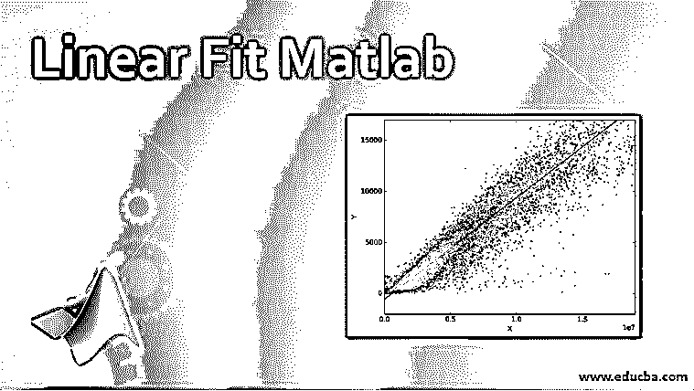
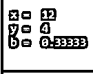

# 线性拟合 Matlab

> 原文：<https://www.educba.com/linear-fit-matlab/>

## 线性拟合 Matlab 简介

线性拟合定义为拟合或回归拟合直线，使实际值和预测值之间的差异最小，或者选择最佳拟合直线，使这些点的误差最小。它描述了自变量和因变量之间的关系，并检查这些变量之间是否存在线性拟合。像这种方法的线性拟合有许多应用，用于分析许多行业中不同的定价和营销技术。

### 线性拟合在 Matlab 中是如何用语法工作的？

在 Matlab 中，用于应用线性拟合的流行且最有效的技术被称为“最小二乘拟合”方法，该方法规定最佳拟合的线以实际值和预测值之间的差(误差)的平方最小的方式进行调整。在我们将线性拟合应用于任何数据集之前，建议查看数量或特征之间是否存在任何关系，这可以通过对数据集应用相关性分析来检查。如果这些变量之间存在非线性关系，有时相关性分析无法检测出来。

<small>Hadoop、数据科学、统计学&其他</small>

线性拟合遵循以下关系:

**语法:**

`Y1=mx1+c`

**其中，**

*   **Y1:** 目标、因变量或标准变量
*   **x1:** 自变量或预测变量
*   **m:** 斜率或回归系数
*   **c:** 常数

**解释:**但是，如果因变量和自变量之间存在非线性关系，那么最好对那些变量进行变换，使那些变量之间存在线性拟合。我们还可以通过散点图等图形分析来测试变量之间的线性关系。相关分析也是检验因变量和自变量之间关系的方法之一。它计算变量之间的相关系数，可以是正的，也可以是负的。如果它是正相关系数，那么变量是正相关的，如果它是负相关系数，那么变量是负相关的。它可以取-1 到 1 之间的值；接近-1 或 1 的值意味着变量是强相关的(可能是正的或负的)。相关系数为 0，意味着各个变量之间的关系很弱。

### 实现线性拟合的 Matlab 实例

\ Matlab 中的运算符用于执行变量之间的线性拟合。请查找下面描述\运算符用法的示例:"

#### 示例#1

**代码:**

`x=12
y=4
b=x\y`

**输出:**

**解释:**这里 b 是回归系数，如果按照上述示例给出输入，线性拟合方程将是 y=0.333x。

线性拟合中的残差定义为因变量或响应变量的实际值与线性模型预测值之间的差值。要生成线性拟合模型，残差的平方和应该最小，这种最小化称为最小二乘拟合。如果我们绘制残差图，并且我们在图中看到一个明确的模式，并且残差点不是以随机的方式出现，那么这表明线性拟合不好。线性拟合优度的一个重要度量是 R^2 或决定系数，它度量数据集中的变化量。从统计学上讲，它表明从模型中获得的值与模型应该预测的因变量的值是如何匹配的。请找到在计算决定系数或 R^2 值时考虑的以下公式:

**R^2=1-RSS/TSS**

**其中，**

*   **R^2:** 决定系数
*   **RSS:** 计算线性拟合得到的残差平方和
*   **TSS:** 响应变量平均值的平方差总和

#### 实施例 2

**代码:**

`x=23
y=17
b=x\y`

**输出:**

**解释:**这里 b 是回归系数，如果按照上述示例给出输入，线性拟合方程将是 y=0.73913x。

### 线性拟合假设

通常，线性拟合模型应遵循某些假设:

*   在应用线性拟合方程时，应考虑自变量和因变量之间的线性关系。
*   被考虑的独立变量之间应该很少或没有相关性。这种现象称为多重共线性，可以通过删除任何相关的独立变量来避免，或者我们可以将两个要素合并为一个要素并将其应用于模型中。
*   线性拟合的另一个假设是线性拟合线上的误差或残差应该是随机的，并且残差中不应该有任何确定的模式。
*   被考虑的变量之间应该有一个正态分布。正态性可以通过图形绘制数值并检查模式来观察。

### 应用程序

许多行业将线性拟合应用用于其业务增长等。请找出一些我们可以对数据集应用线性拟合的应用:

*   来预测某一段时间内任何一个行业的销售额和收入。
*   预测引入的新营销技术的有效性或分析不同促销的结果。
*   在金融行业，它被用来做预测。
*   许多保险公司使用这种技术来预测未来的索赔，并据此做出决策。
*   它还用于研究变量之间的依赖关系，以了解某个特定特征是否会影响某个特定特征。

### 结论

Matlab 中的线性拟合是一个需要学习的非常重要的特性，因为每个公司和行业都逐渐将这种技术用于许多目的。不用考虑我们的直觉，我们可以使用这种技术实际地看到结果，并有效地做出决定。

### 推荐文章

这是一个线性拟合的 Matlab 指南。在这里，我们讨论线性拟合 Matlab 的语法，它是如何工作的，用假设和应用的例子来实现。您也可以浏览我们的其他相关文章，了解更多信息——

1.  [Matlab 计数](https://www.educba.com/matlab-count/)
2.  [Matlab 图例](https://www.educba.com/matlab-legend/)
3.  [Matlab 细胞阵列](https://www.educba.com/matlab-cell-array/)
4.  [Matlab stem() |属性和示例](https://www.educba.com/matlab-stem/)

