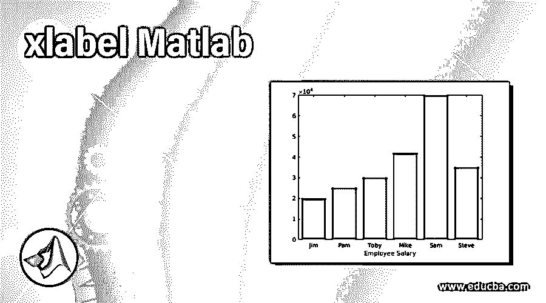
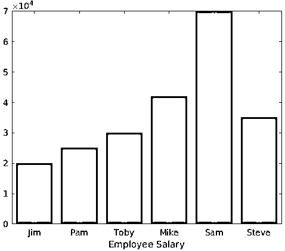
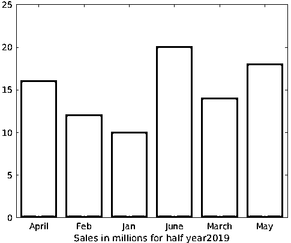
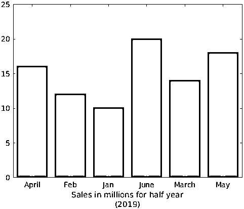

# xlabel Matlab

> 原文：<https://www.educba.com/xlabel-matlab/>

## xlabel Matlab 简介

正如我们所知，MATLAB 是一个很好的可视化工具。它让我们有能力创造各种各样的情节。在这篇文章中，我们将重点讨论如何根据我们的要求来标记 x 轴。在 MATLAB 中，xlabels 函数用于为 x 轴设置自定义标签。

让我们以描绘雇员工资的条形图为例开始。

<small>Hadoop、数据科学、统计学&其他</small>

**语法**

设 A 是一个数组，包含 6 名雇员的工资，他们是吉姆、帕姆、托比、迈克、萨姆、史蒂夫；以同样的顺序。

*   **A** = [ 20000，25000，30000，42000，70000，35000][定义薪资数组]

现在我们将为上面的数据绘制一个条形图。我们将把我们的名字作为分类数组传递:

*   **B** =分类({'Jim '，' Pam '，' Toby '，' Mike '，' Sam '，' Steve ' })[定义雇员姓名数组]
*   **B** = reordercats(B，{'Jim '，' Pam '，' Toby '，' Mike '，' Sam '，' Steve'})【调用' reordercats '以保持顺序】
*   bar (B，A)[创建 bar pot]

现在，我们将我们的 x 轴命名为“员工工资”。为此，我们将使用' xlabel '函数。

*   xlabel({ '雇员薪金' })[设置 x 轴的名称]

**Note:** That in above line of code, we have passed ‘Employee Salary’ as an argument to ‘xlabel’

这是我们的输入和输出在 MATLAB 控制台中的样子:

**代码:**

`A = [ 20000, 25000, 30000, 42000, 70000, 35000 ] B = categorical ({'Jim', 'Pam', 'Toby', 'Mike', 'Sam', 'Steve' })
B = reordercats(B, {'Jim', 'Pam', 'Toby', 'Mike', 'Sam', 'Steve'})
bar (B, A)
xlabel({'Employee Salary'})`

**输出:**

如我们所见，我们将 x 轴命名为“员工工资”。

### 如何获得我们选择的颜色的 x 轴标签？

在上面的输出中，MATLAB 创建了黑色的 x 轴标签。如果我们想让它变成其他颜色呢？为了便于理解，我们将创建绿色的 x 标签。

**语法**

*   **A** = [ 20000，25000，30000，42000，70000，35000][定义薪资数组]

现在我们将为上面的数据绘制一个条形图。我们将把我们的名字作为分类数组传递:

*   **B =** 分类({'Jim '，' Pam '，' Toby '，' Mike '，' Sam '，' Steve ' })[定义雇员姓名数组]
*   **B** = reordercats(B，{'Jim，' Pam，' Toby，Mike，' Sam '，' Steve'})【调用' reordercats '以保持顺序】
*   bar (B，A)[创建 bar pot]

现在，我们将 x 轴的标签颜色设置为绿色。这样做的话，我们将在论证中传递 g。

*   xlabel('雇员薪金'，'颜色'，' g ')[设置名称和颜色]

**Note:** That in above line of code, we have passed ‘color’ and ‘g’ as an argument to ‘xlabel’

这是我们的输入和输出在 MATLAB 控制台中的样子:

**代码:**

`A = [ 20000, 25000, 30000, 42000, 70000, 35000 ] B = categorical ({'Jim', 'Pam', 'Toby', 'Mike', 'Sam', 'Steve' })
B = reordercats(B, {'Jim', 'Pam', 'Toby', 'Mike', 'Sam', 'Steve'})
bar (B, A)
xlabel('Employee Salary', 'color', 'g')`

**输出:**

**Note:** In the above output that ‘Employee Salary’ is now in green color as expected by us.

### 如何从一个变量给我们的 xlabel 加值？

在本例中，我们将看到半年度销售数据:

**语法**

*   **a** = [10.1，12.1，14.1，16.1，18.1，20.1][以百万为单位定义数组]
*   **b** =分类({ '一月'，'二月'，'三月'，'四月'，'五月'，'六月' })【各自的月份】
*   酒吧(b，a)
*   **year**= 2019[声明我们将从中提取值的变量]
*   xlabel(['半年百万销售额'，num2str(年)])

**Note:** In the above code that we passed our variable as an argument

这是我们的输入和输出在 MATLAB 控制台中的样子:

**代码:**

`a = [10.1, 12.1, 14.1, 16.1, 18.1, 20.1] b = categorical({'Jan', 'Feb', 'March', 'April', 'May', 'June'})
bar(b, a)
year = 2019
xlabel(['Sales in millions for half year',num2str(year)])`

**输出:**

从输出中我们可以清楚地看到，我们已经从变量中获得了年份的值。

在上面的例子中，我们也可以创建一个多行标签；也就是说，我们可以在一行标注“半年百万销售额”，在另一行标注“2019”。让我们看看怎么做。

**语法**

*   **a** = [10.1，12.1，14.1，16.1，18.1，20.1][以百万为单位定义数组]
*   **b** =分类({ '一月'，'二月'，'三月'，'四月'，'五月'，'六月' })【各自的月份】
*   酒吧(b，a)
*   xlabel({ '半年百万销售额'，'(2019)'})

**Note:** In the above code that we have passed an array of characters

这是我们的输入和输出在 MATLAB 控制台中的样子:

**代码:**

`a = [10.1, 12.1, 14.1, 16.1, 18.1, 20.1] b = categorical({'Jan', 'Feb', 'March', 'April', 'May', 'June'})
bar(b, a)
xlabel({'Sales in millions for half year','(2019)'})`

**输出:**

我们可以在输出中看到，现在如预期的那样有 2 行标签。

### 结论–xlabel Matlab

MATLAB 可以用来绘制我们的数据，以便可视化和直观地理解它。有些情况下，我们必须为 x 轴提供一个标签。在这种情况下，我们使用函数“xlabel”。

### 推荐文章

这是一个 xlabel Matlab 的指南。在这里，我们讨论一个介绍，语法，如何在 Matlab 中使用应用 xlabel 的例子代码和输出。您也可以浏览我们的其他相关文章，了解更多信息——

1.  [Matlab 绘图圆](https://www.educba.com/matlab-plot-circle/)
2.  [Matlab 中的求和](https://www.educba.com/summation-in-matlab/)
3.  [Matlab 线条样式](https://www.educba.com/matlab-line-style/)
4.  [Fzero Matlab](https://www.educba.com/fzero-matlab/)

