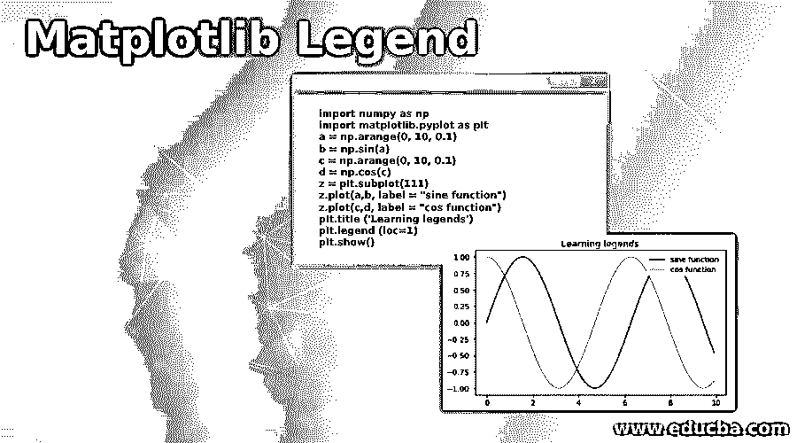
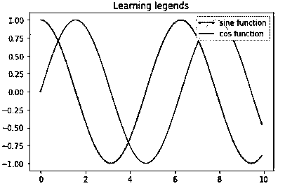
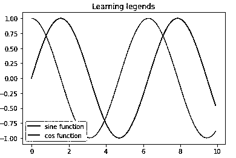
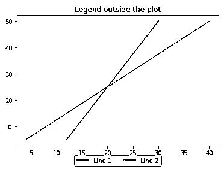

# Matplotlib 图例

> 原文：<https://www.educba.com/matplotlib-legend/>

## Matplotlib 图例**简介**

在本文中，我们将学习 Python 和 matplotlib 中一种叫做“Legend”的方法。我们将使用“图例”方法创建标签。在我们开始为我们的情节创建标签之前，让我们快速了解创建情节的意义是什么，以及为什么我们需要为它们创建标签。

1.  创建绘图是为了在单个视图中可视化数据并从中得出结论
2.  图表对于理解变量之间的相关性非常有用，我们可以在统计概念中进一步利用它，如线性回归和多元回归
3.  因为可以在一个单独的绘图中绘制多个功能；“标签”是提供图中不同功能信息的方式，标签是使用 Python 中的“图例”创建的。

### 实现 Matplotlib 图例的示例

现在让我们了解如何在 python 中使用 matplotlib 创建绘图并给它们添加标签:

<small>Hadoop、数据科学、统计学&其他</small>

#### 示例#1

**导入 Python 库:**

`import numpy as np [importing ‘numpy’] import matplotlib.pyplot as plt  [importing ‘matplotlib’]`

接下来，让我们为这个图定义我们的函数。对于这个例子，我们将使用正弦和余弦函数

`a = np.arange(0, 10, 0.1)
b = np.sin(a) [creating a sine wave] c = np.arange(0, 10, 0.1)
d = np.cos(c) [creating a cos function] z = plt.subplot(111) [creating subplots to include both functions in single plot] z.plot(a,b, label = "sine function") [drawing the plot and defining the label for sine wave] z.plot(c,d, label = "cos function") [drawing the plot and defining the label for sine wave] plt.title ('Learning legends') [giving a name to our plot] plt.legend (loc=1)   [loc is used to control the direction of legend] plt.show() [calling show() to display our pot]`

**代码:**

`import numpy as np
import matplotlib.pyplot as plt
a = np.arange(0, 10, 0.1)
b = np.sin(a)
c = np.arange(0, 10, 0.1)
d = np.cos(c)
z = plt.subplot(111)
z.plot(a,b, label = "sine function")
z.plot(c,d, label = "cos function")
plt.title ('Learning legends')
plt.legend (loc=1)
plt.show()`

**输出:**

**Note:** The label box on the top right side. This direction is obtained because we have passed the argument ‘loc’ = 1 in our legend method. We can set ‘loc’ to different integer values to change the direction of the label box within the plot.

让我们将 loc 的值改为 3，看看我们的输出如何变化。

我们的代码基本上与上面相同，唯一的变化是 loc 现在是 3:

`plt.legend (loc= 3)`

这是我们的输出在 python 中的样子:

请注意，我们的标签框现在位于左下角。因此，我们可以根据我们的要求，通过改变' loc '的值来获得方向。

#### 实施例 2

接下来，我们将了解如何将我们的标签框设置在绘图之外。为了理解这一点，我们将创建一个由两条直线组成的新图:

**导入 Python 库:**

接下来，我们将了解如何将我们的标签框设置在绘图之外。为了理解这一点，我们将创建一个由两条直线组成的新图。

`import matplotlib.pyplot as plt[importing ‘matplotlib’] import numpy as np[importing ‘numpy’] a = [12, 14, 16, 18, 20, 22, 24, 26, 28, 30][Defining our variables to create straight lines] b = [4.1, 8.1, 12.1, 16.1, 20.1, 24.1, 28.1, 32.1, 36.1, 40.1] c = [5.2, 10.2, 15.2, 20.2, 25.2, 30.2, 35.2, 40.2, 45.2, 50.2] fig = plt.figure()
z = plt.subplot(111)[creating subplots to include both functions in single plot] z.plot(a, c, label='Line 1')[drawing the plot and defining the label for first line] z.plot(b, c, label='Line 2')[drawing the plot and defining the label for second line] plt.title('Legend outside the plot')[giving a name to our plot]`

请注意，在下一行代码中，我们添加了几个新参数。将这些预定义的代码作为参数传递将有助于我们在绘图区之外创建标签框

`z.legend(loc='upper center', bbox_to_anchor=(0.5, -0.05), ncol = 2)[ncol = 2, will draw a label box with 2 columns] plt.show() [Finally, displaying our plot]`

**代码:**

`import matplotlib.pyplot as plt
import numpy as np
a = [12, 14, 16, 18, 20, 22, 24, 26, 28, 30] b = [4.1, 8.1, 12.1, 16.1, 20.1, 24.1, 28.1, 32.1, 36.1, 40.1] c = [5.2, 10.2, 15.2, 20.2, 25.2, 30.2, 35.2, 40.2, 45.2, 50.2] fig = plt.figure()
z = plt.subplot(111)
z.plot(a, c, label='Line 1')
z.plot(b, c, label='Line 2')
plt.title('Legend outside the plot')
z.legend(loc='upper center', bbox_to_anchor=(0.5, -0.05), ncol = 2)
plt.show()`

**输出:**

**解释:**正如我们在输出中看到的，标签框现在位于绘图之外，有两列。

### 结论

当我们试图直观地理解数据时，绘图变得非常方便。它们帮助我们理解变量之间的任何关系，并且在不实际查看数据的情况下对数据有一个高层次的理解。matplotlib 中的“Legend”方法用于为绘图创建标签，这有助于我们区分绘图中绘制的函数。

### 推荐文章

这是一个 Matplotlib 传奇指南。这里我们讨论一个 Matplotlib 图例的介绍，以及详细解释的例子，以便更好地理解。您也可以浏览我们的其他相关文章，了解更多信息——

1.  [Matlab 中的极坐标图](https://www.educba.com/polar-plot-in-matlab/)
2.  [数据可视化工具](https://www.educba.com/data-visualization-tools/)
3.  [Matlab color()](https://www.educba.com/matlab-pcolor/)
4.  [颤 Matlab](https://www.educba.com/quiver-matlab/)

