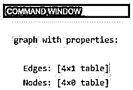
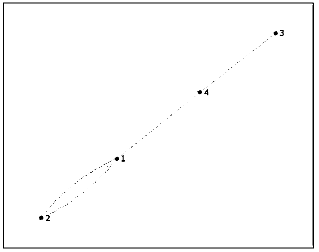
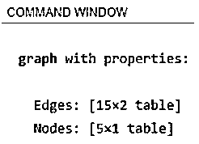
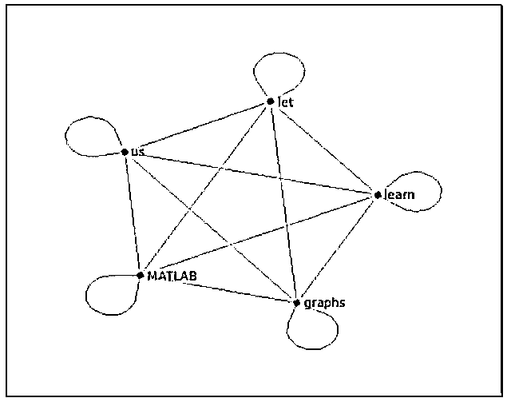
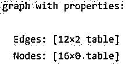
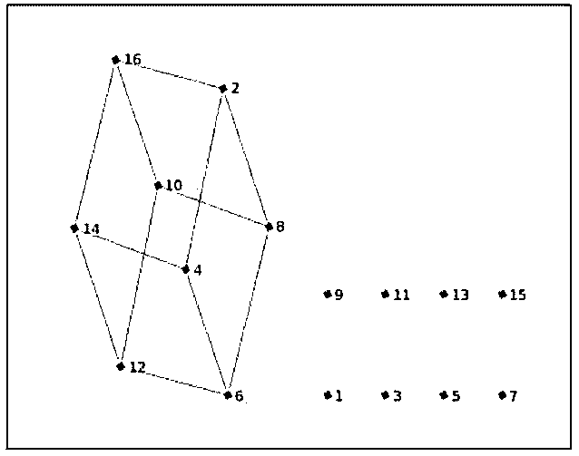

# Matlab 绘图

> 原文：<https://www.educba.com/plot-graph-matlab/>

## 绘图 Matlab 简介

绘制图表对于数据分析和可视化来说是一种非常有用的技术。通过绘制图形，我们可以利用目标函数获得更多的细节。在图表的帮助下，我们可以直观地解释我们的数据是如何表现的，并且可以识别异常值(如果有的话)。在 Matlab 中，我们使用“graph”函数来创建任何函数或数据集的图形，然后使用 plot 函数来绘制该图形。

**Matlab 中绘制图形的语法:**

<small>Hadoop、数据科学、统计学&其他</small>

`A = graph`

`A = graph(X,nodenames)`

**描述:**

*   **A:** graph 会创建一个空的 graph 对象，这个对象是单向的，没有边和节点。
*   **A:** 如果我们需要指定节点的名称，就使用 graph(X，nodenames)。

### Matlab 绘图实例

下面给出了 Matlab 绘图的例子:

#### 示例#1

在这个例子中，我们将创建一个有 4 个节点和 4 条边的图。

我们将遵循以下 2 个步骤:

*   选择图表的坐标。
*   使用图形功能创建图形。

**代码:**

a =[3 2 2 4]；

c =[4 1 1 1]；

[Initializing the coordinates for nodes and edges of the graph]

G =图形(a，c)

[Passing the coordinates to graph function]

plot (G)

[Passing the graph created to the plot function]

**输入:**

`a = [3 2 2 4];
c = [4 1 1 1];
G = graph(a,c)`

**输出:**

正如我们在输出中看到的，我们已经获得了我们所期望的带有传递坐标的图形。

接下来，我们将使用“绘图功能”绘制此图。

**代码:**

`plot (G)`

**输出:**

如果我们需要命名节点，现在让我们看看在 Matlab 中使用“图形函数”绘制图形的代码是什么样子的。

#### 实施例 2

在本例中，我们将使用“triu”命令创建一个图形(用于获取任何矩阵的上三角部分)。

我们将遵循以下 2 个步骤:

*   使用“triu”创建矩阵。
*   使用图形功能创建图形。

**代码:**

a = triu(rand(5));

[Creating the matrix using triu]

nodeNames = { ' let ' ' us ' ' learn ' ' graphs ' ' MATLAB ' }；

[Initializing the names for the nodes of the graph]

G =图形(a，节点名，“上部”)

[Passing the matrix and node names to the graph function] [“upper” keyword is passed to ensure the asymmetric part of input is ignored]

plot (G)

[Passing the graph created to the plot function]

**输入:**

`a = triu(rand(5));
nodeNames = {'let' 'us' 'learn' 'graphs' 'MATLAB'};
G = graph(a,nodeNames, "upper")`

**输出:**

**

** 

正如我们在输出中看到的，我们已经获得了我们所期望的带有传递坐标的图形。

接下来，我们将使用“plot function”来绘制这个图，以查看我们经过的节点的名称。

**代码:**

`plot (G)`

**输出:**

正如我们在输出中看到的，我们已经获得了我们期望的节点名称。

#### 实施例 3

在这个例子中，我们将创建一个几何立方体图。

我们将遵循以下 2 个步骤:

*   传递立方体的坐标。
*   使用图形功能创建图形。

**代码:**

a =[2 2 2 4 4 6 6 8 10 10 12 14]；

b =[4 8 16 6 14 8 12 10 12 16 14 16]；

[Initializing the coordinates of the cube]

w =[11 11 2 11 2 11 2 2 13 13 13 15]；

[Initializing the weights]

G =图形(a，b，w)

[Passing the coordinates and weights to the graph function] [Please note that the nodes which are not included in the cube graph will be left out in the output]

plot (G)

[Passing the graph created to the plot function]

**输入:**

`a = [2 2 2 4 4 6 6 8 10 10 12 14];
b = [4 8 16 6 14 8 12 10 12 16 14 16];
w= [11 11 2 11 2 11 2 2 13 13 13 15];
G = graph(a, b,w)`

**输出:**

**

** 

接下来，我们将使用“绘图功能”绘制此图，以查看我们创建的立方体。

**代码:**

`plot (G)`

这就是我们的曲线图看起来的样子:

**输出:**

正如我们在输出中看到的，我们已经获得了如我们所预期的带有一些遗漏节点的立方体。

### 结论

Matlab 中使用图形函数来得到无向图。这些图有没有方向的边，并且连接节点。这些图形非常便于获得图形或函数的直观表示。

### 推荐文章

这是一个 Matlab 绘图指南。这里我们分别结合实例讨论 Matlab 绘图的介绍。您也可以看看以下文章，了解更多信息–

1.  [震级 Matlab](https://www.educba.com/magnitude-matlab/)
2.  [Matlab fopen](https://www.educba.com/matlab-fopen/)
3.  [Matlab 绘制多条线](https://www.educba.com/matlab-plot-multiple-lines/)
4.  [MATLAB 独有的](https://www.educba.com/matlab-unique/)

