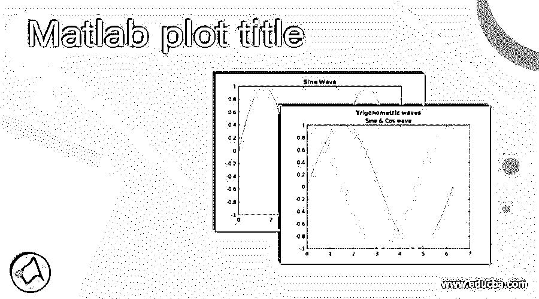
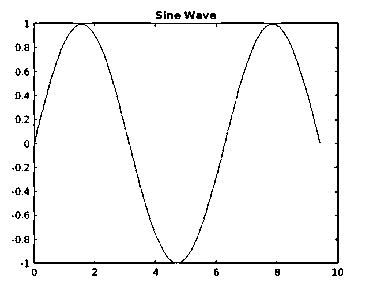
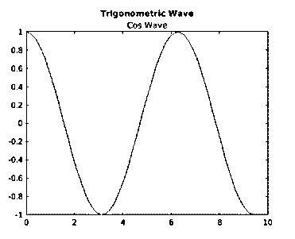
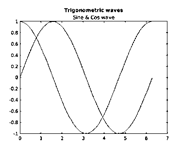
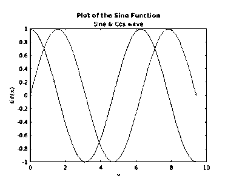

# Matlab 绘图标题

> 原文：<https://www.educba.com/matlab-plot-title/>

## Matlab 绘图标题介绍

在 MATLAB 中,“title”命令用于为任何图形或图像添加标题。我们可以给一个情节添加一个单独的标题或者一个带有副标题的标题。标题的格式可以通过使用 MATLAB 中预先定义的名称-值对来控制。这些名称-值对作为参数传递给“title”命令，以控制绘图标题的格式。

这个标题有助于我们确定这个情节是关于什么的，或者它试图传达什么。

<small>Hadoop、数据科学、统计学&其他</small>

**语法:**

1.  标题([文本](https://www.mathworks.com/help/matlab/ref/title.html#btpi3rq-1-txt))会将指定为“文本”的标题添加到绘图中。请注意，如果该图已经有一个标题，那么使用该命令将替换现有的标题
2.  如果我们需要标题和副标题，就使用 title(text 1，text 2)。第一个参数“文本 1”将作为主标题，第二个参数“文本 2”将作为副标题，显示在主标题下方
3.  title(text， [Name，Value](https://www.mathworks.com/help/matlab/ref/title.html#namevaluepairarguments) )用于通过使用名称值对参数来控制标题的格式

### Matlab 绘图标题示例

现在让我们借助不同的例子来理解如何在 MATLAB 中给一个图加一个标题

#### 示例#1

在第一个例子中，我们将在 MATLAB 中绘制一个正弦波，并将其命名为“正弦波”。本例中要遵循的步骤是:

1.  初始化 x 轴
2.  初始化 y 轴
3.  使用“绘图”命令绘制正弦波
4.  使用“标题”命令为该图添加标题

**代码:**

`x = linspace(0, 3*pi, 50);`

**【初始化 x 轴】**

`y = sin(x);`

**【y 轴初始化】**

`plot(x, y)`

**【绘制正弦波的代码】**

`title(‘Sine Wave’)`

**【给在上述步骤中创建的情节命名】**

**这是我们的输入和输出在 Matlab 命令窗口中的样子:**

**输入:**

`x = linspace(0, 3*pi, 50);
y = sin(x);
plot(x, y)
title('Sine Wave')`

**输出:**

正如我们在输出中所看到的，我们已经获得了一个具有所需标题的正弦波图。接下来，我们将学习如何给情节加标题和副标题。

#### 实施例 2

对于这个例子，我们将在 MATLAB 中绘制一个 cos 波，并将其命名为“三角波”，副标题为“Cos 波”。本例中要遵循的步骤是:

1.  初始化 x 轴
2.  初始化 x 轴
3.  使用' plot '命令绘制 cos 波形
4.  使用带有两个文本参数的“标题”命令，为该图指定标题和副标题

**代码:**

`x = linspace(0, 3*pi, 50);`

**【初始化 x 轴】**

`y = cos(x);`

**【y 轴初始化】**

`plot(x, y)`

**【绘制 cos 波形的代码】**

`title(‘Trigonometric Wave’, ‘Cos Wave’)`

**【给上一步创建的图加标题和副标题】**

**这是我们的输入和输出在 MATLAB 命令窗口中的样子:**

**输入:**

`x = linspace(0, 3*pi, 50);
y = cos(x);
plot(x, y)
title('Trigonometric Wave', 'Cos Wave')`

**输出:**

正如我们在输出中看到的，我们已经获得了一个带有所需标题和副标题的 cos 波形图。

#### 实施例 3

对于这个例子，我们将在同一个图形中绘制一个正弦波和一个余弦波，并将其命名为“三角波”，副标题为“正弦和余弦波”。本例中要遵循的步骤是:

1.  初始化 x 轴
2.  初始化 y 轴
3.  使用“绘图”命令绘制正弦波和余弦波
4.  使用带有 2 个文本参数的“标题”命令，为该图指定标题和副标题

**代码:**

`x = linspace(0, 3*pi, 50);`

**【初始化 x 轴】**

`y = sin(x);`

**【初始化正弦波】**

`plot(x,y)`

**【绘制正弦波的代码】**

`hold on
y1 = cos(x);`

**【初始化 cos 波】**

`plot(x, y1)`

**【绘制 cos 波形的代码】**

`hold off
title('Trigonometric waves', 'Sine & Cos wave')`

**【给上一步创建的图加标题和副标题】**

**这是我们的输入和输出在 MATLAB 命令窗口中的样子:**

**输入:**

`x = linspace(0, 3*pi, 50);
y = sin(x);
plot(x,y)
hold on
y1 = cos(x);
plot(x, y1)
hold off
title('Trigonometric waves', 'Sine & Cos wave')`

**输出:**

正如我们在输出中看到的，我们已经获得了一个带有所需标题和副标题的正弦和余弦波形图。接下来，我们将学习如何格式化情节的标题。

#### 实施例 4

在本例中，我们将在与上例相同的图表中绘制正弦波和 cos 波，但标题和副标题为“蓝色”。本例中要遵循的步骤是:

1.  初始化 x 轴
2.  初始化 y 轴
3.  使用“绘图”命令绘制正弦波和余弦波
4.  使用带有两个文本参数和一个额外的名称-值对参数的“title”命令来指定蓝色

**代码:**

`x = linspace(0, 3*pi, 50);`

**【初始化 x 轴】**

`y = sin(x);`

**【初始化正弦波】**

`plot(x,y)`

**【绘制正弦波的代码】**

`hold on
y1 = cos(x);`

**【初始化 cos 波】**

`plot(x, y1)`

**【绘制 cos 波形的代码】**

`hold off
title('Trigonometric waves', 'Sine & Cos wave', 'Color', 'blue')`

**【给出一个额外的参数以获得‘蓝色’的标题和副标题】**

**这是我们的输入和输出在 MATLAB 命令窗口中的样子:**

**输入:**

`x = linspace(0, 3*pi, 50);
y = sin(x);
plot(x,y)
hold on
y1 = cos(x);
plot(x, y1)
hold off
title('Trigonometric waves', 'Sine & Cos wave', 'Color', 'blue')`

**输出:**

正如我们在输出中看到的，我们获得了一个正弦波和余弦波的 trplot，所需标题为蓝色。

### 结论

MATLAB 中的“标题”命令用于给任何图形或图像添加标题。我们可以给一个情节添加一个单独的标题或者一个带有副标题的标题。可以使用各种名称-值对来控制标题的格式。

### 推荐文章

这是一个 Matlab 绘图标题指南。这里我们分别讨论 Matlab 绘图标题、语法、命令和示例以及代码实现的介绍。您也可以看看以下文章，了解更多信息–

1.  [Matlab 符号](https://www.educba.com/matlab-syms/)
2.  [Matlab 堆积条形图](https://www.educba.com/matlab-stacked-bar/)
3.  [Matlab 图像调整大小](https://www.educba.com/matlab-image-resize/)
4.  [卷积 Matlab](https://www.educba.com/convolution-matlab/)

