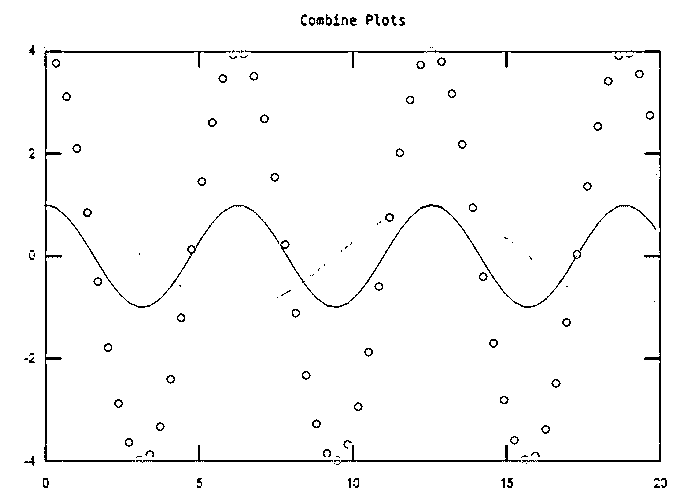
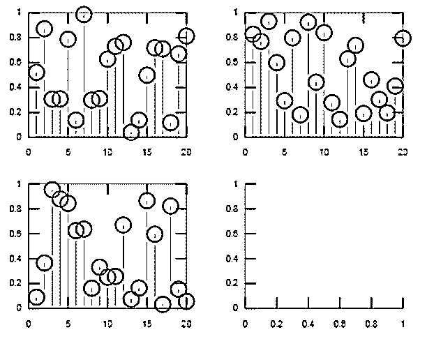
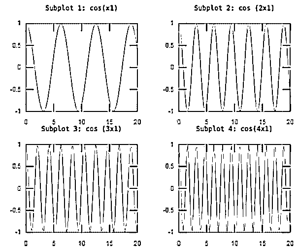

# Matlab 中的多重绘图

> 原文：<https://www.educba.com/multiple-plots-in-matlab/>

## Matlab 中多重绘图的介绍

Matlab 绘图用于数据的图片。当我们显示两个量之间的相互比较时，我们可以使用 plot 语句来可视化数据分布，以显示数据中的轨迹变化。Matlab 多重绘图用于以不同的方式显示数据，如线图、离散数据图等等。为了创建具有多行或多列的绘图，我们使用了 subplot 语句。子图有助于显示图形中的多个轴，并用于以特定方式分割图形。我们可以在 Matlab 中绘制二维和三维图形。

**语法:**

<small>Hadoop、数据科学、统计学&其他</small>

Matlab 中多图的语法如下所示:-

`subplot(m, n, p)`

`subplot(m, n, p, 'replace')`

`subplot(m, n, p, 'align')`

`subplot(m, n, p, ax)`

`subplot('Position', pos)`

`subplot(**___**, Name, Value)`

`ax = subplot(**___**)`

`subplot(ax)`

### 如何在 Matlab 中做多重绘图？

对于数据的多重绘图，我们使用 plot 和 subplot 语句。

使用子图语句多次绘制数据的步骤如下

*   **步骤 1:** 我们取变量并赋值，标绘 1 st 信号。
*   **第二步:**然后我们继续在相同的轴上绘制第二个和第三个信号，但颜色或样式不同。

使用子图语句多次绘制数据的步骤如下

*   **第一步:**取所需信号。
*   步骤 2: 然后，我们使用一个具有适当语法的子情节语句

### Matlab 中的多重绘图示例

下面是一些例子:

#### 示例#1

我们在 matlab 中看到一个多图的例子，在这个例子中，我们在一个图上取三个信号。首先，我们采用一个 linspace 函数来生成一个线性间隔的向量，并将其分配给 x1 变量，我们在 y1 变量上采用一个 cos(x1)信号。然后，我们通过取 x1 和 y1 变量来绘制信号，我们使用绘图函数来绘制信号，绘制 y1 中的数据与 x1 中相应值的关系。然后，我们使用标题函数为该图指定一个标题。现在，我们使用“保持”,保持当前轴中的绘图，以便在不删除先前绘图的情况下添加新绘图。然后，我们将 cos(x1)信号除以 2，并将这些值分配给 y 2，现在我们使用带有 x1 和 y2 变量的绘图函数，用不同的颜色绘制同一轴上的 2 和信号。现在我们绘制一个第 3 第 3图，将 cos(x1)信号乘以幅度 4，并将这些值赋给 y3 变量。然后，我们使用一个散点图函数来绘制一个 3 rd 信号，散点图在由向量 x 和 y 指定的位置用圆圈表示。

**代码:**

`clc;
clear all;
close all;
x1 = linspace(0,20,60);y1 = cos(x1);plot(x1,y1)title('Combine Plots')hold ony2 = cos(x1/2);plot(x1,y2)y3 = 4*cos(x1);scatter(x1,y3) hold off`

**输出:**

#### 实施例 2

让我们看一个例子，我们为任意随机值创建 4 个子图，然后我们用空轴替换第 4 个子图。为此，我们采用一个值为 k=4 的 For 循环，在该 for 循环中，我们使用 rand 函数，基本上 rand 函数用于生成一个随机数。在本例中，我们采用 20 个随机数，因此我们采用 rand(1，20)并将这 20 个随机数分配给变量 d。然后，我们使用 subplot 函数，我们使用 subplot (2，2，k)将当前图形划分为一个 2 乘 2 的网格，并在 k 指定的位置创建轴。然后，k 的值在 1 到 4 之间变化。然后我们使用一个包含 20 个随机数的流函数，然后结束循环。之后我们用一个空的情节替换第 4 个第个情节，为此，我们使用了‘subplot(2，2，4，‘replace’)’这个语句。

**代码:**

`clc;
clear all;
close all;
for k = 1:4
d = rand(1,20);
subplot(2,2,k)
stem(d)end
subplot(2, 2, 4, 'replace')` 

**输出:**

正如我们看到的图，第 4 个地块被替换为空地块。

#### 实施例 3

让我们来看一个 Matlab 中的多重绘图的例子，我们使用一个 subplot 函数来绘制 4 个不同的绘图，我们取 subplot (2，2，p)将当前图形分成一个 2 乘 2 的网格，并在 p 指定的位置创建轴，p 的值决定我们绘制多少个绘图。在我们的例子中，我们取 p 的值为 4。首先，我们使用 linspace 函数将 x1 变量指定为 0 到 20。然后，我们将 y1 变量作为 cos(x1)，然后我们使用绘图函数来绘制使用 x1 和 y1 变量的信号。然后，我们使用标题功能给这个情节指定一个标题，同一个制作人重复三次来绘制 3 个次要情节。对于 y2、y3 和 y4，我们可以将 cos(x1)分别乘以 2、3 和 4。为不同的情节分配不同的标题，我们还改变了一个副情节中的 p 值。然后我们在一个图中看到 4 个具有不同信号的图。

**代码:**

`close all;
subplot(2,2,1)
x1 = linspace(0,20);
y1 = cos(x1);
plot(x1,y1)
title('Subplot 1: cos(x1)')
subplot(2,2,2)
y2 = cos (2*x1);
plot(x1,y2)
title('Subplot 2: cos (2x1)')
subplot(2,2,3)
y3 = cos (3*x1);
plot(x1,y3)
title('Subplot 3: cos (3x1)')
subplot(2,2,4)
y4 = cos(4*x1);
plot(x1,y4)
title('Subplot 4: cos(4x1)')`

**输出:**

### 结论

在本文中，我们看到了 Matlab 中多图的概念。基本上，多图用于数据的可视化。然后看到了与多个图相关的语法以及如何在 Matlab 代码中使用它。此外，我们还在 Matlab 上看到了一些与多个图及其输出相关的示例。

### 推荐文章

这是一个在 Matlab 中多重绘图的指南。在这里，我们还讨论了介绍和如何在 Matlab 中做多图，以及不同的例子和它的代码实现。您也可以看看以下文章，了解更多信息–

1.  [Matlab 绘图标题](https://www.educba.com/matlab-plot-title/)
2.  [Matlab fplot()](https://www.educba.com/matlab-fplot/)
3.  [Matlab 注释](https://www.educba.com/matlab-annotation/)
4.  [Matlab 变量](https://www.educba.com/matlab-variables/)

