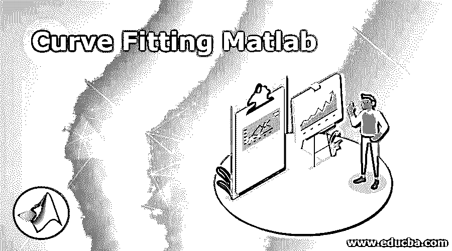
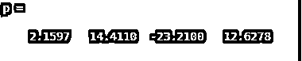
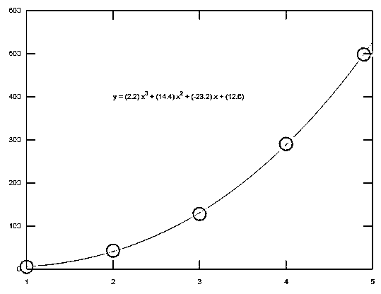
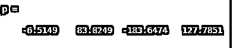
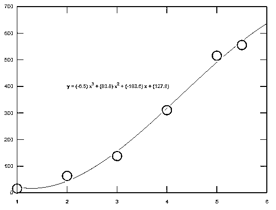
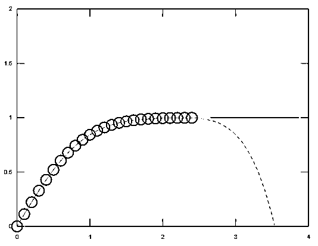

# 曲线拟合 Matlab

> 原文：<https://www.educba.com/curve-fitting-matlab/>

## 曲线拟合 Matlab 简介

曲线拟合模块用于图形用户界面(GUI)和 M 文件实体。它建立在 MATLAB 技术计算环境之上。工具箱为您提供数据预处理等功能，如切片和平滑。一个图形环境(GUI ),允许您探索和分析数据集，并以可视化和数值化的方式拟合，还可以以各种格式保存您的工作，包括 M 文件以及二进制文件和工作空间变量。在这个主题中，我们将学习曲线拟合的 Matlab。

### 句法

`q= polyfit ( a,y,n)
[q,S] = polyfit(a,y,n)
[q,S,u] = polyfit (a,y,n)`

<small>Hadoop、数据科学、统计学&其他</small>

**描述**

q = polyfit(a，y，n)得出 n 次多项式 q(a)的系数，该系数是 y 中数据的最佳拟合值(最小二乘意义)。q 中的系数是降序幂，q 的长度是 n+1。

[q,S] = polyfit(a,y,n) also returns a structure S they can be used as an input to the polyval to obtain error estimates. [q,S,u] = polyfit(a,y,n) also returns u and in which here a two-element vector with centering and scaling values. U (1) is mean(a), and u(2) is std(a). Using these values, polyfitcentrea at zero and scales it to have a unit standard deviation

曲线拟合 Matlab 工具箱提供了一项和两项指数模型。当一个量的变化率与该量的初始量成比例时，就得到指数曲线。如果与 ax 和/或 yz 相关联的系数为负，则 q 表示指数衰减。如果系数为正，q 代表指数增长。

### Matlab 曲线拟合实例

下面举几个例子:

#### 示例#1

以多项式曲线为例，我们可以看到如何以曲线的形式使用多项式实体。variable = polyfit(var1，var2，n)，其中 var1 和 var2 是两个向量的坐标

**代码:**

`ax = [1 2 3 4 4.9];
y = [5.5 43.1 128 290.7 498.4];
p = polyfit(ax,y,3)
x2 = 1:.1:5;
y2 = polyval(p,x2);
plot(ax,y,'o',x2,y2)
grid on
s = sprintf('y = (%.1f) x^3 + (%.1f) x^2 + (%.1f) x + (%.1f)',p(1),p(2),p(3),p(4));
text(2,400,s)`

**输出:**

#### 实施例 2

考虑 2 和号多项式曲线的例子，其中使用了 polyfit 语法。

在下面的例子中显示了 6 点曲线。其中使用 polyfit 语法以简单的方式显示了如何绘制多项式曲线。程序下面也给出了输出。

**代码:**

`ax = [1 2 3 4 5 5.5];
y = [15.5 63.1 138 310.7 515.4 555.56];
p = polyfit(ax,y,3)
x2 = 1:.1:6;
y2 = polyval(p,x2);
plot(ax,y,'o',x2,y2)
grid on
s = sprintf('y = (%.1f) x^3 + (%.1f) x^2 + (%.1f) x + (%.1f)',p(1),p(2),p(3),p(4));
text(2,400,s)`

**输出:**

#### 实施例 3

考虑 3rdno .多项式曲线的例子，其中使用了 polyfit 语法

还有。Polyval Matlab 中的 build 函数的使用

在下面的例子中，显示了指数曲线。其中使用 polyfit 语法以简单的方式显示了如何绘制多项式曲线。程序下面也给出了输出。

**代码:**

`ax = (0:0.1:2.4)';
yz = erf(ax);
p = polyfit(ax,yz,5);
f = polyval(p,ax);
T = table(ax,yz,f,yz-f,'VariableNames',{'X','Y','Fit','FitError'});
x1 = (0:0.1:5)';
y1 = erf(x1);
f1 = polyval(p,x1);
figure
plot(ax,yz,'o')
hold on
plot(x1,y1,'-')
plot(x1,f1,'r--')
axis([0  4  0  2])
hold off`

**输出:**

### 结论

在本文中，我们看到了如何使用曲线拟合，也称为回归分析，曲线拟合是用来找到一系列数据点的“最佳拟合”线或曲线。曲线拟合主要是创建一个用于沿路径查找坐标的方程，您可能不关心查找方程。

### 推荐文章

这是一个 Matlab 曲线拟合指南。这里我们讨论如何在 Matlab 中使用曲线拟合，并给出相应的编程实例，以便更好地理解。您也可以看看以下文章，了解更多信息–

1.  [MATLAB 索引](https://www.educba.com/matlab-indexing/)
2.  [优化的 Matlab](https://www.educba.com/optimset-matlab/)
3.  [函数的 MATLAB 导数](https://www.educba.com/matlab-derivative-of-function/)
4.  [Matlab 中的协方差](https://www.educba.com/covariance-in-matlab/)

