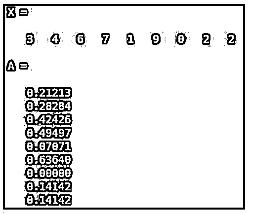
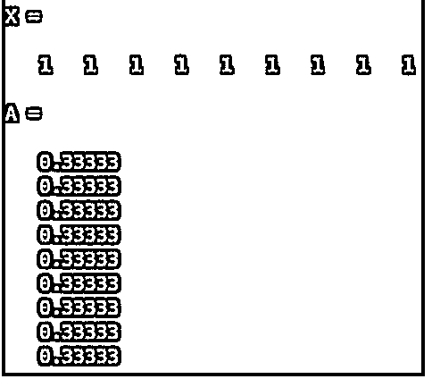
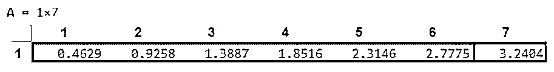
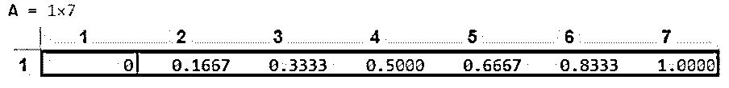
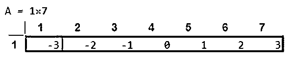
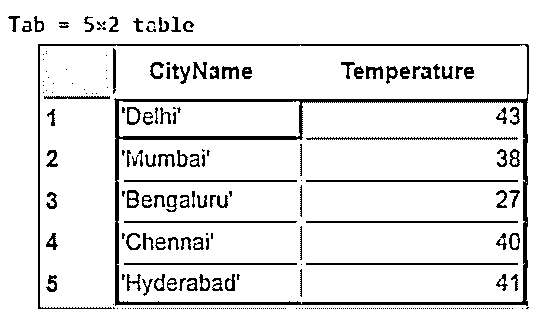
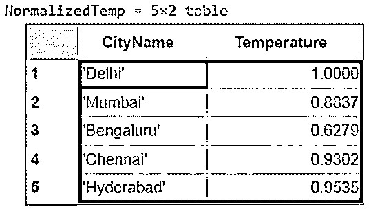

# MATLAB 归一化

> 原文：<https://www.educba.com/matlab-normalize/>

## MATLAB 标准化简介

MATLAB 是一个用于科学计算的交互式编程环境。它广泛应用于许多需要解决问题、数据分析、算法开发和实验的技术领域。特定学科的软件大量使用 MATLAB 编写。MATLAB 为我们提供了“归一化函数”,用于执行向量的归一化。如果我们需要数据在一个类似[-1 到 1]的范围内，我们就执行标准化。换句话说，规范化是我们数据的线性转换，并且在由于浮点运算而对数据施加限制时是必要的。

**语法:**

<small>Hadoop、数据科学、统计学&其他</small>

`A = normalize (X)`

**描述:**

A = normalize (X)将返回 X 中数据的 z 得分(标准差为 1，中心为 0)。

如果输入“X”是一个向量，归一化函数将对整个输入起作用。如果输入“X”是多维数组，规格化函数将沿着数组的第 1 个维维操作，其大小不等于 1。

### MATLAB 归一化示例

下面是提到的例子:

#### 示例#1

这里我们将看到规范化一个 3 X 3 数组的代码是什么样子的。

**代码:**

X = [3 4 6，7 1 9，0 2 2][创建输入 3 X 3 数组]

A =标准化(X)

[Using the normalize function and passing the input array]

**输入:**

`X = [3 4 6, 7 1 9, 0 2 2] A = normalize (X)`

**输出:**

#### 实施例 2

如果数组中的所有元素都相同。就像在单位矩阵中，所有的元素都是 1。

**输入:**

`X = [1 1 1, 1 1 1, 1 1 1] A = normalize (X)`

**输出:**

有一些方法可以作为参数传递给 normalize 函数，以便根据我们的要求得到输出。

下面是我们可以作为参数传递的 3 个主要方法:

*   **标度:**该方法用于使用标准偏差对输入进行标准化。
*   **范围:**该方法将范围[0 到 1]内的输入标准化。
*   **Center:** 该方法将数据归一化为平均值为“0”。

**a .规模**

**代码:**

x = 1:7；

[Initializing the input vector]

A =正常化(X，“标度”)

[Calling the normalize function and passing the ‘scale’ method]

**输入:**

`X = 1 : 7;
A = normalize (X, 'scale')`

**输出:**

**b .范围**

**代码:**

x = 1:7；

[Initializing the input vector]

A =正常化(X，“范围”)

[Calling the normalize function and passing the ‘range’ method]

**输入:**

`X = 1 : 7;
A = normalize (X, 'range')`

**输出:**

正如我们所看到的，我们的输出在范围[0，1]内被归一化。

**3。居中**

**代码:**

x = 1:7；

[Initializing the input vector]

A =正常化(X，'中心')

[Calling the normalize function and passing the ‘center’ method]

**输入:**

`X = 1 : 7;
A = normalize (X, 'center')`

**输出:**

正如我们所看到的，我们的输出以“0”作为平均值进行标准化。

#### 实施例 3

“Normalize function”也可用于规范化表中的属性值。在这种情况下，为了获得规范化的值，我们需要再传递几个参数。

在本例中，我们将创建一个包含 5 个印度城市及其各自温度的表。最后，我们将根据表中的最高温度对温度进行归一化。

**代码:**

CityName = { ' Delhi 孟买'；孟加拉鲁鲁；钦奈’；海得拉巴' }；

[Defining the column 1 of the table]

温度=[43；38;27;40;41];

[Defining the column 2 of the table]

Tab = table(城市名称，温度)

[Creating the table]

NormalizedTemp = normalize (Tab，' norm '，Inf，'数据变量'，'温度')

[Using the normalize function for the table ‘Tab’. Note that, here we have passed 3 new arguments: ‘Inf’, ‘DataVariables’, ‘Temperature’, this will tell MATLAB to normalize the ‘temperature’ attribute w.r.t the maximum temperature in the column].

**输入:**

`CityName = {'Delhi'; 'Mumbai'; 'Bengaluru'; 'Chennai'; 'Hyderabad'};
Temperature = [43; 38; 27; 40; 41];
Tab = table (CityName, Temperature)
NormalizedTemp = normalize (Tab, 'norm', Inf, 'DataVariables', 'Temperature')`

**输出:**

正如我们所看到的，我们的列值被规范化，最高值为 1。

### 结论

MATLAB 为我们提供了“规格化”函数来规格化向量或数组。根据我们期望的输出类型，我们还可以在参数中使用“范围”、“比例”、“中心”等方法。

### 推荐文章

这是一个 MATLAB 规范化指南。这里我们分别讨论 MATLAB Normalize 的介绍和编程实例。您也可以看看以下文章，了解更多信息–

1.  [Matlab 中的协方差](https://www.educba.com/covariance-in-matlab/)
2.  [Matlab 中的滤波函数](https://www.educba.com/filter-function-in-matlab/)
3.  [Matlab mesh()](https://www.educba.com/matlab-mesh/)
4.  [绘图矢量 Matlab](https://www.educba.com/plot-vector-matlab/)

