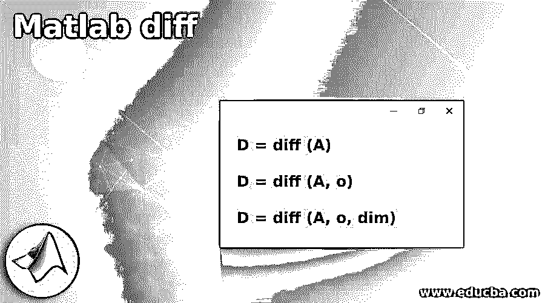
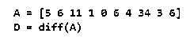
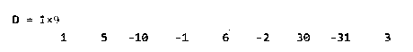
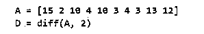
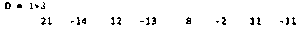
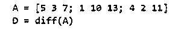
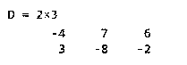
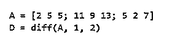

# Matlab 差分

> 原文：<https://www.educba.com/matlab-diff/>

## Matlab diff 简介

Matlab diff 函数用于计算一个序列或数组中两个相邻元素的差值。在矩阵的情况下，它用于根据作为参数传递的维度来查找相邻行或列的差异。默认情况下，该函数计算一阶差分；但是，如果需要，我们可以计算高阶差分。

**diff 函数的语法**

<small>Hadoop、数据科学、统计学&其他</small>

下面给出了 diff 函数的语法:

`D = diff (A)`

`D = diff (A, o)`

`D = diff (A, o, dim)`

**说明:**

*   D = diff (A)用于返回输入 A 中相邻元素之间的差值。
*   D = diff (A，o)用于返回输入 A 中相邻元素之间的有序差，顺序由参数“o”给出。
*   D = diff (A，o，dim)用于返回输入矩阵 A 的相邻行或列之间的差，diff 函数的工作维度(行或列)由参数“dim”决定。
*   diff 函数使用的公式是:D =[A(2)–A(1)A(3)–A(2)…A(n)–A(n–1)]，其中“n”是数组中的项数。

请注意，如果我们在一个向量或数组中有“n”个元素，diff 函数将在输出中返回“n-1”个元素。

### Matlab 差异示例

以下是 Matlab diff 的示例:

#### 示例#1

在这个例子中，我们将对向量输入使用 diff 函数。

**代码:**

a =[5 6 11 1 0 6 4 34 3 6][用 1 0 个元素作为输入初始化一个向量]

d = diff(A)
[将向量‘A’作为输入传递给 diff 函数]

**输入:**

**输出:**

正如我们所看到的，我们已经获得了相邻元素之间的差异作为 diff 函数的输出。

#### 实施例 2

在本例中，我们将使用 diff 函数来计算矢量输入的二阶差分。为此，我们将传递“2”作为第二个参数，这表示要计算二阶差。请注意，二阶差分的公式是 diff (diff (A))。

**代码:**

a =[15 2 10 4 10 3 4 3 13 12][用 10 个元素作为输入初始化一个向量]

D = diff (A，2)
【将向量‘A’作为输入传递给 diff 函数。传递第二个参数以获得二阶差分]

**输入:**

**输出:**

正如我们所看到的，我们已经获得了相邻元素之间的二阶差作为 diff 函数的输出。请注意，输出中的元素数量是 8；这是因为，在二阶差分中，执行差分计算的 2 次迭代。

#### 实施例 3

在这个例子中，我们将使用带有矩阵输入的 diff 函数。默认情况下，diff 函数将计算行元素的差值。另外，请注意，对于“3 x 3”输入矩阵，输出将是“2 x 3”矩阵。

**代码:**

a =[5 3 7；1 10 13;4211][初始化一个 3 x 3 矩阵作为输入]

d = diff(A)
[将矩阵‘A’作为输入传递给 diff 函数]

**输入:**

**输出:**

正如我们所看到的，我们已经获得了相邻行元素之间的差作为 diff 函数的输出。请注意，输出是一个“2 x 3”矩阵，如前所述。

#### 实施例 4

在本例中，我们将使用 diff 函数来计算矩阵相邻列之间的差异。此外，请注意，对于“3 x 3”输入矩阵，输出将是“3 x 2”矩阵。

**代码:**

a =[2 5 5；11 9 13;527][初始化一个 3 x 3 的矩阵作为输入]

D = diff(A，1，2)
【将矩阵‘A’作为输入传递给 diff 函数。第二个参数表示我们需要一阶差分，第三个参数表示我们需要差分以及列]。

**输入:**

**输出:**

正如我们所看到的，我们已经获得了相邻列元素之间的差异作为 diff 函数的输出。请注意，输出是一个“3 x 2”矩阵，如前所述。

### 结论

diff 函数用于查找序列或数组中两个相邻元素之间的差异。它可以用来找出矩阵的两个相邻行或列之间的差异。我们还可以使用 diff 函数来计算有序差，方法是将所需的差序作为参数传递。

### 推荐文章

这是一个 Matlab 比较指南。为了更好地理解，我们在这里讨论 Matlab diff 的介绍和例子。您也可以看看以下文章，了解更多信息–

1.  [什么是 Matlab？](https://www.educba.com/what-is-matlab/)
2.  [Matlab 极限](https://www.educba.com/matlab-limit/)
3.  [Matlab 绘图图](https://www.educba.com/plot-graph-matlab/)
4.  [绝对值 Matlab](https://www.educba.com/absolute-value-matlab/)

