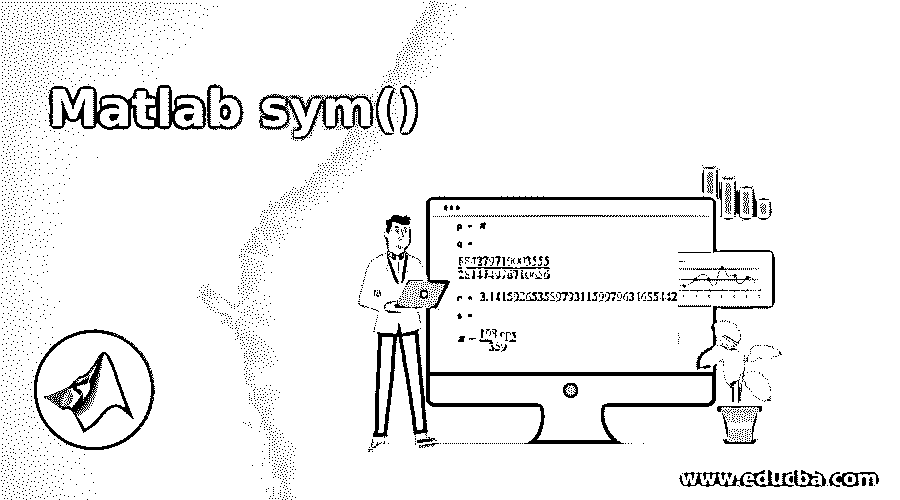
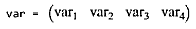
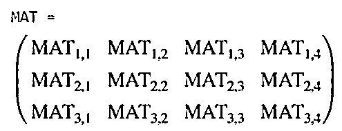
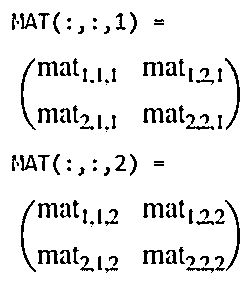
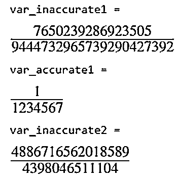
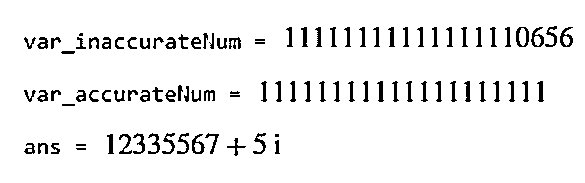
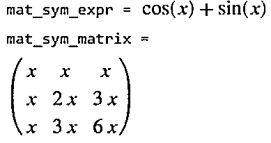
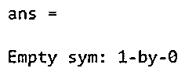
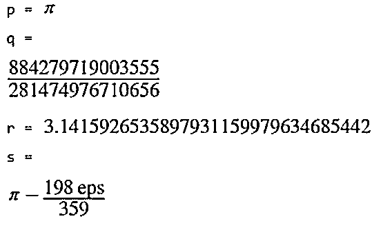

# matlab 符号

> 原文：<https://www.educba.com/matlab-sym/>

## Matlab sym()简介

当一个符号变量与一个假设相关联时，这个符号变量和它的假设被 MATLAB 分开存储。MATLAB 中的 sym()用于创建编号的符号变量或不同 MATLAB 函数中的符号变量。sym()函数生成的符号数字是输入数字的精确表示。

Sym()也可以用于引用现有的符号变量和与该变量相关联的当前假设。如果预期的符号变量以前没有在任何 MATLAB 函数中使用过，那么 sym()会在不关联任何假设的情况下创建该变量。

<small>Hadoop、数据科学、统计学&其他</small>

### Matlab sym()的语法

matlab sym()的语法如下所示:

| **语法** | **描述** |
| `s = sym('s')` | 该命令可用于创建一个符号变量。 |
| `Mat = sym('m',[n1 ... nM])` | This command can be used to create an array of symbols of size n1-by-…-by-nM consisting of automatically generated elements.当使用语法 MAT = sym('mat '，[n1 … nM])时，只有符号数组 MAT 被 sim()函数分配给 MATLAB 工作区。为了分配自动生成的 MAT 元素，需要使用 syms 函数来代替 sym()。举个例子，

syms mat[1 3] ->

*   创建行向量:mat = [mat1 mat2 mat3]和
*   MATLAB 工作空间中的符号变量:a1、a2 和 a3。

 |
| `Mat = sym('m',n)` | 此命令可用于创建由自动生成的元素组成的大小为 n 乘 n 的符号数组。 |
| `sym(___,set)` | 此命令可用于创建任何符号变量或数组，假设变量或数组元素属于“集合”。 |
| `sym(___,'clear')` | 此命令可用于清除对任何符号变量或数组设置的假设。 |
| `sym(numb)` | 该命令可用于将指定为 number 的任何数字或数字矩阵转换为相应的符号数字或带有符号元素的矩阵。 |
| `sym(numb ,flag)` | 此命令可用于使用“flag”指定的技术将浮点数转换为符号数。 |
| `sym(str_num)` | 此命令可用于将字符串或向量(给定为 str_num)转换为精确的符号数，从而避免任何近似。 |
| `Expr_sym = sym(h)` | 该命令可用于从与函数句柄 h 相关联的匿名 MATLAB 函数创建符号表达式或矩阵 Expr_sym。 |

**注:**

在多维数组的情况下，sym()函数生成自动生成的元素，前缀后面是元素的索引，并添加“_”作为分隔符。

**举例:** a1_3_2。

添加命令“清除 x”实际上并不清除与变量相关联的假设的符号对象，例如真实的、积极的或任何假设等。因此，为了消除假设，建议采用以下选项之一:

*   **假设(x，'清除')**:所有影响 x 的假设，都被删除。
*   **清除所有**:清除所有 MATLAB 工作区对象，重置符号引擎。
*   **假设和假设同样**:增加对变量应用假设的灵活性。

表达式，如 pi = sym(pi)，theta = sym('1/10 ')等。创建符号数，使程序能够避免浮点近似。该变量是作为工作空间变量创建的，用于保存 sym()函数中给定的符号值。它会临时替换同名的内置数值函数的名称。

### Matlab sym()示例

下面是 matlab sym()的例子，给出如下:

#### 示例#1

`var1=sym('var1')var2=sym('var2')var3=sym('var3')`

**输出:**

#### 实施例 2

`var = sym('var',[1 4])`

**输出:**

#### 实施例 3

`MAT = sym('MAT',[3 4])`

**输出:**

#### 示例 4–创建符号多维数组

MATLAB 使其程序能够使用 sym()函数一次性创建包含符号元素的多维数组。

`MAT = sym('mat',[2 2 2])`

**输出:**

#### 示例 5–将表达式转换为符号表达式

对完整表达式应用 sym()函数会使转换不准确，因为 MATLAB 会将表达式转换为浮点数，这会导致精度降低，并且 sym()始终无法恢复损失的精度。因此，为了相对于表达式提取符号表达式，sym()需要应用于子表达式而不是整个表达式，以实现更好的准确性。

`var_inaccurate1 = sym(1/1234567)
var_accurate1 = 1/sym(1234567)
var_inaccurate2 = sym(sqrt(1234567))`

**输出**:

#### 示例# 6–生成大的符号数

在生成具有 15 位或更多位的符号数的情况下，使用引号来表示具有最佳精确度的数字。

`var_inaccurateNum = sym(11111111111111111111)
var_accurateNum = sym('11111111111111111111')
sym('12335567 + 5i')`

**输出:**

**注意:** Sym()将虚符号‘I’视为字符向量输入中的标识符。因此，为了提供虚数 I 作为输入，建议使用 1i。

#### 示例 7——从函数句柄中生成符号表达式

MATLAB 支持从与 MATLAB 句柄相关联的匿名函数创建任何符号表达式或符号矩阵。

`mat_expr = @(x)(sin(x) + cos(x));
mat_sym_expr = sym(mat_expr)
mat_matrix = @(x)(x*pascal(3));
mat_sym_matrix = sym(mat_matrix)`

**输出**:

#### 示例 8–生成符号变量时的假设设置

MATLAB 支持创建符号变量，添加一组不同的关于变量特征的假设，如数字是实数、正数或有理数等。

`p = sym('p','real');
q = sym('q','positive');
r = sym('r','rational');
s = sym('s',{'positive','integer'});
assume([p q r s],'clear')
assumptions`

**输出**:

#### 示例 9–选择浮点值的转换技术

sym()函数的功能扩展到可以选择任何转换技术。这是通过指定本质上可选的第二个参数来实现的。参数的值可以是“r”、“f”、“d”或“e”。但是，默认值仍然是“r”。

`p = sym(pi)
q = sym(pi,'f')
r = sym(pi,'d')
s = sym(pi,'e')`

**输出**:

### 结论

当数字向量或矩阵的一个或多个元素被替换为符号数时，MATLAB 将该数视为双精度数，但数字向量或矩阵的这些元素不支持替换为符号变量、函数或表达式，因为这些元素不能转换为双精度数。函数 Sym()和 syms()具有相似的功能，但不同之处在于:

syms()函数创建一个符号对象，自动分配给同名的 MATLAB 变量，而 sym()函数引用的符号对象可以分配给同名的 MATLAB 变量，也可以分配给不同的名称。

### 推荐文章

这是一个 Matlab sym()的指南。在这里，我们还讨论了 matlab sym()的介绍和语法，以及不同的例子和它的代码实现。您也可以看看以下文章，了解更多信息–

1.  [条形图 Matlab](https://www.educba.com/bar-plot-matlab/)
2.  [MATLAB 缸()](https://www.educba.com/matlab-cylinder/)
3.  [xlabel Matlab](https://www.educba.com/xlabel-matlab/)
4.  [Matlab 图](https://www.educba.com/matlab-figure/)

