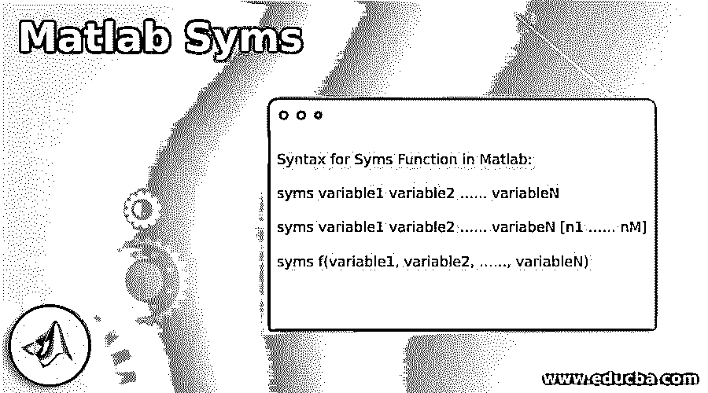
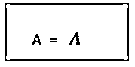
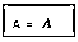
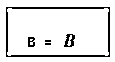
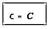
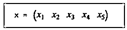
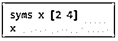
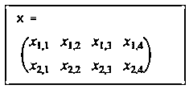
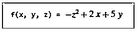

# Matlab 符号

> 原文：<https://www.educba.com/matlab-syms/>

## Matlab Syms 简介

在 MATLAB 中，syms 用作内置函数 sym 的快捷方式。这个函数可以用来创建符号变量。MATLAB 中使用的符号变量不像常规变量那样是常数；我们不会给它们赋值。这些用于在符号数学工具箱中可用函数的帮助下求解各种表达式。syms 函数创建一个符号对象，该对象自动赋给一个同名的 MATLAB 变量。

### Matlab 符号的语法

Matlab 中 Syms 函数的语法:

<small>Hadoop、数据科学、统计学&其他</small>

`syms variable1 variable2 …... variableN`

`syms variable1 variable2 …... variabeN [n1 …... nM]`

`syms f(variable1, variable2, …..., variableN)`

**描述:**

*   syms variable 1 variable 2……variableN 用于创建符号变量 variable 1……variableN。用空格分隔不同的变量。syms 的函数将清除变量中的所有假设。
*   符号变量 1 变量 2…..variableN [n1 … nM]用于创建变量 1 …的符号数组。可变。每个数组的大小为 n1- X -…- X -nM，包含自动生成的符号变量。
*   符号 f(变量 1，变量 2，…..variableN)用于创建符号函数&表示函数‘f’的输入参数的符号变量。请注意，单个调用可以用来创建多个符号函数。

### Matlab 符号示例

现在让我们来理解在 MATLAB 中使用符号的代码。

#### 示例#1

在第一个例子中，我们将使用 syms 函数创建一个变量。请记住，我们在这里使用的是“syms”函数，因此变量是动态创建的。

**代码:**

`syms A`

[Creating symbolic variable A using syms]

`A`

[Displaying the variable created]

命令 syms A 将创建符号变量‘A’，并自动将其赋给同名的 MATLAB 变量。

这是我们的输入和输出在 MATLAB 命令窗口中的样子:

**输入:**

`syms A
A`

**输出:**

正如我们在输出中所看到的，命令 syms A 创建了一个符号变量‘A’&将它赋给了一个同名的变量(A)。

#### 实施例 2

在这个例子中，我们将使用 syms 函数来创建多个变量。这里，所有的变量都是动态创建的。

**代码:**

`syms A B C`

[Creating symbolic variables, A, B, C using syms]

`A
B
C`

[Displaying the variables created]

命令 syms A B C 将创建 3 个符号变量 A，B & C &并将这些变量自动分配给同名的 MATLAB 变量。

这是我们的输入和输出在 MATLAB 命令窗口中的样子:

**输入:**

`syms A B C
A
B
C`

**输出:**

正如我们在输出中看到的，命令“syms A B C”创建了 3 个符号变量，并将它们分配给具有相同名称(A，B，C)的变量。

#### 实施例 3

在这个例子中，我们将使用 syms 函数创建一个符号向量。这个输出向量的元素将在工作空间中自动生成。

**代码:**

`syms x [1 5]`

[Creating symbolic vector ‘x’ using syms]

命令 syms x [1 5]将创建一个大小为 1 X 5 的符号向量“X”

`x`

[Displaying the vector created]

这是我们的输入和输出在 MATLAB 命令窗口中的样子:

**输入:**

`syms x [1 5] x`

**输出:**

正如我们在输出中看到的，命令 syms x [1 5]创建了一个大小为 1 X 5 的符号向量。

#### 实施例 4

在这个例子中，我们将使用 syms 函数创建一个多行的符号矩阵。该输出矩阵的元素将在工作空间中自动生成。

**代码:**

`syms x [2 4]`

[Creating symbolic matrix ‘x’ using syms]

命令 syms X[2 ^ 4]将创建一个大小为 2 X 4 的符号矩阵“X”

`x`

[Displaying the matrix created]

这是我们的输入和输出在 MATLAB 命令窗口中的样子:

**输入:**

`syms x [2 4] x`

**输出:**

正如我们在输出中看到的，命令 syms x [2 5]创建了一个大小为 2 X 4 的符号矩阵。

#### 实施例 5

在本例中，我们将使用 syms 函数创建一个具有 3 个变量 x、y、z 的符号函数。下面是我们将遵循的步骤:

1.  创建所需变量/参数的符号函数。
2.  为创建的函数指定公式。
3.  传递参数以计算函数值。

**代码:**

`syms f(x,y,z)`

[Creating symbolic function ‘f’ using syms]

`f(x,y,z) = 2*x + 5*y - z^2`

[Specify the formula for the function created]

`f(1,2,3)`

[Pass the arguments to compute the value of the function]

这是我们的输入和输出在 MATLAB 命令窗口中的样子:

**输入:**

`syms f(x,y,z)
f(x,y,z) = 2*x + 5*y - z^2
f(1,2,3)`

**输出:**

正如我们在输出中看到的，命令 syms f (x，y，z)创建了一个符号函数‘f’。

### 结论

*   Syms 函数用于动态创建符号变量。
*   这些用于在 MATLAB 中可用函数的帮助下求解各种表达式。
*   Syms 函数也可用于动态创建符号函数。

### 推荐文章

这是一个 Matlab 符号的指南。在这里，我们还讨论了 matlab 符号的介绍和语法，以及不同的例子和它的代码实现。您也可以看看以下文章，了解更多信息–

1.  [Matlab 自相关](https://www.educba.com/matlab-autocorrelation/)
2.  [Matlab 图像调整大小](https://www.educba.com/matlab-image-resize/)
3.  [雅可比 Matlab](https://www.educba.com/jacobian-matlab/)
4.  [点积 MATLAB](https://www.educba.com/dot-product-matlab/)

