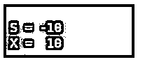
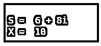
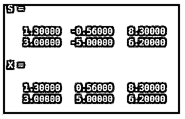
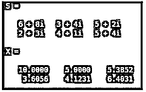

# 绝对值 Matlab

> 原文：<https://www.educba.com/absolute-value-matlab/>

## 绝对值 Matlab 简介

一个数的绝对值给出了它在数轴上与 0 的距离。绝对值不考虑数字所在的方向，因此绝对值永远不会是负的。对于向量，绝对值是向量的大小。复数的绝对值是由复数平面上该数离原点的距离给出的。在 Matlab 中，我们使用“绝对函数”来获得任何数字或向量的绝对值。

**Matlab 中绝对值函数的语法:**

<small>Hadoop、数据科学、统计学&其他</small>

`X = abs (S)`

**描述:**

*   **X = ABS(****S****):**用于获取输入 S 中每个元素的绝对值
*   如果输入数组 S 有复数元素，那么 abs (S)函数将返回“复数幅度”。

### 绝对值 Matlab 示例

下面给出了在 Matlab 中使用“abs (S) function”计算绝对值的代码:

#### 示例#1

在本例中，我们将采用一个简单的标量，并使用 abs (S)函数找到它的绝对值。

我们将遵循以下 2 个步骤:

*   取一个标量。
*   将其作为参数传递给绝对值函数。

**代码:**

S = -10

[Initializing the scalar ‘S’]

X = abs (S)

[Passing the scalar as an input to the absolute function] [Please note that, we can directly pass the scalar value as input to the abs function like, abs (-10)] [Mathematically, the absolute value of -10 is 10]

**输入:**

`S = -10
X = abs (S)`

**输出:**

**

** 

正如我们在输出中看到的，我们获得了输入标量的绝对值 10，这与我们预期的一样。

如果我们想计算一个复数的绝对值，现在让我们看看绝对值的代码在 Matlab 中是什么样子的。

[Please note that, mathematically, the complex magnitude or absolute value of a complex number (a + ib) is given by square root of (a^2 + b^2)].

#### 实施例 2

在本例中，我们将取一个复数，并使用 abs (S)函数求出其绝对值。

我们将遵循以下 2 个步骤:

*   取一个复数。
*   将其作为参数传递给绝对值函数。

**代码:**

S = 6 + 8i

[Initializing the complex number ‘S’]

X = abs (S)

[Passing the complex number as an input to the absolute function] [Please note that, we can directly pass the complex value as input to the abs function like, abs (6 + 8i)] [Mathematically, the absolute value of (6 + 8i) is 10]

**输入:**

`S = 6 + 8i
X = abs (S)`

**输出:**

正如我们在输出中看到的，我们已经获得了输入复数的绝对值 10，这与我们预期的一样。

如果我们想计算向量的绝对值，现在让我们看看绝对值的代码在 Matlab 中是什么样子的。

#### 实施例 3

在这个例子中，我们将使用 abs (S)函数获取一个向量数组并找到它的绝对值。

我们将遵循以下 2 个步骤:

*   创建输入数组。
*   将其作为参数传递给绝对值函数。

**代码:**

s =[1.3-0.56 8.3；3-5 6.2][初始化输入数组']

X = abs (S)

[Passing the array as an input to the absolute function] [Mathematically, the absolute value of [1.3 -0.56 8.3; 3 -5 6.2] is [1.3000   0.5600   8.3000; 3.0000 5.0000  6.2000]

**输入:**

`S = [1.3 -0.56 8.3; 3 -5 6.2] X = abs (S)`

**输出:**

正如我们在输出中看到的，我们已经获得了我们期望的向量输入数组的绝对值。

如果我们想计算一个复数数组的绝对值，现在让我们看看绝对值的代码在 Matlab 中是什么样子的。

#### 实施例 4

在本例中，我们将获取一个复数数组，并使用 abs (S)函数找到它的绝对值。

我们将遵循以下 2 个步骤:

*   创建一个复数数组。
*   将其作为参数传递给绝对值函数。

**代码:**

s =[6+8i 3+4 I 5+2i；2+3i 4+1i 5+4 I][创建复数数组]

X = abs (S)

[Passing the array as an input to the absolute function] [abs (S) will find the absolute value of every element of the array]

**输入:**

`S = [6+8i 3+4i 5+2i; 2+3i 4+1i 5+4i] X = abs (S)`

**输出:**

**

** 

正如我们在输出中看到的，我们已经获得了我们所期望的复数输入数组的绝对值。

### 结论

绝对值函数可以在 Matlab 中使用，以获得任何标量或向量的绝对值。我们也可以用同样的函数得到复数的复数幅度。

### 推荐文章

这是一个绝对值 Matlab 指南。这里我们分别用例子来讨论绝对值 Matlab 的介绍。您也可以看看以下文章，了解更多信息–

1.  [震级 Matlab](https://www.educba.com/magnitude-matlab/)
2.  [Matlab fopen](https://www.educba.com/matlab-fopen/)
3.  [Matlab 绘制多条线](https://www.educba.com/matlab-plot-multiple-lines/)
4.  [MATLAB 独有的](https://www.educba.com/matlab-unique/)

