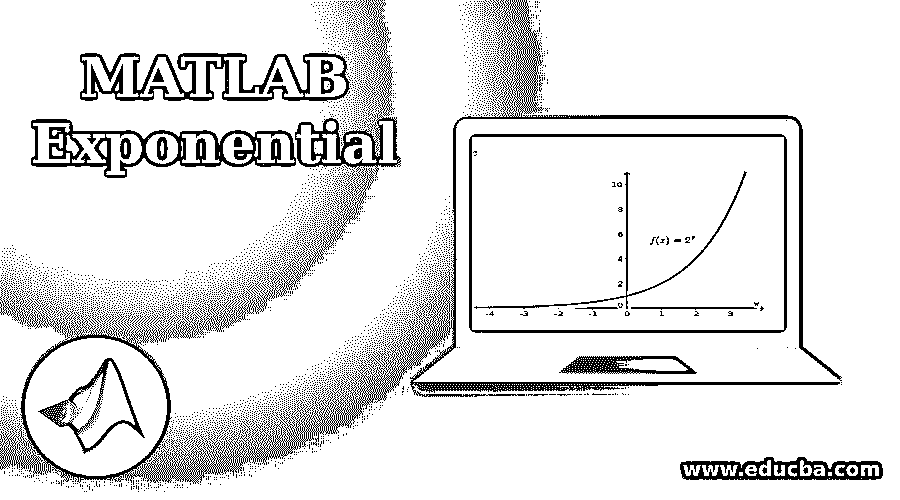
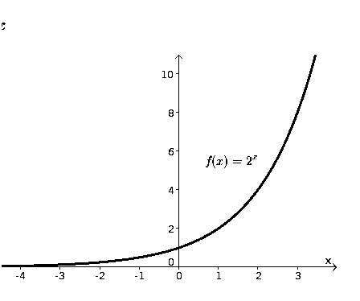
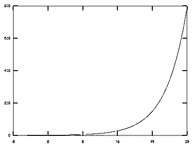

# MATLAB 指数

> 原文：<https://www.educba.com/matlab-exponential/>

## MATLAB 指数函数简介

MATLAB 有各种各样的命令和函数，有许多实用程序。本文将着重于理解一个非常重要的 MATLAB 函数，称为“指数函数”。我们使用 exp(x)来计算作为参数传递的函数的指数。我们还将了解如何直观地表示指数函数。我们希望计算其指数的函数作为参数传递给' exp '命令。

**我们先来刷新一下对指数函数的理解。**

<small>Hadoop、数据科学、统计学&其他</small>

指数函数是常数为“e”的函数，它的幂是自变量的幂。

它可以表示为 f(x) = b(x)

这里‘b**’**表示一个正数的实数

x 代表指数自变量

指数函数是实变量的函数，这些函数的增长率与函数值成正比。增长率实际上是函数的导数。

在指数函数中，指数是独立变量。

下面是指数函数的一个简单示例:

`F(x) = 2 ^ x`

如上图所示，指数函数快速增加。让我们来看另一个函数:

g(x) =1/2 的 x 次方，这是一个指数衰减的例子，随着 x 的增加，函数迅速减小。

对于上例中的 f(x)来说，我们每次加到 x 上，函数就翻倍，在函数的指数衰减中，我们每次加到 x 上，函数就减少到一半，这是指数函数的一个特性，表示它们增长或衰减的快慢。

### MATLAB 指数函数示例

以下是 MATLAB 指数的例子:

现在我们已经刷过了对指数函数的理解，下面我们来了解一下它在 MATLAB 中的用法。

**语法:**

`exp (X)`

对于数组 X 中的每个元素， [y](https://in.mathworks.com/help/matlab/ref/exp.html#bt9_gkt-1-Y) = exp ( [X](https://in.mathworks.com/help/matlab/ref/exp.html#bt9_gkt-1-X) )将返回指数函数‘e’的 X 次幂

它也可以用于 z = x + iy 形式的复杂元素。

输出将是

e ^ z = e ^ x (sin y + i cos y)

现在我们将借助各种例子来理解上面的语法

### MATLAB 中指数函数的类型

以下是 Matlab 中指数函数的类型:

#### 1.单位指数

让我们首先计算单位(1)的指数。

**代码:**

`exp (1)`

**输出:**

#### 2.正数的指数

现在让我们取另一个正数的指数。

**代码:**

`exp (3)`

**输出:**

#### 3.负数的指数

负数的指数也是可能的。为了便于理解，让我们取“-3”的指数。

**代码:**

`exp (-3)`

**输出:**

#### 4.分数的指数

在上面的例子中，我们看到了如何取整数的指数，我们也可以取分数的指数。为了我们的理解，我们以分数为例。

**代码:**

`exp (1 / 4)`

**输出:**

#### 5.浮点值的指数

我们也可以计算浮点数的指数。我们取一个浮点值 2.23 来进行理解。

**代码:**

`exp (2.23)`

**输出:**

#### 6.对数函数的指数

我们也可以计算对数函数的指数。让我们取值'-2 '作为我们的理解。

**代码:**

`exp (log (-2))`

**输出:**

#### 7.绘制指数函数

现在让我们来学习如何绘制一个指数函数。当我们想要分析函数的行为时，图表在视觉上比普通数据更强大。

**举例:**

我们的函数是 A = e ^ (x / 3)

让我们假设这些值在[-3，20]的范围内。我们的输入看起来是这样的:

**代码:**

`X = -3 : 0.5 : 20;
A = exp (X / 3);
plot (X, A)`

**输出:**

因此，在本文中，我们学习了如何在 MATLAB 中使用指数函数。我们可以在 MATLAB 中使用 exp(x)语法来计算作为参数传递的任何函数的指数。我们也可以使用“绘图”表达式来绘制我们已经计算的函数，这允许我们直观地解释我们的函数。

### 推荐文章

这是一个 MATLAB 指数指南。这里我们讨论 MATLAB 指数的介绍和它的不同例子，以及它的输入和输出。您也可以浏览我们推荐的文章，了解更多信息——

1.  [MATLAB 函数介绍](https://www.educba.com/matlab-functions/)
2.  [Matlab 的十大优势](https://www.educba.com/advantages-of-matlab/)
3.  [Matlab 中的 Switch 语句是什么？](https://www.educba.com/switch-statement-in-matlab/)
4.  [Matlab sphere() |语法和示例](https://www.educba.com/matlab-sphere/)

