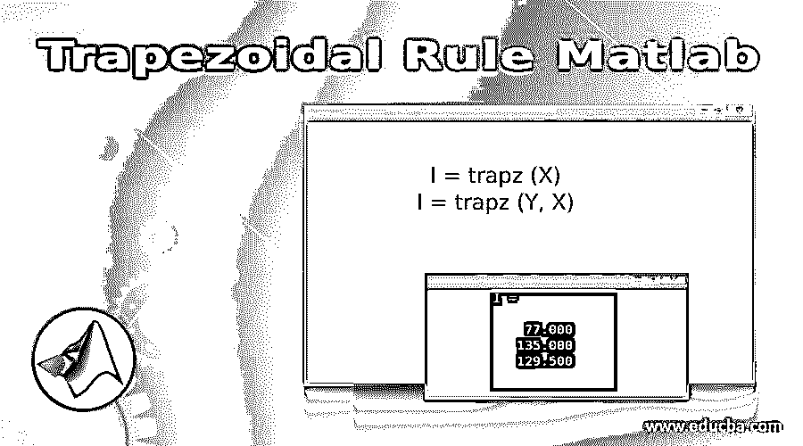
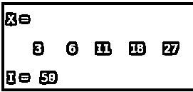
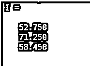
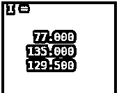

# 梯形法则 Matlab

> 原文：<https://www.educba.com/trapezoidal-rule-matlab/>

## 梯形法则 Matlab 简介

积分中使用梯形法则来计算函数的定积分。它在数值分析过程中被广泛使用。出于积分的目的，梯形法则认为曲线下的面积由小梯形组成，然后通过将所有这些小梯形的面积相加来计算总面积。在 MATLAB 中，我们使用“trapz 函数”通过梯形法则得到函数的积分。

现在让我们理解 Matlab 中 trapz 函数的语法:

<small>Hadoop、数据科学、统计学&其他</small>

**语法:**

`I = trapz (X)`

`I = trapz (Y, X)`

**描述:**

*   I = trapz (X)用于计算 X 的积分，使用梯形法则。对于向量，它会给出近似积分。对于矩阵，它将提供所有列的积分，并将在行向量中返回积分值
*   I = trapz (Y，X)将对 Y 给定的 X w.r.t 坐标进行积分

### 梯形法则 Matlab 实例

现在让我们理解在 MATLAB 中使用“梯形法则”计算积分的代码。

#### 示例#1

在这个例子中，我们将采用一个代表(x^2 + 2)的数组，并使用梯形法则对其进行积分。我们将遵循以下 2 个步骤:

*   创建输入数组
*   将函数传递给 trapz 函数

**语法:**

`X = [3 6 11 18 27]`

[Creating the input array for the function x^2 + 2, in the range 1 to 5]

`I = trapz (X)`

[Calling the trapz function and passing the input array as an argument] [Mathematically, the trapezoidal rule will give integration of (x^2 + 2) as 50]

**输入:**

`X = [3 6 11 18 27] I = trapz (X)`

**输出:**

正如我们在输出中看到的，我们已经获得了输入函数的积分 50，这与我们预期的相同。

#### 实施例 2

在本例中，我们将采用 sin 函数，并使用梯形法则对其进行积分。我们将遵循以下 3 个步骤:

1.  定义输入正弦函数的限值
2.  创建一个 sin 函数
3.  将输入函数和所需的限制传递给 trapz 函数

**语法:**

`Y = 0:100;`

[Defining the limits for trapezoidal rule]

`X = 10 - 10 * sin (pi / 200 * Y);`

[Creating the sine wave]

`I = trapz (Y, X)`

[Calling the trapz function and passing the input function as an argument] [Mathematically, the trapezoidal rule will give integration of (10 – 10 * sin (pi / 200 * Y)) as 363.3933]

**输入:**

`Y = 0:100;
X = 10 - 10 * sin (pi / 200 * Y);
I = trapz (Y, X)`

**输出:**

正如我们在输出中看到的，我们已经获得了输入函数的积分 363.3933，这与我们预期的相同。

#### 实施例 3

在本例中，我们将采用 cos 函数，并使用梯形法则对其进行积分。我们将遵循以下 3 个步骤:

1.  定义输入 cos 函数的限值
2.  创建一个 cos 函数
3.  将输入函数和所需的限制传递给 trapz 函数

**语法:**

`Y = 0:100;`

[Defining the limits for trapezoidal rule]

`X = 20 - 50 * cos (2*pi / 100 * Y);`

[Creating the cos wave]

`I = trapz (Y, X)`

[Calling the trapz function and passing the input function as an argument] [Mathematically, the trapezoidal rule will give integration of (20 – 50 * cos (2*pi / 100 * Y)) as 2.0000e+03]

**输入:**

`Y = 0:100;
X = 20 - 50 * cos (2*pi / 100 * Y);
I = trapz (Y, X)`

**输出:**

#### 实施例 4

在这个例子中，我们将采用一个矩阵，并用梯形法则对其行进行积分。我们将遵循以下 3 个步骤:

1.  创建向量
2.  创建一个包含观察值(即输入数据)的矩阵
3.  将向量和矩阵传递给 trapz 函数

**语法:**

`Y = [2 4.5 7 9];`

[Creating the vector]

`X = [5    8    6     13;
4     7   15    15;
4     5   10.2 18];`

[Creating the input matrix with observations]

`I = trapz (Y, X, 2)`

[Calling the trapz function and passing the input array and matrix as arguments. We have also passed a third argument as ‘2’, which implies that our target data is present in the rows]

**输入:****T3】**

`Y = [2 4.5 7 9];
X = [5    8    6     13;
4     7   15    15;
4     5   10.2 18];
I = trapz (Y, X, 2)`

**输出:**

正如我们在输出中所看到的，我们已经获得了作为列向量的输入的积分，每个元素对应于输入矩阵‘X’的一行。

#### 实施例 5

在本例中，我们将采用一个 3×5 矩阵，并使用梯形法则对其行进行积分。我们将遵循以下 3 个步骤:

1.  创建向量
2.  创建一个包含观察值(即输入数据)的 3×5 矩阵
3.  将向量和矩阵传递给 trapz 函数

**语法:**

`Y = [1 5 8 10 14];`

[Creating the vector]

`X = [15      8     4     3   0;
12     17    5    11  3;
8      15    10   8   6];`

[Creating the input matrix with observations]

`I = trapz (Y, X, 2)`

[Calling the trapz function and passing the input array and matrix as arguments. The third argument ‘2’ implies that our target data is present in the rows]

**输入:**

`Y = [1 5 8 10 14];
X = [15      8     4     3   0;
12     17    5    11  3;
8      15    10   8   6];
I = trapz (Y, X, 2)`

**输出:**

正如我们在输出中所看到的，我们已经获得了作为列向量的输入的积分，每个元素对应于输入矩阵‘X’的一行。

### 推荐文章

这是一个梯形法则的 Matlab 指南。在这里，我们还讨论了梯形规则 matlab 的介绍和语法，以及不同的例子和它的代码实现。您也可以看看以下文章，了解更多信息–

1.  [MATLAB 导数](https://www.educba.com/matlab-derivative/)
2.  [Matlab 中的阶乘](https://www.educba.com/factorial-in-matlab/)
3.  [傅立叶级数 Matlab](https://www.educba.com/fourier-series-matlab/)
4.  [条形图 Matlab](https://www.educba.com/bar-plot-matlab/)

