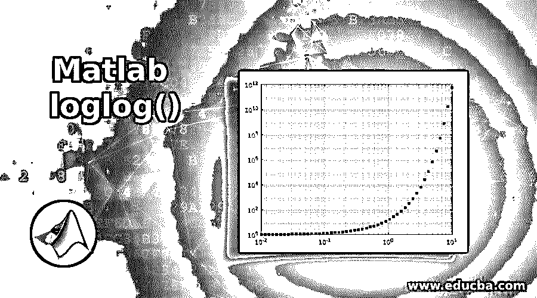
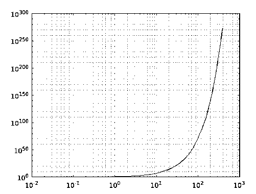
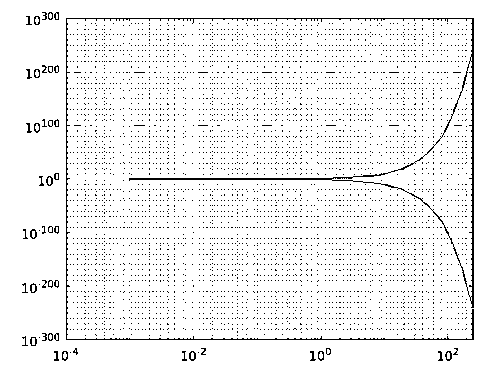
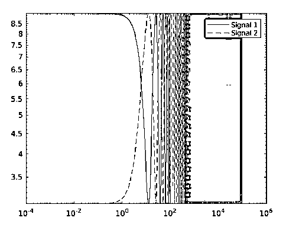
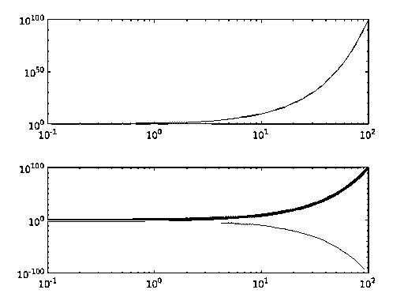
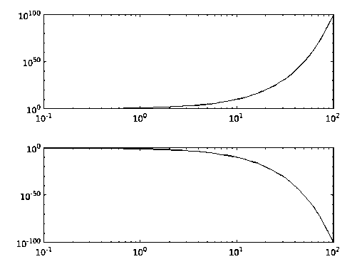
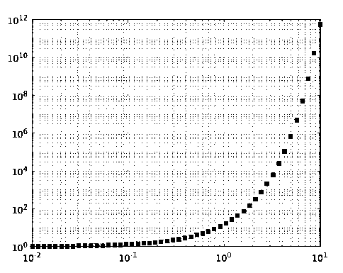

# Matlab 对数对数()

> 原文：<https://www.educba.com/matlab-loglog/>

## Matlab loglog()简介

在 MATLAB 中，loglog()函数是一个 2D 绘图创建函数，它生成一个对数标度(以 10 为底)的绘图。它以对数标度绘制“x”和“y”轴的数据集。对于非常大值或非常小的正值，生成图基本上是有用的。通过将轴、XScale 和 YScale 的属性设置为“log ”,从 loglog()函数生成该图。

该函数还允许我们将输入的实数值设置为 x 轴坐标，将输入的虚数值设置为 y 轴坐标，从而生成复数的对数图。

<small>Hadoop、数据科学、统计学&其他</small>

### Matlab loglog()的语法

Matlab loglog()的语法如下所示:

**语法:**

MATLAB 函数 loglog()支持各种语法，具体取决于要生成的图的。

| **语法** | **描述** |
| `loglog(X,Y)` | 这用于创建在 x 轴和 y 轴上应用对数刻度的图。 |
| `loglog(X,Y,LineSpec)` | 这用于创建在 x 轴和 y 轴上应用对数刻度的图，并根据线条样式、标记或颜色指定线条规格。 |
| `loglog(X1,Y1,...,Xn,Yn)` | This is used to create multiple plots with respect to each pair of x, y coordinates (X1, Y1), (X2, Y2),…, (Xn, Yn) applying logarithmic scale on the same set of X-Y axes.这种语法是将多重集坐标声明为矩阵的替代方法。 |
| `loglog(X1,Y1,LineSpec1,...,Xn,Yn,LineSpecn)` | 这用于创建关于每对 X，Y 坐标(X1，Y1)，(X2，Y2)，…，(Xn，Yn)的多个图，在同一组 X-Y 轴上应用对数标度，并根据每组的线条样式、标记或颜色指定线条规格。 |
| `loglog(Y)` | 这用于创建相对于 x 轴集合的图“Y ”,这是隐含的。 |
| `loglog(Y,LineSpec)` | 这用于创建相对于 x 轴集合的绘图“Y ”,该集合隐含了线条样式、标记和颜色的自定义值。 |
| `loglog(___,Name,Value)` | 这用于创建在 x 轴和 y 轴上应用对数刻度的图，以及自定义以名称-值对参数格式给出的图的显示属性 |
| `loglog(ax,___)` | 这用于在新设置的目标轴上的 x 轴和 y 轴上应用对数刻度来创建图。 |
| `lineobj = loglog(___)` | 这用于创建在 x 轴和 y 轴上应用对数刻度的图，并存储在线型对象 lineobj 中。该对象可用于在创建地块后编辑地块属性。 |

### Matlab loglog()的例子

以下是 Matlab loglog()的例子。

#### 示例#1

`xdata = logspace(-2,3);
ydata = 5.^xdata+2;
loglog(xdata,ydata)
grid on`

**输出**:

loglog()使用户能够创建共享一个公共 x-y 平面的多个图，调用一个单行命令。这可以通过 syntaxloglog(X1，Y1，…，Xn，Yn，___)的实现来实现。

#### 实施例 2

`xdata = logspace(-3,5);
ydata1 = 10.^xdata;
ydata2 = 1./10.^xdata;
loglog(xdata, ydata1,xdata,ydata2)
grid on`

**输出**:

这里，输入 ydata1 和 ydata2 的对数图是使用 xdata 中的公共 x 坐标创建的。

该语法还支持使用输入参数作为 LineSpec 值来定制绘图。

#### 实施例 3

`x1 = logspace(-1,2,10000);
x2 = logspace(-3,5,20000);
y1 = 6 + 3*cos(x1/4);
y2 = 6 - 3*cos(x2/4);
loglog(x1,y1,x2,y2,'--')
legend('Signal 1','Signal 2')`

**输出**:

该函数扩展了其功能，即使在生成图后也能灵活地定制图。通过使用 line 对象存储由 loglog()函数生成的图，可以使用该功能。

#### 实施例 4

`xdata = logspace(-1,2);
ydata1 = 10.^xdata;
ydata2 = 1./10.^xdata;
lg = loglog(xdata,ydata1,xdata,ydata2);
lg(1).LineWidth = 3;
lg(2).Color = [0.5 1 1];`

**输出:**

**输入参数**:

语法是基于函数定义支持的输入参数开发的。下表描述了可用作输入参数的不同参数:

| X 坐标-X | 输入数据用于设置 X 轴上的数据点。 |
| Y 坐标-Y | 输入数据用于设置 Y 轴上的数据点以创建图。 |
| LineSpec | 字符或符号串的向量，可用于决定绘图的线型、标记或颜色。 |
| 目标轴- ax | 可设置为绘图目标轴的新轴对象。 |

#### 实施例 5

`tiledlayout('flow')
axdata1 = nexttile;
x = logspace(-1,2);
y1 = 10.^x;
loglog(axdata1,x,y1)
axdata2 = nexttile;
y2 = 1./10.^x;
loglog(axdata2,x,y2)`

**输出**:

**属性:**

该函数支持通过一些预定义的属性对通过它生成的图进行定制。通过按照名称-值对参数的格式改变属性值，可以改变绘图的显示。

| 颜色 | 以关键字“color”开头的指定值以名称-值对的形式设置线条的颜色。 |
| 行距 | 以关键字“LineWidth”开头的指定值以名称-值对的形式设置线条的宽度。 |
| 市场规模 | 以关键字“MarkerSize”开头指定的正值以名称-值对的形式设置标记的大小。 |
| MarkerEdgeColor | 以关键字“MarkerEdgeColor”开头的指定值以名称-值对的形式设置标记轮廓的颜色。 |
| MarkerFaceColor | 以关键字“MarkerFaceColor”开头的指定值以名称-值对的形式决定了标记内部区域要填充的颜色。 |

#### 实施例 6

`xdata = logspace(-2,1,50);
ydata = 15.^xdata;
loglog(xdata,ydata,'s','MarkerFaceColor',[0 0.447 0.741])
grid on`

**输出**:

**补充说明**:

*   调用 loglog()函数时，如果轴的保持状态设置为打开状态，XScale 和 YScale 属性不会改变。在这种情况下，显示图的比例将自动设置为线性或半对数。
*   如果一组坐标由线段连接，则向量 X 和 Y 必须具有相同的长度，如果多组坐标共享一组公共轴，则需要将 X 和 Y 中的至少一个输入指定为矩阵。
*   当图片中有一组隐含的 x 坐标时，即函数调用使用唯一的 Y 作为输入参数时，x 坐标的范围根据以下内容决定
    *   Y 作为向量:x 的范围是 1 到长度(Y)
    *   作为矩阵的 Y:x 的范围是 1 到 Rows(Y)(行数)

### 推荐文章

这是一个 Matlab loglog()的指南。在这里，我们还讨论了 Matlab loglog()的介绍和语法，以及不同的例子和它的代码实现。您也可以看看以下文章，了解更多信息–

1.  [优化的 Matlab](https://www.educba.com/optimset-matlab/)
2.  [Fzero Matlab](https://www.educba.com/fzero-matlab/)
3.  [Matlab 绘图圆](https://www.educba.com/matlab-plot-circle/)
4.  [Matlab pcolor()](https://www.educba.com/matlab-pcolor/)

