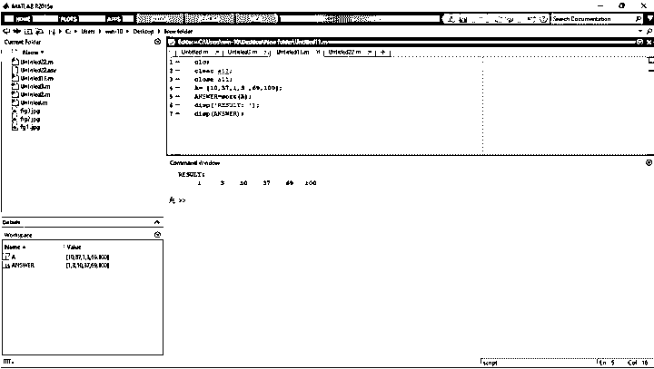
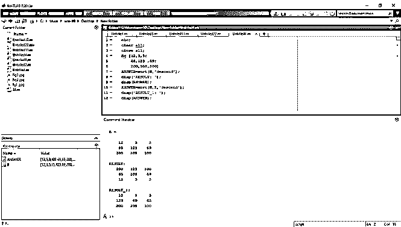
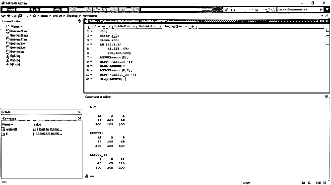

# Matlab 排序

> 原文：<https://www.educba.com/matlab-sort/>

## Matlab 排序的定义

Matlab 排序函数用于所有情况下的内部排序，如符号表达式和函数。这个函数用于对数组和矩阵中不同维度的元素进行排序。这个函数按照升序对向量、数组或变量的元素进行排序。这个函数对矩阵的元素进行排序，独立地对每一列和每一行进行排序。当 Matlab 排序函数对多维数组排序时，该函数对第一个大小不相等的数组维中的元素进行排序。

**语法:**

<small>Hadoop、数据科学、统计学&其他</small>

*   [Y = sort(X)](https://in.mathworks.com/help/symbolic/sort.html#d122e242893)
*   [Y =排序(](https://in.mathworks.com/help/symbolic/sort.html#d122e242966)[**_ _ _ _ _ _**](https://in.mathworks.com/help/symbolic/sort.html#d122e242966)[，方向)](https://in.mathworks.com/help/symbolic/sort.html#d122e242966)
*   [Y = sort(X，dim)](https://in.mathworks.com/help/symbolic/sort.html#d122e242936)

### Matlab 中的排序函数是如何工作的？

该函数用于所有情况下的内部排序，如符号表达式和函数。对元素进行排序有一些简单的步骤，如下所示。

**第一步:**将数据加载到变量或数组中。

**第二步:**使用适当语法的函数对输入数据进行排序。

**第三步**:执行 Matlab 代码运行程序。

### 例子

让我们讨论 Matlab 排序的例子。

#### 示例#1

在这个例子中，我们看到了如何在 Matlab 中对数组进行升序排序。为此，我们首先创建一个数组。这里我们创建了一个数组 A 来存储数字数据。“10、37、1、3、69 和 100”这些数字被分配给数组 A。之后，我们使用 Matlab 排序函数对数组 A 进行排序。"答案=排序(A)；"Matlab 排序函数的语法用于对数组“A”进行排序。默认情况下，该函数是按升序排列的。所以在 Matlab 中使用 Matlab 排序函数对任何可能是实数和复数的数字或任何符号向量进行升序排序是非常简单的。然后利用 Matlab 的显示函数显示结果。disp(答案)；'这一行用于显示排序后的数组。

**代码:**

`clc;
clear all;
close all;
A= [10,37,1,3 ,69,100];
ANSWER=sort(A);
disp('RESULT: ');
disp(ANSWER);`

**输出:**

**

** 

#### 实施例 2

在这个例子中，我们看到如何将输入数据按升序和降序排序。所以我们首先创建一个矩阵。这里我们创建一个矩阵‘B’。矩阵 B 是一个具有数字输入参数的 3×3 矩阵。“B= [12，3，5；65,123, 69;200,108,100];"这一行用来创建 3×3 的矩阵 b，然后我们对矩阵 b 进行排序，默认情况下，函数按照升序和降序对矩阵的元素进行排序。默认情况下，该函数按升序对矩阵元素进行排序。对矩阵的元素按降序排序，排序的方向在 Matlab 排序函数的语法中提到。在这个例子中，我们可以按降序对矩阵进行排序。" ANSWER = sort (B，'降序')；"此语法用于按降序对矩阵元素进行排序。然后利用 Matlab 的显示函数显示结果。disp(答案)；'这一行用于显示排序后的数组。

**代码:**

`clc;
clear all;
close all;
B= [12,3,5;
65,123 ,69;
200,108,100] ANSWER=sort(B,'descend');
disp('RESULT: ');
disp(ANSWER);
ANSWER=sort(B,2,'descend');
disp('RESULT_1: ');
disp(ANSWER);`

**输出:**

**

** 

#### 实施例 3

在这个例子中，我们看到了如何对矩阵及其列和行进行排序。正如我们所知，为了在 Matlab 中对数值表达式和函数进行排序，我们使用了 Matlab sort 函数。所以我们首先创建一个矩阵。这里我们创建一个矩阵‘B’。矩阵 B 是一个具有数字输入参数的 3×3 矩阵。“B= [12，3，5；65,123, 69;200,108,100];"这一行用于创建 3×3 矩阵 b。然后我们对矩阵 b 进行排序。默认情况下，Matlab 排序函数按照每一列对矩阵的元素进行排序。"答案=排序(B)；"该语法用于按照每列对矩阵 B 进行排序。然后利用 Matlab 的显示函数显示结果。disp(答案)；'该行用于显示按每列排序的矩阵。现在我们可以看到如何按行对矩阵进行排序。我们使用 Matlab 排序函数，将相同的矩阵 B 和排序后的矩阵 B 作为每行。" ANSWER=sort(B，2)；"该语法用于按行对矩阵 B 进行排序。这里 2 表示排序维度。然后利用 Matlab 的显示函数显示结果。disp(答案)；'这一行用于显示按每行排序的矩阵。执行 Matlab 代码以获得输出。

**代码:**

`clc;
clear all;
close all;
B= [12,3,5;
65,123 ,69;
200,108,100] ANSWER=sort(B);
disp('RESULT: ');
disp(ANSWER);
ANSWER=sort(B,2);
disp('RESULT_1: ');
disp(ANSWER);`

**输出:**

### 结论

在本文中，我们看到了 Matlab 排序函数的概念。基本上，这个函数用于不同元素的内部排序。然后看到了与排序函数相关的语法以及如何在 Matlab 代码中使用它。然后，当我们对矩阵及其列和行进行排序时，我们看到了它的有效用途。

### 推荐文章

这是一个 Matlab 排序指南。这里我们讨论 Matlab 排序的定义，排序函数在 Matlab 中是如何工作的？并分别举例说明。您也可以看看以下文章，了解更多信息–

1.  [Matlab 自相关](https://www.educba.com/matlab-autocorrelation/)
2.  [Matlab 图像调整大小](https://www.educba.com/matlab-image-resize/)
3.  [雅可比 Matlab](https://www.educba.com/jacobian-matlab/)
4.  [Matlab 格式](https://www.educba.com/matlab-format/)

