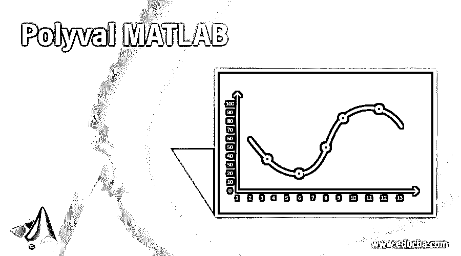
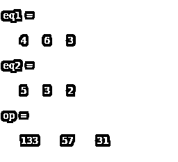
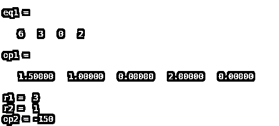
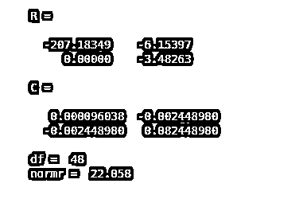

# 聚 val MATLAB

> 原文：<https://www.educba.com/polyval-matlab/>

## Polyval MATLAB 简介

“Polyval”是 Matlab 中的重要语法之一，因为在计算机系统中求解数学二次或线性方程非常复杂。polyval 支持解决这些问题。通过使用 polyval 命令，我们可以在 Matlab 中求解复杂的多项式。该命令不限于一个或两个度数，而是计算“n”个度数和根的根。它还包括其他函数，如 poly、polyder、poly int、polyvalm、polyeig、residue、roots、conv、second 和 polyfit。Poly int 用于求多项式的定积分。Polyfit 用于将一次多项式拟合到解中。Polyvalm 用于计算矩阵向量多项式。波利埃格曾用来求特征问题的解。使用部分分数留数命令求部分分数的根。conv 用来做卷积和多项式的乘法，deconv 用来做反卷积和多项式的除法

**语法**

<small>Hadoop、数据科学、统计学&其他</small>

*   **Op = polyval(eq1，eq2):** 输出变量名= polyval(多项式的系数，点位置)
*   **Op = polyint(eq1)** :输出变量名= polyint(多项式的系数)
*   **[op，op1] = polyfit(range，eq1，1):** 输出变量名= polyfit(range，多项式系数，1)

### 我们为什么使用 Polyval Matlab？

有各种函数和命令用于找出多项式的根，但是其他方法不能评估高次多项式的根或解。在这种情况下，polyval 起着至关重要的作用。如果我们想找出多项式在不同位置的根，那么我们使用 polyval。让我们假设一个等式 x 1 = 9 x^3 + 5 x^2 + 4 x + 9 在点 4，5，3，2，那么它将创建一个向量[ 9，5，4，9 ]。这个向量代表多项式的系数。也有助于计算多项式的定积分。如果我们想要拟合或使用多个值或范围，那么我们可以使用 polyfit 命令。

### Polyval MATLAB 实现示例

下面是提到的例子:

#### 示例#1

让我们考虑两个等式，eq1 = 4 x^2 + 6 x + 3，eq2 = [ 5，3，2 ]，eq2 是点的位置。示例 1 展示了解决这个问题的 Mat lab 程序。此示例的输出将显示位置 5、3 和 2 处的上述 eq1 的根。

**代码:**

`clc ;
clear all;
eq1 = [ 4, 6, 3 ] eq2 = [ 5, 3, 2 ] op = polyval(eq1, eq2)`

**输出:**

#### 实施例 2

让我们考虑极限为 r1 和 r2 的积分例子。Eq1 =6 x^3 + 3 x^2 + 2。在等式 1 中，缺少一个度数，因此我们将系数视为 0。r 1 和 r 2 的值分别为 3 和 1。为了评估这个问题，首先我们将使用 polyint 命令计算 eq1 的积分，积分后，我们可以通过在 polyval 命令中输入 r1 和 r2 的输出和值来找到定义值。

**代码:**

`clc ;
clear all ;
eq1 = [ 6, 3, 0, 2 ] op1 = polyint(eq1)
r1 = 3
r2 = 1
op2 = diff(polyval( op1, [ r1 , r2 ] ))`

**输出:**

#### 实施例 3

在示例 3 中，我们使用了 polyfit 函数，该函数用于将一次值的范围拟合到多项式中。在这个例子中，范围被认为是从 1 到 50，它被定义为可变范围，多项式被存储在等式 1 中。赋值后，我们使用 polyfit 命令拟合多项式和函数范围。Matlab 代码显示了示例 3 的实现

**代码:**

`clc ;
clear all ;
range = 1 : 50 ;
eq1 = 0.5 * range + 3 * randn(1, 50 ) ;
[ op ,op1] = polyfit(range, eq1, 1)`

**输出:**

### 结论

在上述模块中，我们已经看到了使用 Mat lab 的多项式演化。我们可以使用各种命令来找到精确的解决方案。例如 polyval、polyint、polyder、poly 和 polyfit。我们也可以通过使用这些命令来计算任意多项式。随着这些应用，我们还可以通过使用多项式矩阵和多项式回归找到更高次的多项式解。多项式回归是多值实现的重要应用之一。

### 推荐文章

这是一个 Polyval MATLAB 的指南。这里我们讨论 polyval 如何使用适当的语法和相应的示例来实现。您也可以浏览我们的其他相关文章，了解更多信息——

1.  [Matlab 中的向量](https://www.educba.com/vectors-in-matlab/)
2.  [Matlab 编译器](https://www.educba.com/matlab-compiler/?source=leftnav)
3.  [Matlab 命令](https://www.educba.com/matlab-commands/?source=leftnav)
4.  [MATLAB 中的数据类型](https://www.educba.com/data-types-in-matlab/?source=leftnav)

