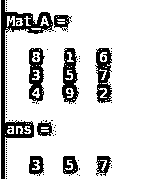
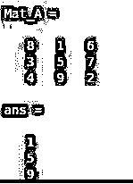
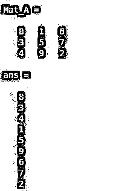
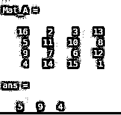
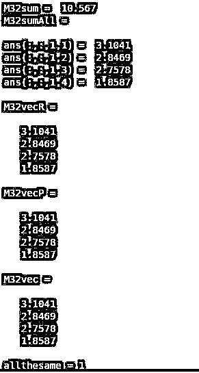
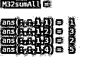
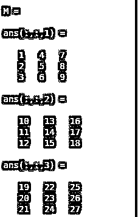
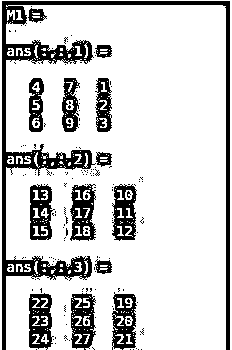
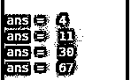

# MATLAB 冒号

> 原文：<https://www.educba.com/matlab-colon/>

## MATLAB 冒号介绍

“冒号”在 MATLAB 编程中用作运算符，是常用的运算符之一。这个操作符用于创建用简单表达式定义的向量，指定“for”迭代或订阅数组，或者访问序列中现有向量的一组元素。当使用“cellName{:}”或“structName(:)形式的冒号运算符创建 vector 以索引单元格或结构类型数组时。fieldName)'，MATLAB 会将多个输出放入逗号分隔的列表中。

### 句法

支持各种形式的语法来使用运算符“:”。不同语法的功能描述如下:

<small>Hadoop、数据科学、统计学&其他</small>

| **语法** | **描述** |
| 李= j:k | 该语法用于创建一个单位空间矢量列表，即增量值为“1”的值，由元素[j，j+1，…，k]组成。 |
| 李= j:i:k | 该语法用于使用具有增量值“I”的值创建规则间隔的向量列表“li”，由元素[j，j+1，…，k]组成。 |
| m(:，n) | 该语法用于存储矩阵 m 的第 n 列 |
| M(m，) | 该语法用于存储矩阵 m 的第 m 行 |
| m(:) | 该语法可用于将元素“M”整形为包含单个列的向量。 |
| 男(女:男) | This syntax can be used to apply the vector list having the elementsj: kin order to index into matrix M.这相当于把向量形成为[M(j)，M(j+1)，…，M(k)]。 |
| m(:，:，p) | 该语法可用于从第 p 页的三维数组 A 集中存储/提取数据。 |
| m(:，:) | 该语法可用于将矩阵“M”的元素重新成形为二维矩阵。 |
| m(:，j:k) | 该语法可用于包括第一维中存在的下标，并使用具有元素 j:k 的向量来索引第二维。这导致矩阵具有列[M(:，j)，M(:，j+1)，…，M(:，k)]。 |

### 实现 MATLAB 冒号的例子

下面是提到的一些例子:

#### 示例#1

**代码:**

`list_name = -3:3`

**输出**:

**解释:**该命令生成了一个从-3 到 3 的值列表，其中两个连续元素之间的差值为“1”。

#### 实施例 2

**代码:**

`list_name = -3:3:30`

**输出**:

**解释:**该命令生成了从-3 到 30 的值列表，其中两个连续元素之间的差异为“3”。

#### 实施例 3

**代码:**

`Mat_A = magic(3)Mat_A(2,:)`

**输出**:

**解释:**该命令显示了矩阵‘Mat _ A’第二行的元素

#### 实施例 4

**代码:**

`Mat_A = magic(3)Mat_A(:,2)`

**输出**:

**解释:**该命令显示了矩阵‘Mat _ A’第二列的元素

#### 实施例 5

**代码:**

`Mat_A = magic(3)Mat_A(:)`

**输出**:

**解释:**该命令在一列中显示了矩阵‘Mat _ A’的元素。

#### 实施例 6

**代码:**

`Mat_A = magic(4)Mat_A(2:4)`

**输出**:

**解释:**该命令显示了矩阵‘Mat _ A’中索引在 2 到 4 之间的元素。

### MATLAB 冒号的应用

以下是应用程序:

#### 1.使用冒号创建列表

使用冒号运算符可以生成一个数字间距相等的向量。

**代码:**

`Mat_A =1:2:10`

**输出**:

#### 2.创建只有列格式的向量

冒号运算符可用于将行向量类型的输入转换为列向量类型的输入。冒号运算符也可以与整形或置换函数一起使用来创建列向量。

**代码:**

`M = rand(3,2,6,4);
M32sum = sum(M(3,2,:))
M32sumAll = sum(M(3,2,:,:))
%Creating column vector using reshape method
M32vecR = reshape(M32sumAll,[],1)
%Creating column vector using %permute method
M32vecP = permute(M32sumAll, [4 1:3])
%Creating column vector using only colon operator
M32vec = M32sumAll(:)
allthesame = isequal(M32vec, M32vecP, M32vecR)`

**输出**:

#### 3.在赋值操作期间保持数组的形状

在对输入矩阵的赋值操作中应用赋值运算符，确保了数组的形状保持不变。

**代码:**

`M32sumAll(:) = [1 2; 3 5]`

**输出**:

**Note:** In order to maintain the shape of the input array, the number of elements being assigning to the input array should be the same as the number of elements in the existing array input. The values from the right-hand side get assigned to the input array in the left-hand side in the form of a column vector. A scalar value can also be used as the right-hand side operand in the assignment operation. In that case, MATLABapplies a scalar expansion for the left-hand side to be filled.

#### 4.处理指定维度中的所有条目

冒号操作符也可以用来操作输入数组的特定维度。

**代码:**

`M = zeros(3,3,3)M(:) = 1:numel(M)M1 = M(:,[2:size(M,2) 1],:)`

**输出**:

**解释:**输入矩阵‘M’中元素的索引被重新定义，并通过应用冒号操作符创建了新的输入矩阵 M1。

#### 5.创建单位间距矢量

使用冒号操作符，可以使用语法 li=j: k 生成一个包含指定范围内连续数字列表的向量。

**代码:**

`list_vector = 1:15`

**输出**:

**解释:**使用冒号操作符从 MATLAB 命令生成一个从 1 到 15 的列表。

#### 6.用指定的增量创建一个向量

使用冒号运算符，可以使用语法 li=j:i: k 生成一个向量，该向量包含一列数字，这些数字在指定范围内的两个连续数字之间具有相等的差值。

**代码:**

`list_vector = 1:3:15`

**输出**:

**解释:**使用冒号操作符从 MATLAB 命令中生成一个从 1 到 15 的数字列表，这些数字的普通差为 3。

#### 7.指定 for 循环迭代

在 MATLAB 编程中，冒号操作符也被用来设计循环操作。

**代码:**

`for m = 1:4
m^3+3
end`

**输出**:

#### 附加要点:

在 I 为非整数且 k 不等于 j+m*i 的情况下，在 li=j:i:k 的命令形式中，浮点运算确定冒号是否包括端点 k。

如果没有指定标量数组，那么 MATLAB 假设 i:k 为 j(1): i(1):k(1)。

li =冒号(j，k)和 li =冒号(j，I，k)很少分别作为命令 li=j:k 和 li=j:i:k 的替代方式使用。实现类时，这些语法可用于应用运算符重载。

linspace 表现出与冒号操作符相似的行为。不同之处在于，线性空间直接控制点的数量，并且始终包含端点。

Logspace，sibling 函数用于生成以对数间隔的值。

### 推荐文章

这是一个 MATLAB 冒号指南。这里我们讨论一个 MATLAB 冒号的介绍，语法，例子和应用。您也可以浏览我们的其他相关文章，了解更多信息——

1.  [MATLAB 索引](https://www.educba.com/matlab-indexing/)
2.  [Matlab 结构](https://www.educba.com/matlab-struct/)
3.  [MATLAB 绘图函数](https://www.educba.com/matlab-plot-function/)
4.  [Matlab 中的矩阵](https://www.educba.com/matrix-in-matlab/)

