# Matlab 拟合

> 原文：<https://www.educba.com/matlab-fit/>

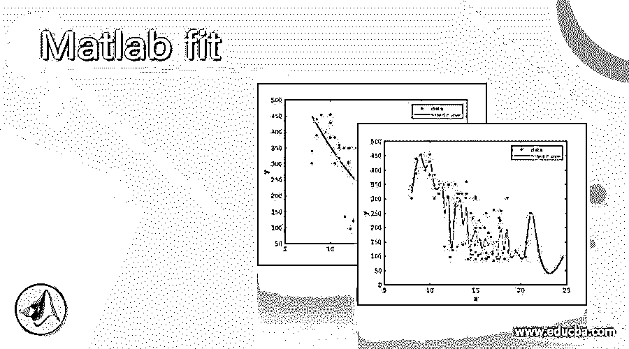

## Matlab 拟合简介

MATLAB 拟合方法可以用来拟合一个数据集的曲线或曲面。对数据拟合曲线是人工智能和机器学习模型中用于预测各种属性值的常用技术。

举个例子，如果我们把一个像大米这样的物品的重量和它的价格进行比较；理想情况下，它应该是线性增长的(价格会随着大米重量的增加而增加)。如果我们对这些重量和价格数据拟合一条曲线，我们将得到一条线性曲线。现在，看着这条线性曲线的人可以很容易地解释这两个属性(在我们的例子中是重量和价格)之间的关系，而不用看数据。

<small>Hadoop、数据科学、统计学&其他</small>

**语法:**

1.  fitobject = fit (a，b，fitType)用于将曲线拟合到由属性‘a’和‘b’表示的数据。要拟合的模型或曲线的类型由参数“fitType”给出
2.  参数“fitType”可以采用的各种值在下表中给出:

| **型号名称** | **描述** |
| 

1.  [poly 1]

 | 具有线性性质的多项式曲线 |
| 

1.  【聚 11】

 | 具有线性性质的多项式曲面 |
| 

1.  [poly 2]

 | 具有二次性质的多项式曲线 |
|  | 线性分段插值 |
| 

1.  [Cubic explanation]

 | 三次分段插值 |
| 

1.  [smooth line]

 | 自然平滑样条曲线 |

**表 1**

现在让我们了解如何在 MATLAB 中用曲线或曲面拟合数据:

我们需要一些数据来拟合曲线，对于我们的例子，我们将使用 MATLAB 提供的一些内置数据集，如“carsmall”和“census”。

### Matlab 拟合示例

让我们讨论 Matlab 拟合的例子。

#### 示例#1

在这个例子中，我们将使用 MATLAB 提供的“carsmall”数据。这些数据是 1970 年、1976 年和 1982 年生产的汽车的各种属性。它有类似“加速度”、“气缸”、“马力”等属性。代表汽车的各种特征。我们将把这些数据加载到我们的工作空间，并将曲线拟合到它的属性“加速度”和“位移”。本例中要遵循的步骤是:

1.  将“carsmall”数据加载到工作区
2.  查看上面加载的文件以了解其属性
3.  使用“拟合”功能将曲线拟合到加载的数据
4.  绘制上一步中创建的模型

**代码:**

**1。装载小汽车**

[Using the ‘load’ command to load the ‘carsmall’ data set to our workspace]

**2。谁的文件小汽车**

[Using ‘whos’ command to view the file loaded above]

**3。C = fit(加速度，位移，' poly2')**

[Using the ‘fit’ command to fit a curve to the data. The first 2 parameters represent the attributes to which we want to fit the curve and the 3rd parameter represents the type of curve which we want to fit (please refer to Table 1 for this)]

**4。绘图(C，加速度，位移)**

[Using ‘plot’ command to plot the model created in above step]

这是我们的输入和输出在 MATLAB 命令窗口中的样子:

**输入 1:**

**加载 carsmall 数据集:**

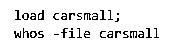

**输入 2:**

**对数据进行曲线拟合:**

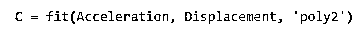

**输入 3:**

**绘制上面创建的模型:**

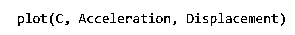

**输出 1:**

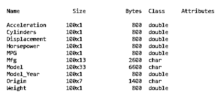

**输出 2:**

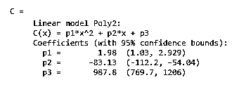

**输出 3:**

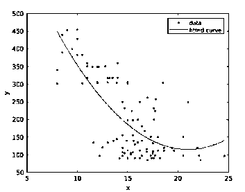

正如我们在输出 3 中看到的，我们已经获得了一条符合我们数据的曲线。输出 1 和输出 2 分别表示数据属性和模型。

在同一个例子中，我们还可以根据需要拟合不同类型的曲线。让我们试着用“平滑曲线”来拟合上述数据。

代码将与上面的例子相似，只是第 3 行有所变化

**代码:**

**1。装载小汽车**

[Using the ‘load’ command to load the ‘carsmall’ file to our workspace]

**2。谁的文件小汽车**

[Using ‘whos’ command to view the file loaded above]

**3。C = fit(加速度、位移、“平滑曲线”)**

[Please note that the 3rd argument is now ‘smoothingspline’]

**4。绘图(C，加速度，位移)**

[Using ‘plot’ command to plot the model created in above step]

这是我们的输入和输出在 Matlab 命令窗口中的样子:

**输入 1:**

**加载 carsmall 数据集:**

**输入 2:**

**对数据进行曲线拟合:**

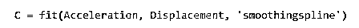

**输入 3:**

**绘制上面创建的模型:**

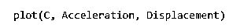

**输出 1:**

**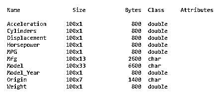

** 

**输出 2:**

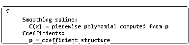

**输出 3:**

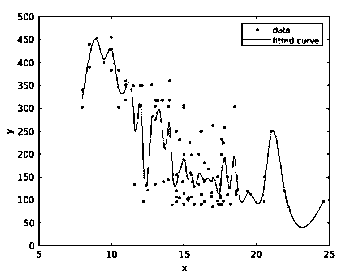

**正如我们在输出 3 中看到的，我们已经获得了一条适合我们数据的平滑样条曲线。**

#### 实施例 2

在这个例子中，我们将使用 MATLAB 提供的“人口普查”数据。这是美国的数据，给出了该国特定年份的人口。它有两个属性' cdate '和' pop ',分别代表'普查日期'和'人口'。我们将把这些数据加载到我们的工作区，并拟合一条曲线。本例中要遵循的步骤是:

1.  将人口普查数据加载到工作空间
2.  查看上面加载的文件以了解其属性
3.  使用“拟合”功能将曲线拟合到加载的数据
4.  绘制上一步中创建的模型

**代码:**

`load census`

[Using the ‘load’ command to load the census file to our workspace]

`whos -file census`

[Using ‘whos’ command to view the file loaded above]

`C = fit(cdate, pop, 'poly2')`

[Using the ‘fit’ command to fit a curve to the data. The first 2 parameters represent the attributes to which we want to fit the curve and the 3rd parameter represents the type of curve which we want to fit (please refer to Table 1 for this)]

`plot(C, cdate, pop)`

[Using ‘plot’ command to plot the model created in above step]

这是我们的输入和输出在 MATLAB 命令窗口中的样子:

**输入 1:**

**加载人口普查数据集:**

**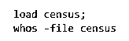

** 

**输入 2:**

**对数据进行曲线拟合:**

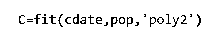

**输入 3:**

**绘制上面创建的模型:**

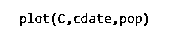

**输出 1:**

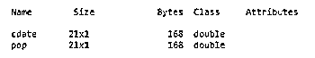

**输出 2:**

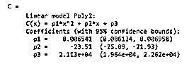

**输出 3:**

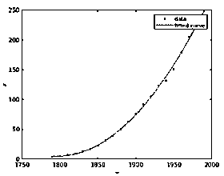

正如我们在输出 3 中看到的，我们已经获得了一条符合我们数据的曲线。输出 1 和输出 2 分别表示数据属性和模型。

### 结论

1.  我们使用 MATLAB 中的“拟合”功能来拟合数据集的曲线
2.  拟合曲线是机器学习中非常有用的技术
3.  我们可以通过使用“fitType”参数来控制我们想要拟合的曲线类型。

### 推荐文章

这是一个 Matlab 拟合指南。在这里，我们还讨论了介绍、语法和代码实现的不同示例。您也可以看看以下文章，了解更多信息–

1.  [Matlab 表单](https://www.educba.com/matlab-forms/)
2.  [Matlab 绘图标题](https://www.educba.com/matlab-plot-title/)
3.  [Matlab fplot()](https://www.educba.com/matlab-fplot/)
4.  [Matlab 符号](https://www.educba.com/matlab-syms/)

