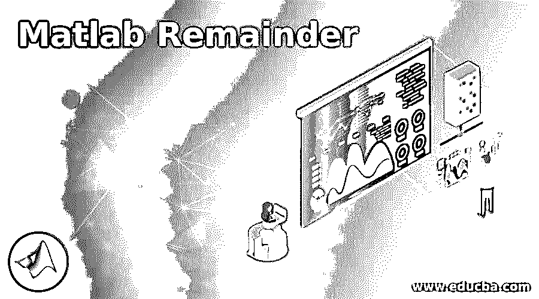
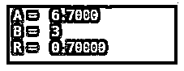
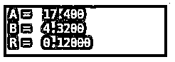
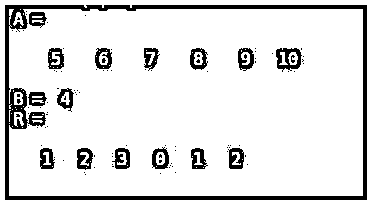
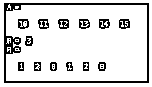

# Matlab 余数

> 原文：<https://www.educba.com/matlab-remainder/>

## Matlab 余数介绍

下面的文章提供了 Matlab 余数的概要。当两个数不能被整除时，余数在除法中得到。

第 4 部分涉及数量。

<small>Hadoop、数据科学、统计学&其他</small>

*   **被除数:**要被除的数。
*   **除数:**“被除数”要除以的数字。
*   **商:**“除数”乘以“乘数”，使其等于或最接近“被除数”。
*   **余数:**如果积除数*商不等于‘被除数’，那么滞后被称为‘余数’。

在 Matlab 中，我们使用“rem”函数来寻找除法的余数。

**语法:**

`R = rem (A, B)`

**描述:**

*   R = rem (A，B)将得出‘A’除以‘B’的余数。
*   a 是被除数，B 是除数。
*   像 A:B 这样的范围也可以作为参数传递。在这种情况下，整个范围将被视为“红利”,我们将获得与每个红利相关的“余数”数组。

### Matlab 余数示例

下面是提到的例子:

#### 示例#1

在这个例子中，我们将被除数和除数都作为整数。

对于我们的第一个示例，我们将遵循以下步骤:

*   初始化红利。
*   初始化除数。
*   将被除数和除数都传递给 rem 函数。

**代码:**

A = 15

[Initializing the Dividend]

B = 3

[Initializing the Divisor]

R = rem(A，B)

[Passing Dividend and Divisor as arguments to the rem function] [Mathematically, if we divide A with B, we will get ‘0’ as remainder. This is because 3 exactly divides 15, leaving no remainder]

**输入:**

`A = 15
B = 3
R = rem(A, B)`

**输出:**

正如我们在输出中看到的，我们已经获得了 15 和 3 的余数“0”。

#### 实施例 2

在这个例子中，我们将把一个非整数的被除数和除数作为一个整数。

对于此示例，我们将遵循以下步骤:

*   初始化红利。
*   初始化除数。
*   将被除数和除数都传递给 rem 函数。

**代码:**

A = 6.7

[Initializing the Dividend]

B = 3

[Initializing the Divisor]

R = rem(A，B)

[Passing Dividend and Divisor as arguments to the rem function] [Mathematically, if we divide A with B, we will get ‘0.7’ as remainder. This is because 3 does not divide 6.7 exactly, and leaves 0.7 as remainder]

**输入:**

`A = 6.7
B = 3
R = rem(A, B)`

**输出:**

正如我们在输出中看到的，我们已经获得了 6.7 和 3 的余数“0.7”。

#### 实施例 3

在这个例子中，我们将被除数和除数都作为非整数。

对于此示例，我们将遵循以下步骤:

*   初始化红利。
*   初始化除数。
*   将被除数和除数都传递给 rem 函数。

**代码:**

A = 17.4

[Initializing the Dividend]

B = 4.32

[Initializing the Divisor]

R = rem(A，B)

[Passing Dividend and Divisor as arguments to the rem function] [Mathematically, if we divide A with B, we will get ‘0.12’ as remainder. This is because 4.32 does not divide 17.4 exactly and leaves 0.12 as remainder]

**输入:**

`A = 17.4
B = 4.32
R = rem(A, B)`

**输出:**

正如我们在输出中看到的，我们已经获得了 17.4 和 4.32 的余数 0.12。

在上面的 3 个例子中，我们使用 rem 函数来获得单个输入的余数。

接下来，我们将看到如何使用 rem 函数计算一系列红利。

将一个整数范围传递给 rem 函数将得到一个数组输出，其中包含每个元素除以除数后的余数。

#### 实施例 4

我们将取 5 到 10 的范围，并用 4 作为除数。

对于此示例，我们将遵循以下步骤:

*   将范围初始化为[5:10]
*   初始化除数
*   将被除数范围和除数传递给 rem 函数

**代码:**

a =[5:10][初始化分红范围]

B = 4

[Initializing the Divisor]

R = rem(A，B)

[Passing Dividend range and Divisor as arguments to the rem function] [Mathematically, if we divide every integer from 5 to 10 by 4, we will get the following remainders:

1 2 3 0 1 2

请注意，这些余数对应于 A 的元素除以 4]

**输入:**

`A = [5 : 10] B = 4
R = rem(A, B)`

**输出:**

**

** 

正如我们在输出中看到的，我们已经获得了作为参数传递的范围的余数数组。

#### 实施例 5

让我们再举一个例子，取 10 到 15 的范围。

对于此示例，我们将遵循以下步骤:

*   将范围初始化为[10:15]。
*   将除数初始化为 3。
*   将被除数范围和除数传递给 rem 函数。

**代码:**

a =[10:15][初始化红利范围]

B = 3

[Initializing the Divisor]

R = rem(A，B)

[Passing Dividend range and Divisor as arguments to the rem function] [Mathematically, if we divide every integer from 10 to 15 by 3, we will get following remainders:

1 2 0 1 2 0]

**输入:**

`A = [10 : 15] B = 3
R = rem(A, B)`

**输出:**

正如我们在输出中看到的，我们已经获得了作为参数传递的范围的余数数组。

### 结论

Matlab 中使用 rem 函数来寻找除法运算中的余数。我们可以将单个红利或一系列红利作为参数传递给' rem '函数。

### 推荐文章

这是一个 Matlab 余数指南。为了更好地理解，我们在这里讨论 Matlab 余数的介绍和例子。您也可以看看以下文章，了解更多信息–

1.  [曲线拟合 Matlab](https://www.educba.com/curve-fitting-matlab/)
2.  [MATLAB 指数](https://www.educba.com/matlab-exponential/)
3.  [Matlab 梯形()](https://www.educba.com/matlab-trapz/)
4.  [Ceil Matlab](https://www.educba.com/ceil-matlab/)

