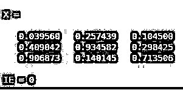
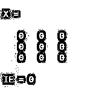

# isempty MATLAB

> 原文：<https://www.educba.com/isempty-matlab/>

## MATLAB 中 isempty 函数介绍

MATLAB 是一个交互式的编程环境，用于科学计算。它广泛应用于许多需要解决问题、数据分析、算法开发和实验的技术领域。特定学科的软件广泛使用 MATLAB 编写。在本文中，我们将研究如何在 MATLAB 中使用' isempty '函数。在我们开始学习“isempty”函数如何在 MATLAB 中工作之前，让我们先来回顾一下我们为什么需要“isempty”函数。

我们在数组上使用“isempty”函数来检查数组是否为空。这是一个非常方便的数据分析工具，在这种情况下，我们有大量的数据集，并希望识别 null 或空数组。有时在报告中，分析师需要发送没有空值/数组/单元格的数据。在这种情况下，isempty 函数就成了数据分析师的救星。

<small>Hadoop、数据科学、统计学&其他</small>

**语法**

现在让我们理解 MATLAB 中“isempty”函数的语法:

`IE = isempty (X)`

**【请记住 isempty 是一个逻辑函数，返回 0 或 1 作为输出】**

**说明:**此函数将返回逻辑 1，表示真，如果 X 为空，则输出逻辑 0，表示假，如果 X 不为空。如果我们有一个空数组，它的最小维数为 0，那么‘isempty’将返回 1 作为输出。[即“0 X 3”或“3 X 0”等形式的数组。]

### 实现 isempty MATLAB 的示例

现在，借助各种示例，让我们了解 MATLAB 中“isempty”函数的代码是什么样子的。

#### 示例#1

在第一个示例中，让我们取一个 3 x 0 维的数组，看看“isempty”函数是如何工作的。

**代码:**

`X = rand (3, 0)
IE = isempty (X)`

**输出:**

**说明:**定义维数为 3 x 0 的输入数组。使用输入数组“X”调用 isempty 函数。正如我们在输出中看到的，我们已经获得了 3 x 0 维数组的逻辑 1，正如我们所期望的。

#### 实施例 2

让我们以一个 0×4 维的数组为例，看看“isempty”函数是如何工作的。

**代码:**

`X = rand (0, 4)
IE = isempty (X)`

**输出:**

**说明:**定义维度为 0 x 4 的输入数组。使用输入数组“X”调用 isempty 函数。正如我们在输出中所看到的，我们已经获得了一个维数为 0 x 4 的数组的逻辑 1，正如我们所期望的那样。

#### 实施例 3

现在让我们取一个维数不等于零的数组，看看结果如何变化。我们将获取一个 3 x 3 维的数组，看看“isempty”函数是如何工作的。

**代码:**

`X = rand (3, 3)
IE = isempty (X)`

**输出:**

**说明:**定义维数为 3×3 的输入数组。使用输入数组“X”调用 isempty 函数。正如我们在输出中看到的，我们已经获得了 3 x 3 维数组的逻辑 0，正如我们所期望的。这里要记住的非常重要的一点是‘isempty’函数识别空数组，而不是所有值都为零的数组。

#### 实施例 4

现在让我们取一个维数不等于零的数组，但它的所有元素都等于零。

**代码:**

`X = zeros (3, 3)
IE = isempty (X)`

**输出:**

**说明:**定义输入数组，维数 3×3，所有元素为零。使用输入数组“X”调用 isempty 函数。正如我们在输出中看到的，我们已经获得了 3 x 3 维数组的逻辑 0，并且所有元素都为“0”。因此，可以得出结论，所有元素都为零的数组不被视为空数组。MATLAB 中的 isempty 函数也可以用于字符串数组。让我们学习如何使用“is empty”函数来确定一个字符串数组是否为空。

#### 实施例 4

现在让我们取一个维数不等于零的字符串数组。

**代码:**

`X = ["is"  "empty"  "function"] IE = isempty (X)`

**输出:**

**说明:**定义维度为 1 x 3 的输入字符串数组。使用输入字符串数组“X”调用 isempty 函数。因此，我们获得了逻辑 0 作为输出，因为我们示例中的输入字符串数组不为空。

### 结论

MATLAB 为我们提供了一个‘isempty’函数来检查数组是否为空。此外，我们还可以通过将字符串向量作为参数传递给“isempty”函数来检查它。“isempty”函数的一个重要之处是它检查空数组，不要与包含全零的数组相混淆。

### 推荐文章

这是一个 isempty MATLAB 的指南。在这里，我们讨论 isempty MATLAB 的介绍，语法，编程的例子和解释。您也可以浏览我们的其他相关文章，了解更多信息——

1.  [MATLAB 指数](https://www.educba.com/matlab-exponential/)
2.  [Matlab traps()](https://www.educba.com/matlab-trapz/)
3.  [Matlab 正弦波](https://www.educba.com/matlab-sine-wave/)
4.  [曲线拟合 Matlab](https://www.educba.com/curve-fitting-matlab/)
5.  [亥维赛 MATLAB](https://www.educba.com/heaviside-matlab/)

